# 数据结构

## 第1章：绪论

### 1.数据结构

#### 数据

- **定义**：就是信息的原始素材，可以是数字、文字、符号等。
- **例子**：`3, "苹果", 3.14, 'A'` 这些都是数据，但它们是零散的、无意义的。

#### 数据元素

- **定义**：数据的基本单位（就像组成表格的"一行"）。
- **例子**：一个学生的信息（`学号:101，姓名:张三，年龄:20`）就是一个数据元素。

#### 数据对象

- **定义**：同一类数据元素的集合（类似"`全班花名册`"）。
- **例子**：全班50个学生的信息合起来就是一个数据对象。

#### 数据类型

- **定义**：数据的种类，决定了能对它做什么操作（比如数字能加减，文字不能）。
- 例子：
	- `int`（整数类型）：可以加减乘除。
	- `string`（字符串类型）：可以拼接、截取。

#### 数据结构

- **定义**：数据元素之间的组织方式，目的是高效存取或操作。
- 例子：
	- **数组**：像一排连续盒子，快速按编号找东西。
	- **链表**：像手拉手的小朋友，插入删除灵活但查找慢。
	- **树**：像家族家谱，适合表达层级关系。

> - **数据**：`"张三", 20, "李四", 19`（零散信息）
> - **数据元素**：`{"姓名":"张三", "年龄":20}`（一个学生的完整信息）
> - **数据对象**：全班学生的信息集合（所有数据元素放一起）
> - **数据类型**：年龄是`int`，姓名是`string`（规定怎么存、怎么算）
> - **数据结构**：用**数组**存学生（快速查第n个），或用**链表**存（方便插班生）

> **数据**和**数据元素**是原材料，**数据结构**是包装盒

#### 数据结构三要素

1. **逻辑结构**：数据元素之间**一对一、一对多、多对多**的关系（比如**有序表**）
2. **存储结构**：**物理空间**中的存储方法（比如**顺序、链式、索引、散列存储**）
3. 数据的运算

> 区别逻辑结构和物理结构：从名字里无法得出物理存储方式，则为逻辑结构，否则是存储结构
>
> 比如线性表可以顺序或链式存储，为逻辑结构
>
> 而顺序表的物理空间连续，为存储结构

### 2.算法

#### 五个特征

1. 有穷性
2. 确定性
3. 可行性：算法的每条操作都可以实现的
4. 输入
5. 输出

#### 时间复杂度

一般考虑最坏情况

#### 空间复杂度

额外空间


## 第2章：线性表

### 1.线性表

线性表是**逻辑结构**，可**顺序或链式存储**

有前驱和后继

### 2.顺序表

逻辑顺序和物理顺序相同

**空间固定，满了需要扩容**

**随机访问**

结点只存储数据，**不存储数据之间的关系**

### 3.链表

**注意链表的头结点不存储数据，只为方便遍历和插入**

**插入删除的时间复杂度是$O(n)$，因为要找前一个结点**

#### 双链表

**可以在$O(1)$复杂度内完成插入删除**（不用遍历找前一个结点）

#### 循环链表

**尾结点的next是头结点，而不是$a_1$**

#### 静态链表

用**表格**的形式表示链表，以`next=-1`作为结束标志


## 第3章：栈与队列

### 1.卡特兰数

$$
n个元素进栈，有\frac{1}{n+1}C^n_{2n}种出栈排列 \\\\
C_0=1\\\\
C_1=1\\\\
C_2=2\\\\
C_3=5\\\\
C_4=14
$$

> 注意：这里的n个元素进栈是有顺序的，比如以`123`的顺序进栈，但是出栈的顺序有`123，132，213，231，321`五种

### 2.顺序栈

逻辑结构是线性表

初始时设置`S.top=-1`

### 3.共享栈

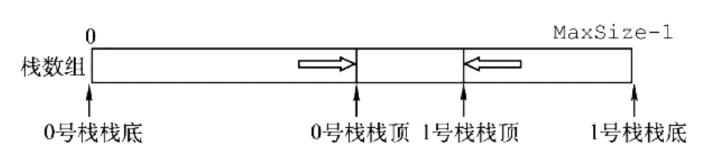

**降低上溢风险**，因为共享栈更大，只有整个空间被占满才会上溢

**栈满条件**：

1. 起始指针为`-1和MaxSize`，表示**已被占用的位置**，`top1-top0=1`
2. 起始指针为`0和MaxSize-1`，表示**下一个将被占用的位置**，两指针以“`top0top1`”相遇时并不会栈满，而是以“`top1top0`”形式相遇时才会栈满，因此栈满条件为`top0-top1=1`

### 4.链栈

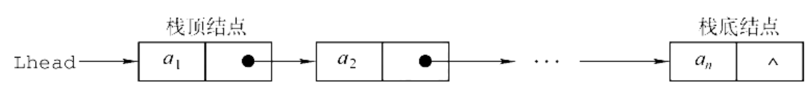

链栈**不会上溢**

**没有头结点**

**所有操作在表头完成**

### 5.队列

逻辑结构是线性表

**尾进头出**

**front指向队头，rear指向队尾的下一个元素**

初始时`front=rear=0`

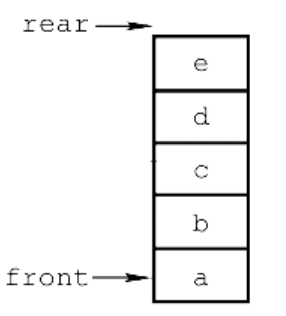

### 6.循环队列

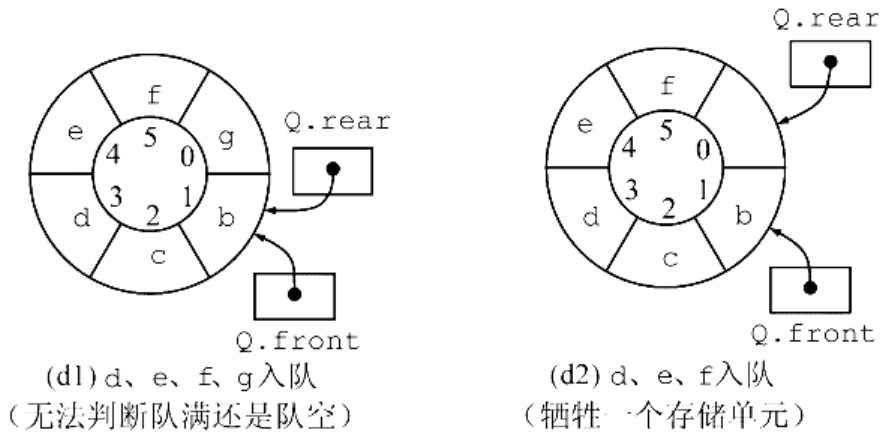

循环队列**以数组的形式存储**

循环队列是**物理结构**

由于判断队满和队空的条件均为`front=rear`，因此采取下面三种方式区分栈满和栈空

1. 牺牲一个存储单元`(rear+1)%MaxSize=front`栈满
2. 引入`size`
3. 引入`tag`，`tag=1`栈满

### 7.链队列

单链表，头指针指向**头结点**，尾指针指向最后一个结点

注意，出队时，如果只剩最后一个结点，则要额外把`rear`移动到头结点和`front`重合，以便通过`front=rear`判断队空

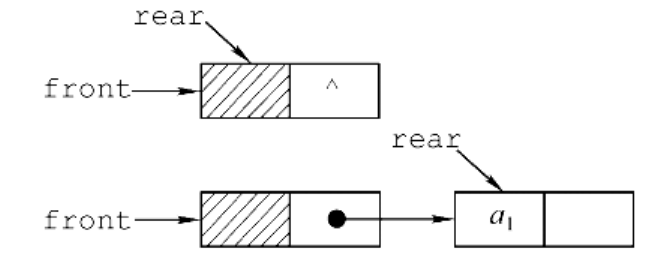

### 8.双端队列

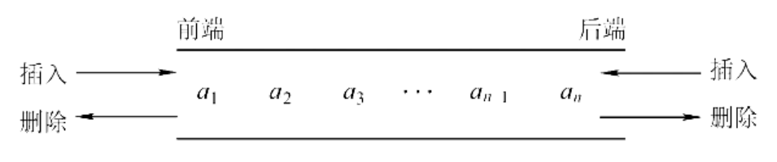

输出受限的双端队列：

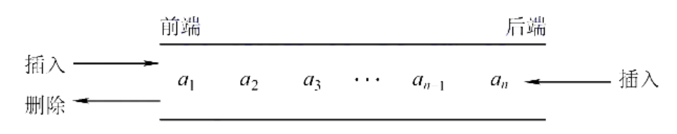

输入受限的双端队列：

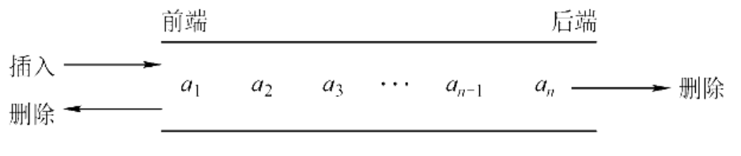

> 输入序列1234
>
> 对于输出受限，预得到4213，先从左右插入得到4213：`1->21->213->4213`，全部左出
>
> 对于输入受限，预得到4132，先从一端插入1234，然后从两端取出：`1234->123->23->3`

### 9.栈与队列的应用

#### 括号匹配

遍历，左括号入栈，右括号则去匹配栈顶

#### 后缀表达式和表达式求值

也称**逆波兰式**

**中缀转后缀**：有一个`op`栈暂存符号

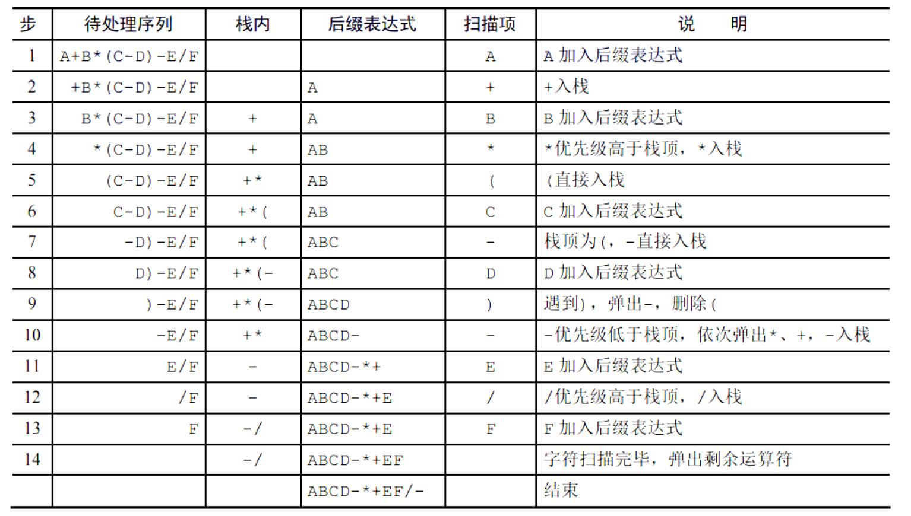

**计算中缀表达式**，比如`A+B*(C-D)-E/F`：

1. `num`和`op`两个栈
2. 数字直接入栈
3. 若**栈顶的优先级$\geq$自己，则一直出栈**，直到栈顶优先级$<$自己或栈空为止
4. **右括号一直出栈，直到找到左括号**

#### 栈与递归

#### 队列与层次遍历

```java
while(!Q.isEmpty()) {
    int n = Q.size();
    for (int i = 0; i < n; i++) {
        TreeNode node = Q.pop();
        if (node.left != NULL) {
            Q.push(node.left);
        }
        if (node.right != NULL) {
            Q.push(node.right);
        }
    }
}
```

#### 缓冲区与消息队列

缓冲区：解决快慢匹配问题（如CPU与打印机）

消息队列：异步、削峰（多个外设同时请求CPU）、解耦

### 10.数组和特殊矩阵

#### 对称矩阵

上下三角半区的元素相同，因此**存储在一维数组$[n(n+1)/2]$中**，在一维数组中的下标k与矩阵的坐标关系：

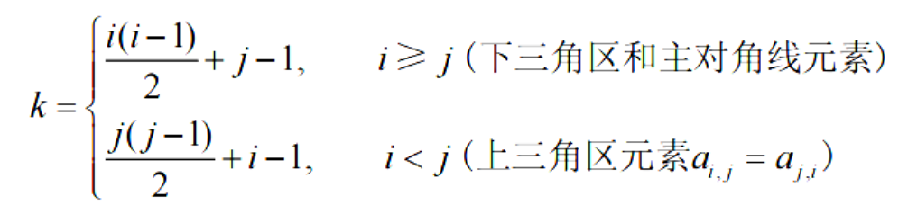

#### 三角矩阵

和对称矩阵类似，不过**最后要存储对角线另一侧的常数（三角矩阵对角线另一侧全为常数）**：

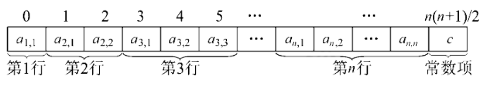


#### 三对角矩阵

存放到**一维数组**：

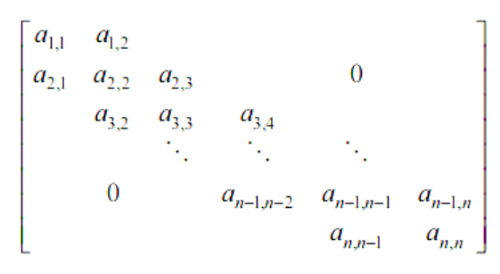

#### 稀疏矩阵

**三元组**$(i,j,a_{ij})$，可用**数组或十字链表存储三元组**


## 第4章：串

### 1.KMP算法

书写得依托答辩，看下面的图即可：

**主串的指针i永远不回退**：

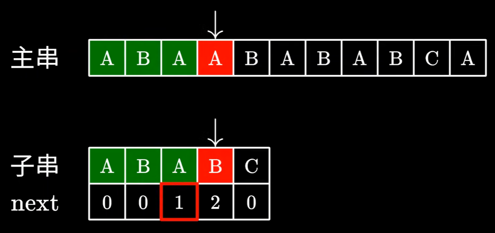

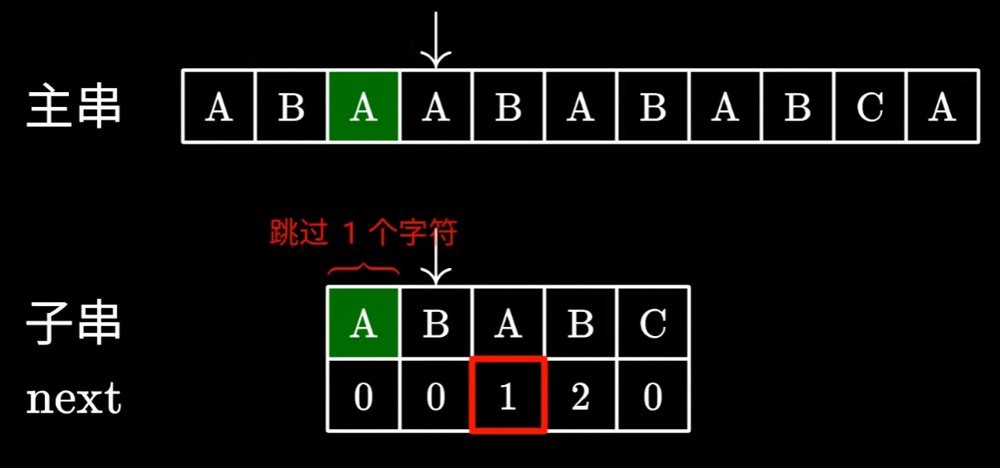

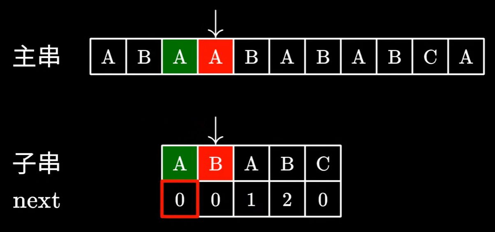

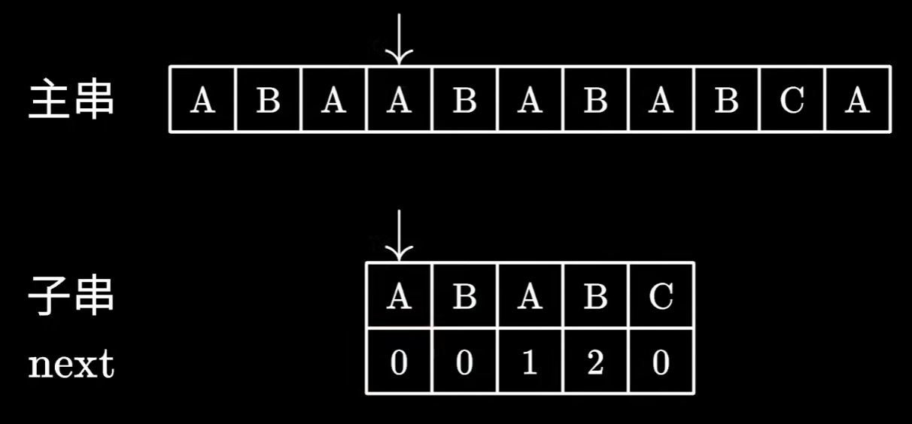

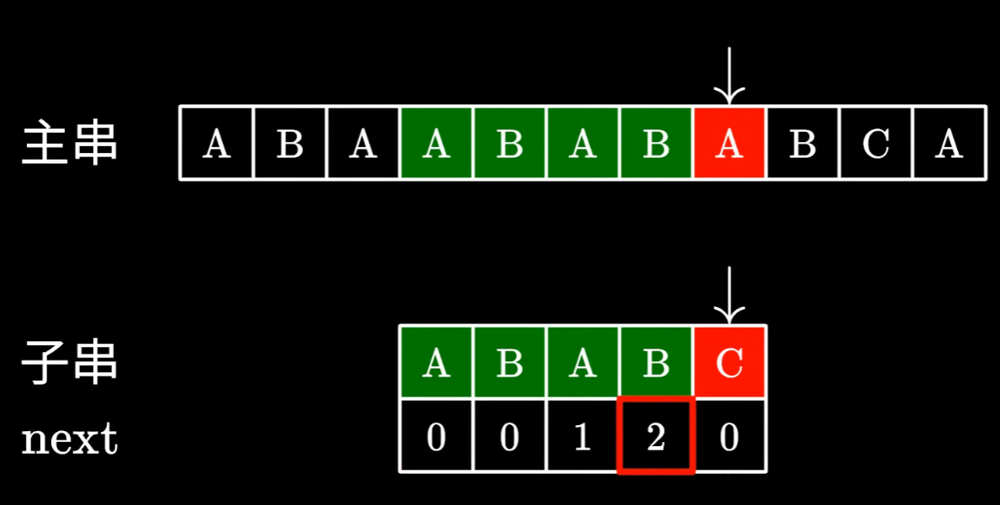

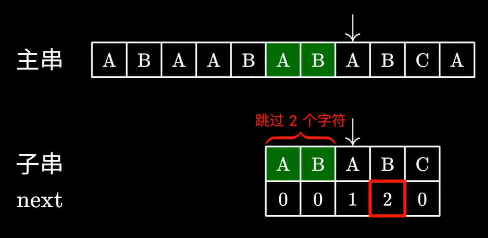

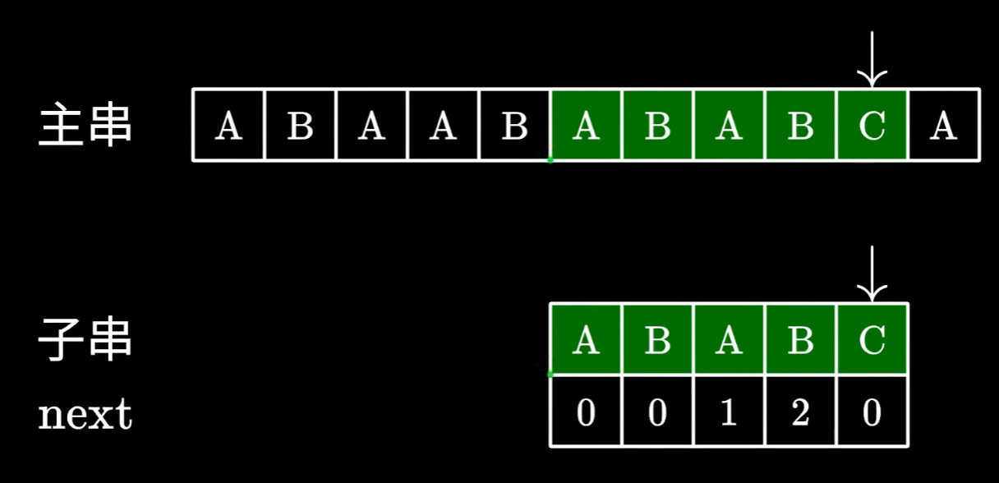

当匹配失败时，找**最后一个匹配位置的next的值**。新一轮匹配时，**模式串直接跳过next的值个字符**，将当前的字符和主串匹配失败的位置继续匹配

现在，所有的问题在于如何寻找next数组

### 2.next数组

next数组的本质就是**寻找子串中相同前后缀的长度**：

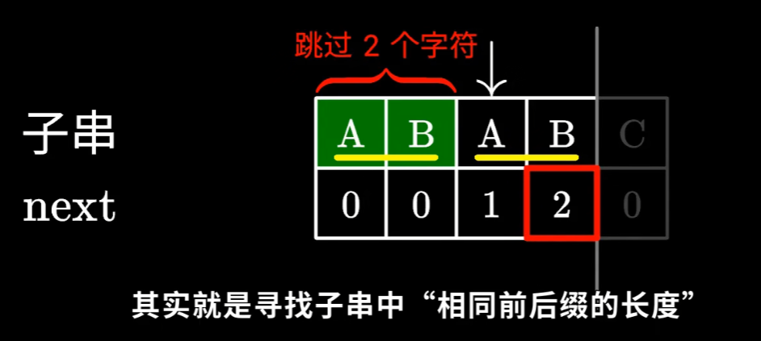

计算方法见下图：

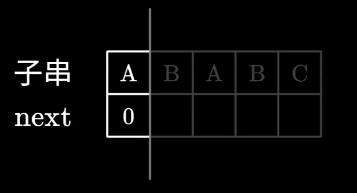

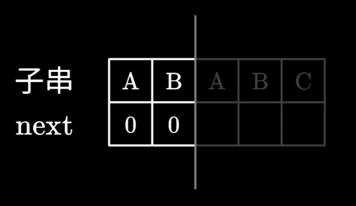

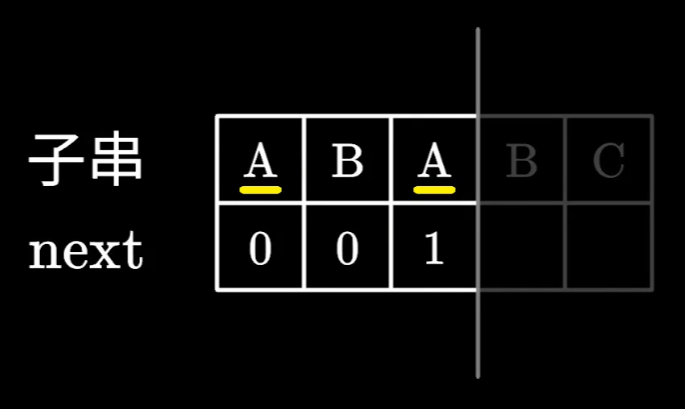

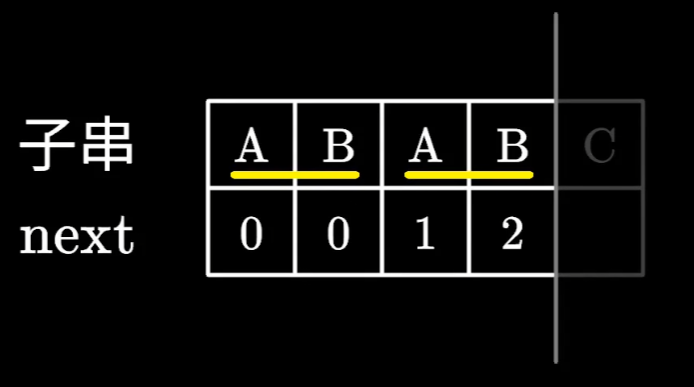

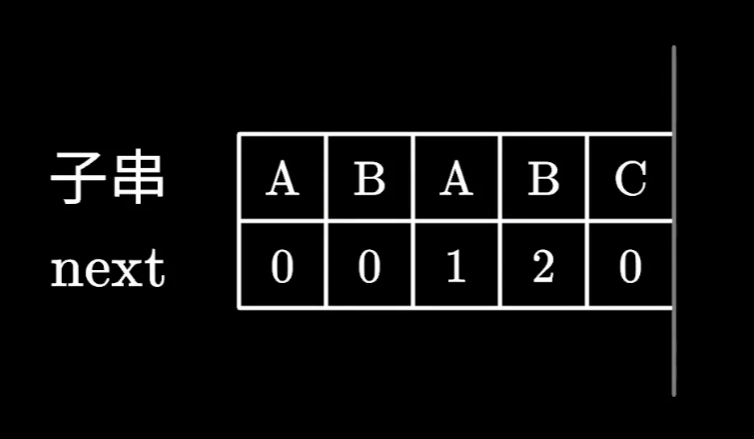

### 3.递推求解next数组

核心思想：没必要每次都寻找最长前后缀，可以根据**动态规划**的思想，**利用前面掌握的信息递推下一项**

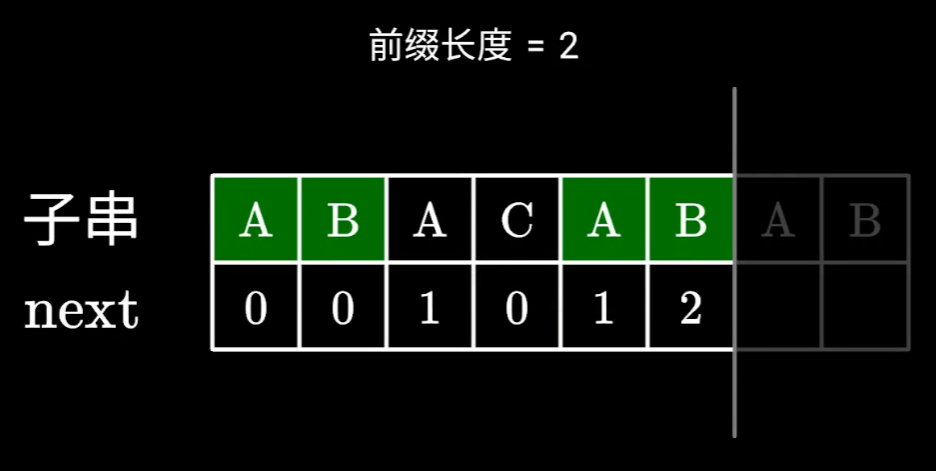

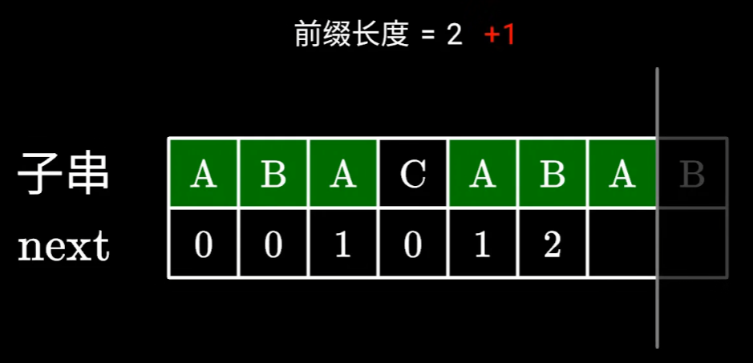

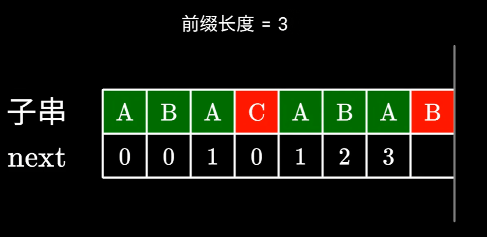

下面可能有点绕，解释一下：下一位不匹配，但是子串`ABACABA`已经匹配过了，它存在最长前后缀`ABA`，那么后面那个`A`在左边已经求得跳跃长度为1(`next[2]=1`)，因此只需子串`ABACABA`跳过第一个`A`，然后第二个`B`匹配，因此这里的`B`的最长前后缀为`next[2]+1=2`

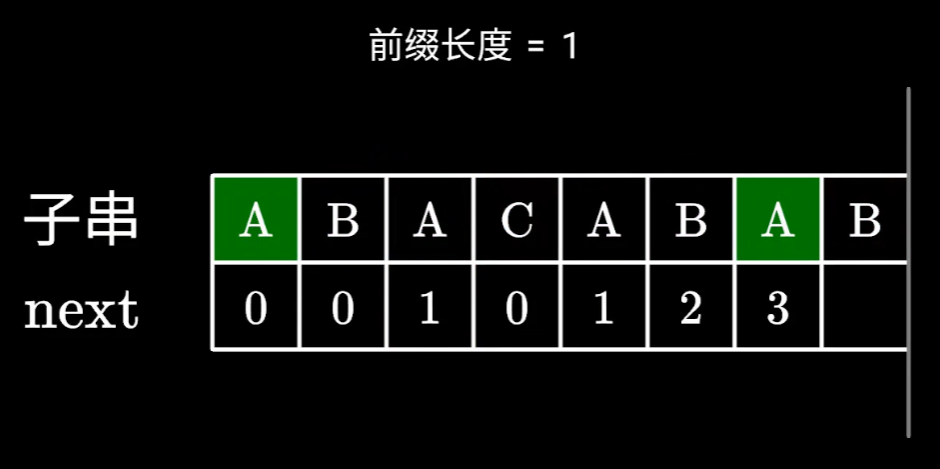

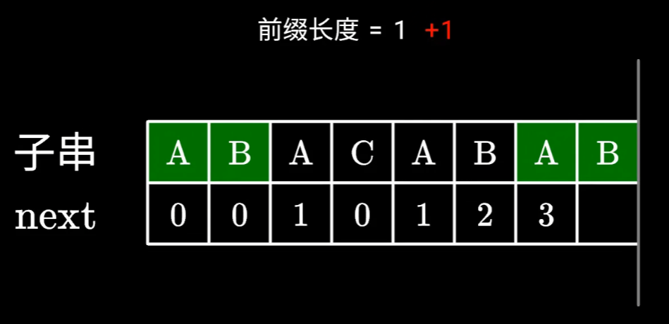


## 第5章：树与二叉树

### 1.树的概念

**结点的度=出度**；**树的度=最大度数**

**结点的路径长度=两结点之间的边数**；**树的路径长度=根到所有结点的路径长度总和**

### 2.二叉树

**二叉树是有序树**
$$
n个结点最多形成\frac{(2n)!}{(n+1)!n!}个二叉树
$$
**二叉树**和**度为2的树**的区别：

1. 二叉树可以为空；度为2的树至少要有3个结点
2. 二叉树有序；度为2的树不一定有序

#### 满二叉树

**每一层都填满**

#### 完全二叉树

可以**用一维数组存储**

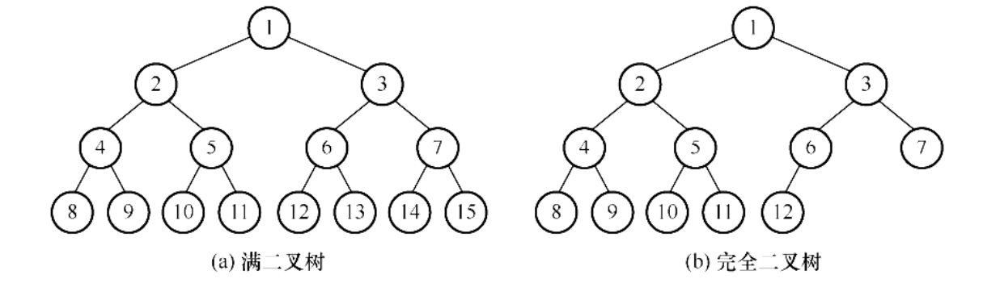

**完全二叉树度为1的结点最多1个**（非常重要）

注意：完全二叉树的**叶子节点最后一层和倒数第二层都可能有**，**不能忽略倒数第二层**

#### 正则二叉树

只有度为0或2的结点

#### 性质

$$
&n_0+n_1+n_2=n_1+2 \times n_2+1 \\\\
&n_0=n_2+1
$$

### 3.二叉树的遍历和线索二叉树

#### 二叉树的遍历

先序遍历：一根线围一圈

中序遍历：竖着看

后序遍历：从左到右摘葡萄

#### 由遍历构造二叉树

核心思路：**分治**

**先序+中序**：

```java
TreeNode findTreeByPreorderInorder(String preorder, String inorder) {
    if (preorder.isEmpty() || inorder.isEmpty()) {
        return null;
    }
    if (preorder.length() == 1 || inorder.length() == 1) {
        return new TreeNode(preorder.charAt(0) - '0');
    }
    
    char root = preorder.charAt(0);
    int rootIndex = inorder.indexOf(root); // 左子树的大小
    
    String leftPreorder = preorder.substring(1, rootIndex + 1);
    String rightPreorder = preorder.substring(rootIndex + 1);
    String leftInorder = inorder.substring(0, rootIndex);
    String rightInorder = inorder.substring(rootIndex + 1);
    
    TreeNode left = findTreeByPreorderInorder(leftPreorder, leftInorder);
    TreeNode right = findTreeByPreorderInorder(rightPreorder, rightInorder);
    
    return new TreeNode(root - '0', left, right);
}
```

**后序+中序**：

基本同理，不再赘述

**层次+中序**：

```java
TreeNode findTreeByLevelorderInorder(String levelorder, String inorder) {
    if (levelorder.isEmpty() || inorder.isEmpty()) {
        return null;
    }
    if (levelorder.length() == 1 || inorder.length() == 1) {
        return new TreeNode(levelorder.charAt(0) - '0');
    }
    
    char rootVal = levelorder.charAt(0);
    int rootIndex = inorder.indexOf(rootVal); // 左子树的大小
    
    String leftInorder = inorder.substring(0, rootIndex);
    String rightInorder = inorder.substring(rootIndex + 1);
    
    StringBuilder leftLevelorder = new StringBuilder();
    StringBuilder rightLevelorder = new StringBuilder();
    
    // 整体的层次遍历，包含了左右子树的层次遍历
    // 如果元素来自左子树，则加入leftInorder，加入顺序符合左子树层次遍历的顺序
    for (int i = 1; i < levelorder.length(); i++) {
        char c = levelorder.charAt(i);
        if (leftInorder.indexOf(c) != -1) {
            leftLevelorder.append(c);
        } else if (rightInorder.indexOf(c) != -1) {
            rightLevelorder.append(c);
        }
    }
    
    TreeNode left = 
        findTreeByLevelorderInorder(leftLevelorder.toString(), leftInorder);
    TreeNode right = 
        findTreeByLevelorderInorder(rightLevelorder.toString(), rightInorder);
    
    return new TreeNode(rootVal - '0', left, right);
}
```

#### 线索二叉树

**总空间：`2n`**

**使用：`n-1`**

**空余：`n+1`**

线索二叉树就是要**把空余的`n+1`个空间利用起来**，用它们**指示结点的先\中\后序遍历的前驱和后继**

增加`ltag`和`rtag`，标识左右子树是指向孩子还是前驱后继：

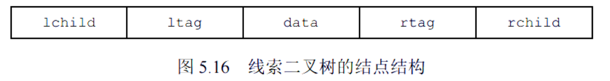

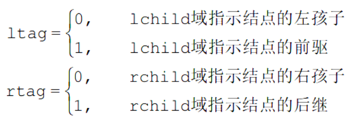

遍历**中序**线索二叉树：

```java
TreeNode nextNode(TreeNode root) {
    if (root.rtag == 0) { // 右子树的最左结点
        return firstNode(root.right);
    }
    return root.right; // 直接返回后继
}

TreeNode firstNode(TreeNode root) { // 树的最左结点
    if (root == null || root.left == null) {
        return null;
    }
    return firstNode(root.left);
}
```

### 4.树和森林

#### 树的表示法

**双亲表示法**：

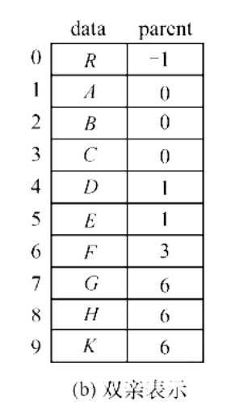

**孩子表示法**：

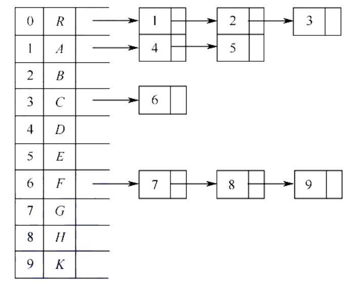

**孩子兄弟表示法**：

```c
typedef struct TreeNode {
    ElemType* data;
    struct TreeNode *firstChild, *nextBrother;
} TreeNode, *Tree;
```

有第一个孩子和下一个兄弟，可以轻易**将森林化为二叉树**

#### 树、森林、二叉树转换

**树->二叉树**：

`left`指向**第一个孩子**，`right`指向**右兄弟**：

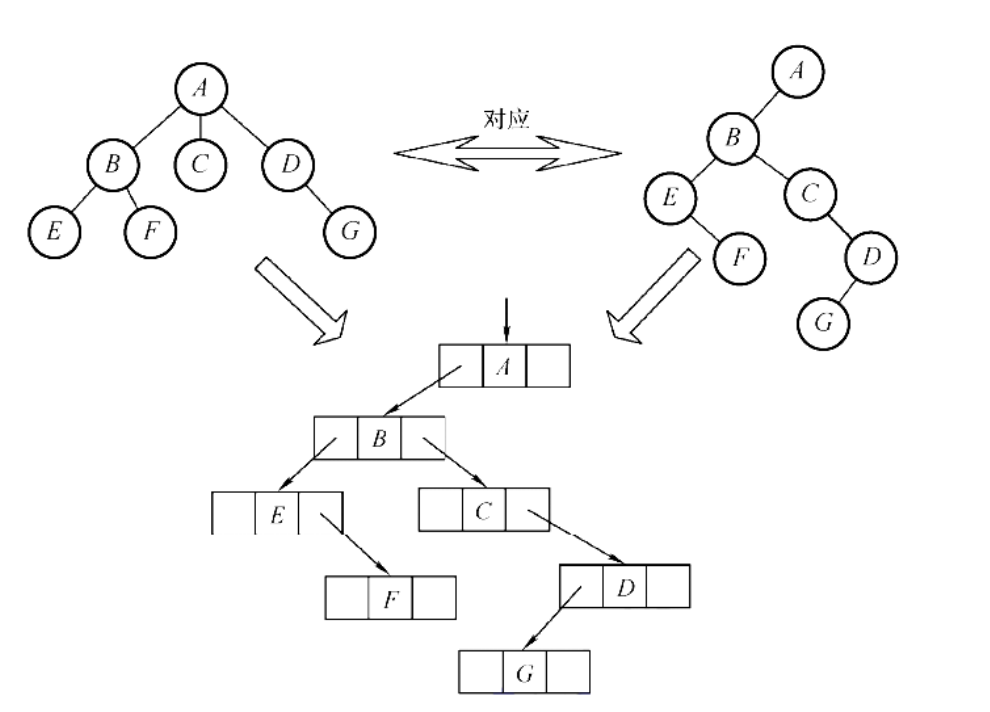

**森林->二叉树**：

同理

**二叉树->森林**：

1. **根结点和左子树是一棵树**，**断开右子树**；
2. 右子树重复上述操作

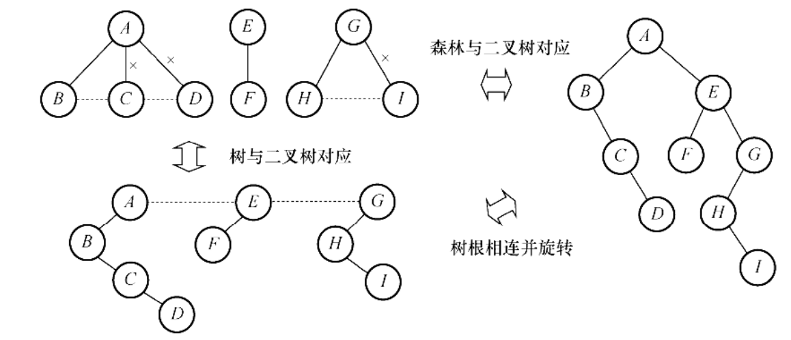

#### 树和森林的遍历

树的**先根遍历**

树的**后根遍历**

**森林的先序遍历**：依次**先根遍历**每一棵树

**森林的中序遍历**：依次**后根遍历**每一棵树

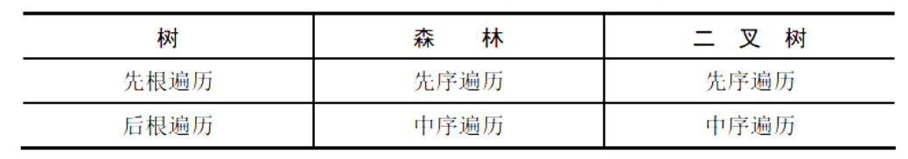

### 5.树与二叉树的应用

#### 哈夫曼树

树的带权路径长度(只算叶子结点)最小

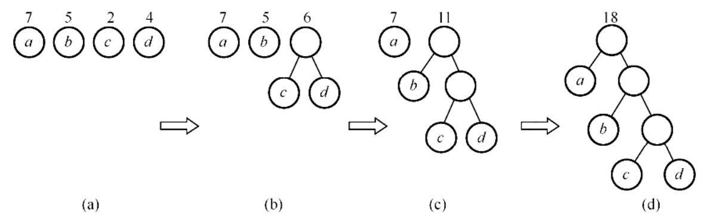

#### 并查集

作用：**查找两个元素是否属于同一集合，合并两个集合**

`Initial`，`Union`，`Find`

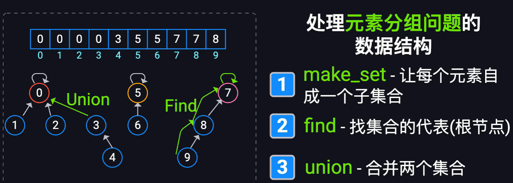

**用数组表示并查集**

**数组的index是编号，数组的值是index的父结点**

构造并查集的步骤如下图（**也可初始化为-1或其它负数**）：

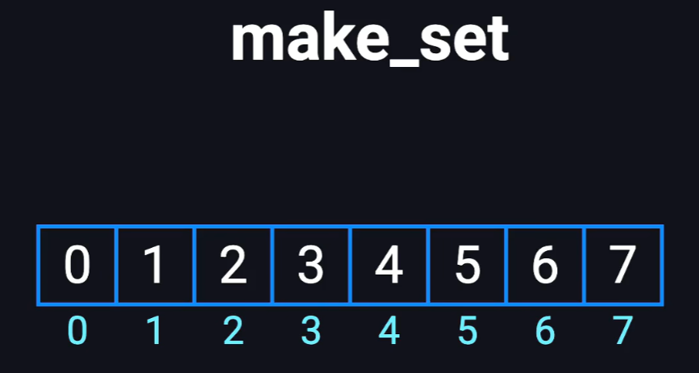

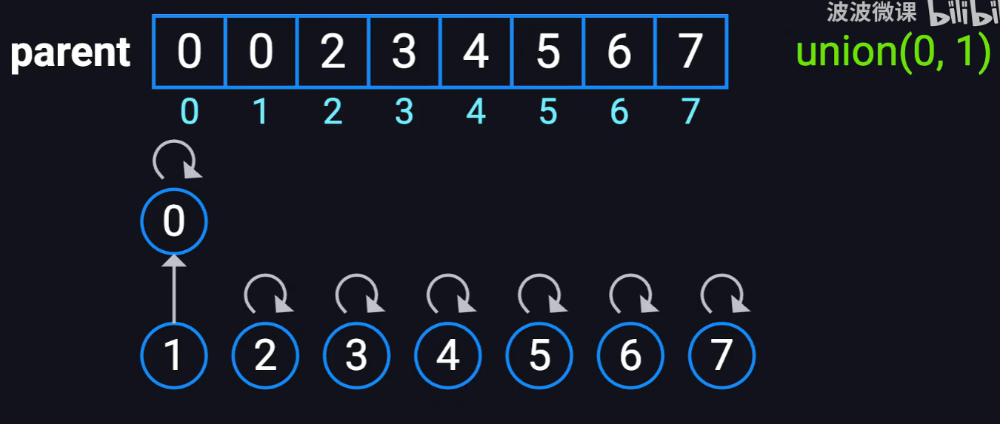

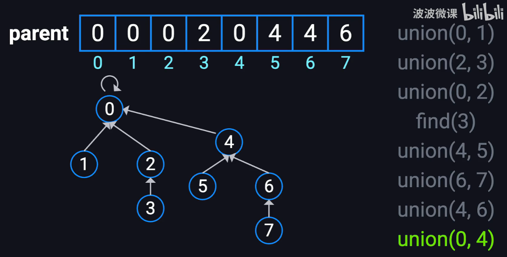

```java
void init(int[] parent) {
    for (int i = 0; i < parent.length; i++)
        parent[i] = i; // 所有元素的父节点初始化为自己
}

int find(int[] parent, int index) {
    return parent[index] == index ? index : find(parent, parent[index]);
}

void union(int[] parent, int index1, int index2) {
    parent[find[index2]] = find[index1];
}
```

**路径压缩**：为了**避免让树过高**，可以在**find的过程中，让树的每一个元素的parent直接指向根节点**

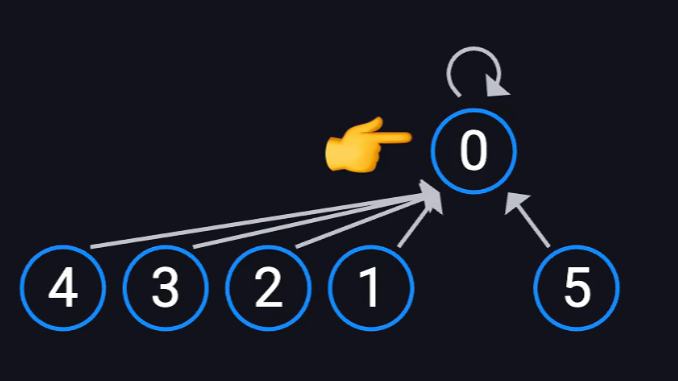

```java
int find(int[] parent, int index) {
    if (parent[index] != index) {
        parent[index] = find(parent, parent[index]); // 路径压缩
    }
    return parent[index];
}
```


## 第6讲：图

### 1.图的概念

**顶点集非空，边集可为空**

#### 简单图

1. 无重复边
2. 无指向自己的边

#### 多重图

非简单图

#### 简单路径

顶点不重复的路径

#### 简单回路

顶点不重复的回路

#### 距离

距离=最短路径

#### 连通、连通分量

**无向图**的概念

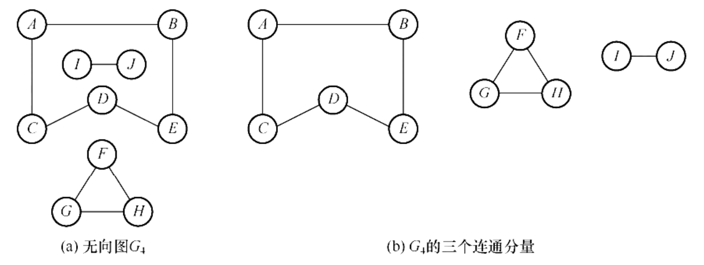

#### 强连通、强连通分量

**有向图**的概念

任意两点相互有弧

#### 生成树

性质：**边数=顶点数-1**（重要）

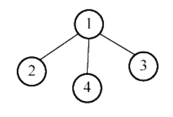

#### 网

网=带权的图

#### 完全图

边全满

### 2.图的存储

#### 邻接矩阵

适合**稠密图**

空间：$V^2$

#### 邻接链表

分为**顶点表**和**边表**

**顶点表竖着，边表横着**

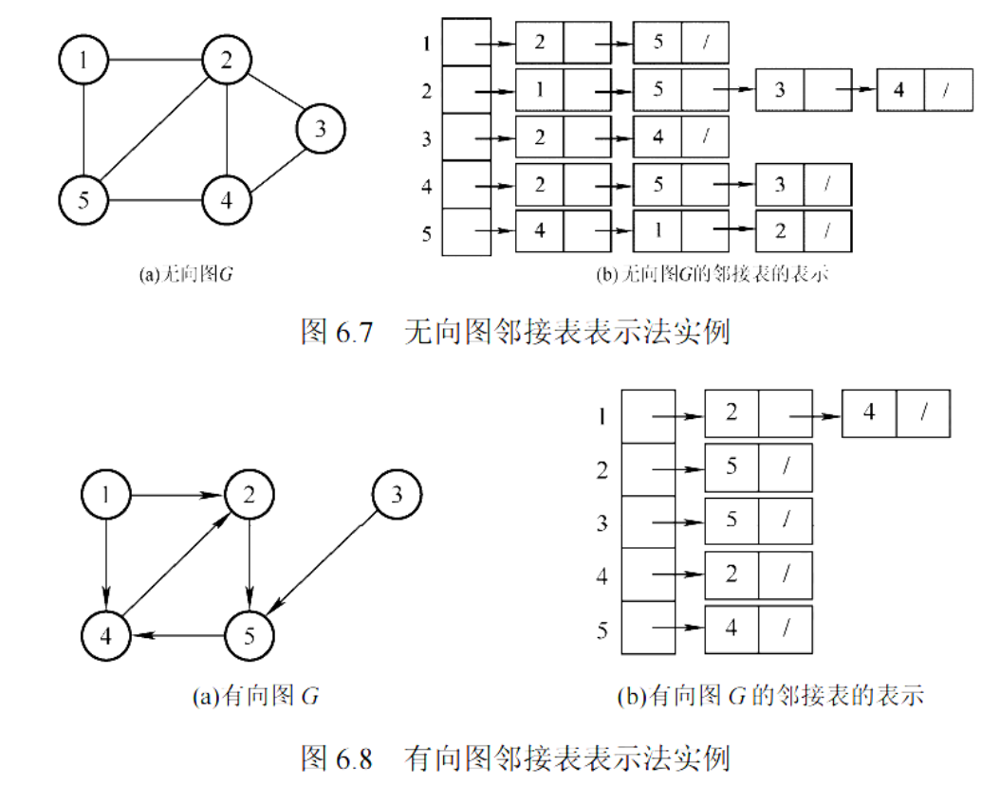

空间：$V+E$

#### 十字链表

只适用于**有向图**

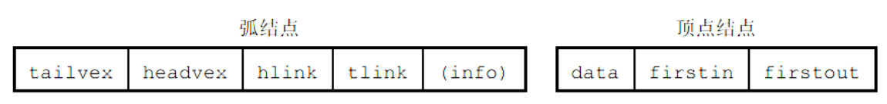

**顶点结点**：`firstin`以该点作为弧头的第一个弧；`firstout`以该点作为弧尾的第一个弧

**弧结点**：前两个分别是弧的尾头，后面两个是竖着和横着的`next`

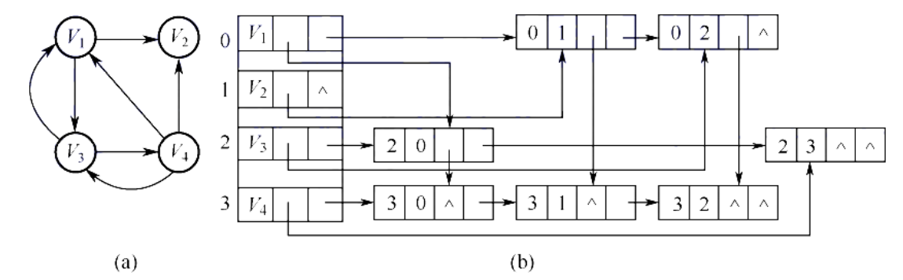

#### 邻接多重表

只适用于**无向图**

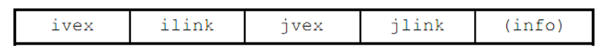

`ivex`域和`jvex`域=**两个顶点的编号**

`ilink`域指向ivex的**下一条边**；`jlink`域指向**jvex的下一条边**


`firstedge`=该节点的**第一条边**


### 3.图的遍历

#### BFS

辅助队列`Q`，且有`visit[]`，类似层次遍历

```java
boolean visited[] = new boolean[V];

void BFSTraverse(Graph G) {
    for (int i = 0; i < V; i++) {
        visited = false;
    }
    Queue Q = new Deque<Integer>();
    for (int i = 0; i < V; i++) {
        if (!visited[i]) {
            BFS(G, i);
        }
    }
}

void BFS(Graph G, int i) {
    visited[i] = true;
    Q.offer(i);
    while (Q.isNotEmpty()) {
        int peek = Q.poll();
        for (int j = 0; j < V; j++) {
            if (G.edge[peek][j] == 1 && !visited[j]) {
                visited[j] = true;
                Q.offer(j);
            }
        }
    }
}
```

适合走迷宫类问题

**空间复杂度**：**$O(V)$**，辅助队列`Q`

**时间复杂度**：**$O(V+E)(邻接链表)$、$O(V^2)(邻接矩阵)$**

#### DFS

类似先序遍历

**空间复杂度**：**$O(V)$**，递归栈

**时间复杂度**：**$O(V+E)(邻接链表)$、$O(V^2)(邻接矩阵)$**

> 连通图/强连通图，一次调用BFS/DFS即可访问所有点
>
> 非连通图/非强连通图，一次调用BFS/DFS不能访问所有点

### 4.图的应用

#### 最小生成树

最小生成树，**边数=顶点数-1**

---

**Prim算法**：

1. 先选一个点，然后选**离它最近的一个点**
2. 更新其它点到这个新整体的距离
3. 在选一个离新整体最近的点

**时间复杂度**：**$O(V^2)$**，只和顶点有关

---

**Kruskal算法**：

1. 选**最短的一条边**
2. 如果不构成回路，则加入，否则丢弃
3. 直到有n-1条边

**时间复杂度**：**$O(E\log_2E)$**，只和变有关

#### 最短路径

**Dijkstra算法**：单源最短路径

每次**选离源点最短的点**，更新其它点到新整体的距离


**时间复杂度**：**$O(V^2)$**，只和顶点有关

**边上有负值时，Dijkstra算法不适用**

---

**Floyd算法**：

```java
dist[i][j] = min(dist[i][j], dist[i][k] + dist[k][j])
```

**时间复杂度**：**$O(V^3)$**，只和顶点有关

**允许负权的边，不允许总权值为负的回路**


#### 有向无环图

DAG图，编译原理里有讲过


#### 拓扑排序

AOV网无权值

不断找**入度为0**的点输出；找不到则说明有回路


**时间复杂度**：**$O(V+E)(邻接链表)$、$O(V^2)(邻接矩阵)$**

拓扑排列的结果不一定唯一

#### 关键路径

AOE网有权值

人话：**一个点只有等所有指向它的点都完成才能开始，因此最早开始时间是指向它的所有点中的最晚时间**，求出所有点的最早开始时间后，选一条**时间最长的路径**就是关键路径


1. `v_e`就是每个点的最早开始时间

	

2. `v_l`是每个点的最晚开始时间，从`v_6`开始反着来减，找最大值

	

3. `e`是弧的最早开始时间，等于弧尾的最早开始时间`v_e`

4. `l`是弧的最晚开始时间，等于弧头的最晚开始时间减`weight`：`v_l-weight`

5. 最后`l-e=0`的就是关键路径

**关键路径不唯一**


## 第7讲：查找

### 1.查找的概念

静态查找表：只查不改，适用于顺序、折半、散列

动态查找表：CRUD，适用于二叉排序树、散列

平均查找长度**ASL**：**被查找概率\*比较次数**

### 2.顺序查找和折半查找

#### 顺序查找

**一般顺序查找**：
$$
\mathrm{ASL}_\text{战功}=\sum_{i=1}^nP_i(n-i+1)=\frac{n+1}{2} \\\\
\mathrm{ASL}_\text{ 不成功 }=n+1
$$

---

**有序线性查找**：


有**n+1个空隙**，到达**最后两个空隙都需要比较n次**
$$
\text{ASL}{\text{不成功}} = \sum{j=1}^{n} q_j (l_j - 1) = \frac{1 + 2 + \cdots + n + n}{n+1} = \frac{n}{2} + \frac{n}{n+1}
$$

#### 折半查找


$$
\text{ASL} = \frac{1}{n}\sum_{i=1}^{n} l_i = \frac{n+1}{n}\log_2(n+1) - 1 \approx \log_2(n+1) - 1 \\\\
查找成功（圆形结点）：ASL=(1×1+2×2+3×4+4×4)/11=3\\\\
查找失败（方形结点）：ASL=(3×4+4×8)/12=11/3
$$

#### 分块查找

块内无序，块间有序

块内顺序，块间折半

### 3.树形查找

#### 二叉排序树

**不能有重复元素**

CRUD复杂度均为`O(logn)`

**二叉排序树的删除**：

1. 叶子结点直接删除

2. 被删除结点**只有一个子树**，则将子树直接连到父结点

3. 被删除结点有**两个子树**，则用其直接后继(**右子树的最左结点**)代替

	

#### 平衡二叉树

注意：平衡二叉树是**所有的子树都平衡**，**并不只有根节点所在的树平衡**

```Java
boolean isAVL = true;

int treeLevel(TreeNode root) { // 在求树的高度中顺带判断是否平衡
    if (root == null)
        return 0;
    int leftLevel = treeLevel(root.left);
    int rightLevel = treeLevel(root.right);
    if (Math::abs(leftLevel - rightLevel) > 1)
        isAVL = false;
    return Math::abs(leftLevel, rightLevel) + 1;
}
```


**LL**：右旋


**RR**：左旋


**LR**：C先左旋到B，再右旋到A


**RL**：C先右旋到B，再左旋到A


**深度为n的平衡二叉树最少结点数**：
$$
n_h=n_{h-2}+n_{h-1}+1
$$


#### 红黑树


**null是黑色的**

**最长路径不会超过最短路径的两倍**，比如上图中，最短为左子树三黑，最后为右子树的黑红黑红黑

红黑树不平衡，搜索效率率低于AVL树，但插入和删除效率高于AVL树

红黑树的插入和构造不想记

### 4.B树和B+树

> 二叉搜索树、AVL树、红黑树都是将全部数据读到内存中，数据量不大
>
> 而B树适用于数据量很大，无法一次性读入内存，只能一次读一个结点进行比较，然后再比较下一个结点
>
> 硬盘访问次数和树的高度成正比，**B树可以降低硬盘访问次数**（Mysql使用B+树存储数据）

#### B树

**最下面查找失败的外部结点叫叶子结点**


$$
m阶B树最多m个子树，m-1个元素 \\\\

m阶B树至少 \left\lceil \frac{m}{2} \right\rceil个子树，\left\lceil \frac{m}{2} \right\rceil -1个元素
$$
**根结点最少还是1个元素**

> 上图中每个结点最多5个子树，4个元素；最少3个子树，2个元素

**访问结点在硬盘上进行**；**结点内查找是在内存中进行**

---

**插入**：出现上溢出，则**中间左偏结点向上提**

> **4阶**B树：最多3个元素，最少1个元素
>
> 
>
> 
>
> 
>
> 
>
> 
>
> 
>
> 
>
> 
>
> 
>
> 

---

**删除**：

1. **删除非最后一层的元素，都用其直接前驱或后继代替**

	

	

2. **出现下溢出，向左右兄弟借**

	

	**把父节点元素下移，兄弟元素上移**

	

	

3. **左右兄弟都不够借，和其中一个合并**

	**父节点先下移再合并**

	

	

	

4. **父节点下溢出的情况**

	

	

	

#### B+树


每个结点**元素和子树个数相同**

**每个元素对应子树的元素最大值**

---

**最后一层不存储数据，而是指向数据的地址**


### 5.散列表

#### 散列函数

1. 直接定址法
2. 除留余数法
3. 数字分析法
4. 平方取中法

#### 哈希冲突

**开放定址法**：放到现有的其它空间，**不开辟新的空间**

1. 线性探测法：向后递推
2. 平方探测法：$d_i=1^2,-1^2,2^2,-2^2,\cdots,k^2,-k^2$
3. 双散列法：$d_i=i\mathrm{xHash}_2(\mathrm{key})$，利用第二个散列函数$Hash_2(key)$计算该关键字的地址增量
4. 伪随机数法

---

**拉链法**：**开辟新的空间**


#### 装填因子

$$
\alpha=\frac{\text{表中记录数}n}{\text{散列表长度}m}
$$


## 第8讲：排序

### 1.排序的概念

**稳定排序**：**不改变相同元素的相对位置**

**不稳定排序**：**改变相同元素的相对位置**

**内部排序**：所有数据加载到内存中排序，**速度取决于时间复杂度**

**外部排序**：排序的数据不断在内存、外存中移动，**速度取决于内、外存移动次数**

### 2.插入排序

#### 直接插入排序

前面部分有序

#### 折半插入排序

时间复杂度仍为$O(n^2)$，因为每次循环需要把后面的元素向后移一位

#### 希尔排序

把间隔为 $d$ 的元素分为一组，每一组内部直接插入排序，不断减小 $d$ 直至为 1


### 3.交换排序

#### 冒泡排序

如果已经有序，则break，最好时间复杂度为 $O(n)$

#### 快速排序

分治思想，选一个 `pivot`，每一趟左边小于等于 `pivot`，右边大于等于 `pivot`

```Java
void quickSort(int[] arr, int low, int high) {
    if (arr == null || arr.length <= 1 || low >= high)
        return;
    
    int pivotIndex = partition(arr, low, high);
    quickSort(arr, low, pivotIndex - 1);
    quickSort(arr, pivotIndex + 1, high);
}

int partition(int[] arr, int low, int high) {
    int pivot = arr[low];
    while(low < high) {
        while(low < high && arr[high] >= pivot)
            high--;
        arr[low] = arr[high];
        while(low < high && arr[low] <= pivot)
            low++;
        arr[high] = arr[low];
    }
    arr[low] = pivot;
    return low;
}
```

```
[5, 3, 8, 6, 2, 7, 1, 4] 初始
[4, 3, 1, 2, 5, 7, 6, 8] 第1轮后（基准5归位）
[2, 3, 1, 4]             第2轮左子数组（基准4）
[1, 2, 3]                第3轮左子数组（基准2）
[6, 7, 8]                第4轮右子数组（基准7）
[1, 2, 3, 4, 5, 6, 7, 8] 最终结果
```

### 4.选择排序

#### 简单选择排序

每次选一个最小的

#### 堆排序

**堆=完全二叉树**，用**一维数组存储**


**从最后一个子树开始，逐步向上调整为大根堆**


堆排序就是建立完堆后，**逐步输出并删除堆顶元素**

---

**删除**：


1. **堆顶和最后一个元素交换**
2. 然后**逐步向下调整**


---

**插入**：

1. 新结点放在末端
2. 然后**逐步向上调整**


---


适用于从海量数据中找最大的几个数

**建堆时间复杂度 $O(n)$**

**删除和插入只和树高度有关**，**时间复杂度 $O(\log_2n)$**

### 5.归并排序

需要辅助空间，**空间复杂度 $O(n)$**

```Java
void mergeSort(int[] arr, int low, int high) {
    if (arr.legnth == 0 || arr.length == 1)
        return;
    int mid = (low + right) / 2;
    mergeSort(arr, low, mid);
    mergeSort(arr, mid + 1, high);
    int[] temp = new int[arr.length]; // 辅助空间
    int i = 0, j = mid + 1, index = 0;
    while(i <= mid && j <= high) {
        if (arr[i] <= arr[j])
            temp[index++] = arr[i++];
        else
            temp[index++] = arr[j++];
    }
    while(i <= mid)
        temp[index++] = arr[i++];
    while(j <= high)
        temp[index++] = arr[j++];
    for (index = 0; index < arr.length; index++)
        arr[index] = temp[index];
}
```

### 6.基数排序和计数排序

#### 基数排序

就是**桶排序**

```
[329, 457, 657, 839, 436, 720, 355]
按个位排序
[720, 355, 436, 457, 657, 329, 839]
再按十位排序
[720, 329, 436, 839, 355, 457, 657]
再按百位排序
[329, 355, 436, 457, 657, 720, 839]
```

**按每次排序完成的顺序放入下一个桶中**

**时间复杂度**：**$O(d(n+r))$**，其中 **d=3, r=10**

#### 计数排序

给定数的范围，先构造数组，然后一次遍历，**统计每个数出现的次数**

### 7.内部排序比较

| 算法种类     | 最好情况  | 平均情况      | 最坏情况  | 空间复杂度   | 是否稳定 |
| ------------ | --------- | ------------- | --------- | ------------ | -------- |
| 直接插入排序 | **O(n)**  | O(n²)         | O(n²)     | O(1)         | 是       |
| 冒泡排序     | **O(n)**  | O(n²)         | O(n²)     | O(1)         | 是       |
| 简单选择排序 | O(n²)     | O(n²)         | O(n²)     | O(1)         | **否**   |
| 希尔排序     | -         | -             | -         | O(1)         | **否**   |
| 快速排序     | O(nlog₂n) | O(nlog₂n)     | **O(n²)** | **O(log₂n)** | **否**   |
| 堆排序       | O(nlog₂n) | O(nlog₂n)     | O(nlog₂n) | O(1)         | **否**   |
| 二路归并排序 | O(nlog₂n) | O(nlog₂n)     | O(nlog₂n) | **O(n)**     | 是       |
| 基数排序     | O(d(n+r)) | **O(d(n+r))** | O(d(n+r)) | **O(r)**     | 是       |

### 8.外部排序

外部排序指的是大文件的排序，即待**排序的记录存储在外存中**，待排序的文件**无法一次性装入内存**，需要在**内存和外存之间进行多次数据交换**，以达到排序整个文件的目的。

**时间取决于IO次数**


**上图进行了3趟归并(树高为3)**

#### 多路平衡归并与败者树

**增加归并路数，降低归并趟数**，但是**归并算法复杂度会增加**；为了**避免归并算法复杂度增加，引入败者树**

1. **叶子节点**：多路归并的各路当前元素
2. **非叶子节点**：比较中的**失败者**的**索引**
3. **根节点**：**全局败者**（最终**胜者不保存在树中，直接输出**）
4. 在**根节点上加一个结点表示最终胜者**


#### 置换-选择排序

**作用**：将大量数据分成若干个**有序的块**（而不是完全排序），为后续多路归并排序做准备

**核心思想**：利用有限内存，边读数据边排序，输出一组**相对有序的子序列**，减少后续归并次数


#### 最佳归并树

**作用**：在**多路归并排序**中，**用最少的读写次数**将多个有序小文件（归并段）合并成一个大文件

**核心思想**：像“合并快递包裹”一样，**优先合并小的文件**，减少总搬运（I/O）次数

**本质**：**多路哈夫曼树**


上述方法并不是最佳

若**初始归并段不足以构成一颗完整的k叉树**，则添加长度为0的**虚段**


---

**计算虚段个数**：
$$
\text{设度为 }0\text{ 的结点有 }n_0\text{ 个,度为 }k\text{ 的结点有 }n_k\text{ 个,归并树的结点总数为 }n \\\\
\begin{aligned}n&=n_k+n_0\\\\n&=kn_k+1\end{aligned} \\\\
n_k=(n_0-1)/(k-1) \\\\
(n_0-1)\%(k-1)=0，正好可以构造k叉归并树 \\\\
(n_0-1)\%(k-1)=u\neq0，有u个多余，补上k-n-1个虚段
$$


# 计算机组成原理

