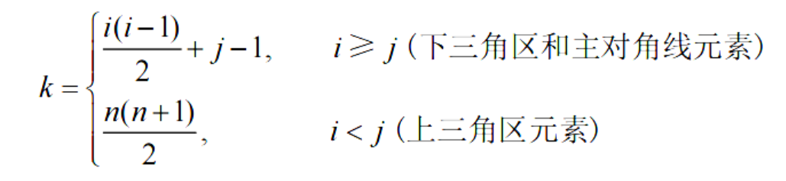
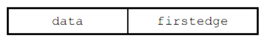

# 数据结构

## 第1章：绪论

### 1.数据结构

#### 数据

- **定义**：就是信息的原始素材，可以是数字、文字、符号等。
- **例子**：`3, "苹果", 3.14, 'A'` 这些都是数据，但它们是零散的、无意义的。

#### 数据元素

- **定义**：数据的基本单位（就像组成表格的"一行"）。
- **例子**：一个学生的信息（`学号:101，姓名:张三，年龄:20`）就是一个数据元素。

#### 数据对象

- **定义**：同一类数据元素的集合（类似"`全班花名册`"）。
- **例子**：全班50个学生的信息合起来就是一个数据对象。

#### 数据类型

- **定义**：数据的种类，决定了能对它做什么操作（比如数字能加减，文字不能）。
- 例子：
	- `int`（整数类型）：可以加减乘除。
	- `string`（字符串类型）：可以拼接、截取。

#### 数据结构

- **定义**：数据元素之间的组织方式，目的是高效存取或操作。
- 例子：
	- **数组**：像一排连续盒子，快速按编号找东西。
	- **链表**：像手拉手的小朋友，插入删除灵活但查找慢。
	- **树**：像家族家谱，适合表达层级关系。

> - **数据**：`"张三", 20, "李四", 19`（零散信息）
> - **数据元素**：`{"姓名":"张三", "年龄":20}`（一个学生的完整信息）
> - **数据对象**：全班学生的信息集合（所有数据元素放一起）
> - **数据类型**：年龄是`int`，姓名是`string`（规定怎么存、怎么算）
> - **数据结构**：用**数组**存学生（快速查第n个），或用**链表**存（方便插班生）

> **数据**和**数据元素**是原材料，**数据结构**是包装盒

#### 数据结构三要素

1. **逻辑结构**：数据元素之间**一对一、一对多、多对多**的关系（比如**有序表**）
2. **存储结构**：**物理空间**中的存储方法（比如**顺序、链式、索引、散列存储**）
3. 数据的运算

### 2.算法

#### 五个特征

1. 有穷性
2. 确定性
3. 可行性：算法的每条操作都可以实现的
4. 输入
5. 输出

#### 时间复杂度

一般考虑最坏情况

#### 空间复杂度

额外空间


## 第2章：线性表

### 1.线性表

线性表是**逻辑结构**，可**顺序或链式存储**

有前驱和后继

### 2.顺序表

逻辑顺序和物理顺序相同

**空间固定，满了需要扩容**

**随机访问**

结点只存储数据，**不存储数据之间的关系**

### 3.链表

**注意链表的头结点不存储数据，只为方便遍历和插入**

**插入删除的时间复杂度是$O(n)$，因为要找前一个结点**

#### 双链表

**可以在$O(1)$复杂度内完成插入删除**（不用遍历找前一个结点）

#### 循环链表

**尾结点的next是头结点，而不是$a_1$**

#### 静态链表

用**表格**的形式表示链表，以`next=-1`作为结束标志


## 第3章：栈与队列

### 1.卡特兰数

$$
n个元素进栈，有\frac{1}{n+1}C^n_{2n}种出栈排列 \\\\
C_0=1\\\\
C_1=1\\\\
C_2=2\\\\
C_3=5\\\\
C_4=14
$$

> 注意：这里的n个元素进栈是有顺序的，比如以`123`的顺序进栈，但是出栈的顺序有`123，132，213，231，321`五种

### 2.顺序栈

逻辑结构是线性表

初始时设置`S.top=-1`

### 3.共享栈


**降低上溢风险**，因为共享栈更大，只有整个空间被占满才会上溢

**栈满条件**：

1. 起始指针为`-1和MaxSize`，表示**已被占用的位置**，`top1-top0=1`
2. 起始指针为`0和MaxSize-1`，表示**下一个将被占用的位置**，两指针以“`top0top1`”相遇时并不会栈满，而是以“`top1top0`”形式相遇时才会栈满，因此栈满条件为`top0-top1=1`

### 4.链栈


链栈**不会上溢**

**没有头结点**

**所有操作在表头完成**

### 5.队列

逻辑结构是线性表

**尾进头出**

**front指向队头，rear指向队尾的下一个元素**

初始时`front=rear=0`


### 6.循环队列


循环队列**以数组的形式存储**

循环队列是**物理结构**

由于判断队满和队空的条件均为`front=rear`，因此采取下面三种方式区分栈满和栈空

1. 牺牲一个存储单元`(rear+1)%MaxSize=front`栈满
2. 引入`size`
3. 引入`tag`，`tag=1`栈满

### 7.链队列

单链表，头指针指向**头结点**，尾指针指向最后一个结点

注意，出队时，如果只剩最后一个结点，则要额外把`rear`移动到头结点和`front`重合，以便通过`front=rear`判断队空


### 8.双端队列


输出受限的双端队列：


输入受限的双端队列：


> 输入序列1234
>
> 对于输出受限，预得到4213，先从左右插入得到4213：`1->21->213->4213`，全部左出
>
> 对于输入受限，预得到4132，先从一端插入1234，然后从两端取出：`1234->123->23->3`

### 9.栈与队列的应用

#### 括号匹配

遍历，左括号入栈，右括号则去匹配栈顶

#### 后缀表达式和表达式求值

也称**逆波兰式**

**中缀转后缀**：有一个`op`栈暂存符号


**计算中缀表达式**，比如`A+B*(C-D)-E/F`：

1. `num`和`op`两个栈
2. 数字直接入栈
3. 若**栈顶的优先级$\geq$自己，则一直出栈**，直到栈顶优先级$<$自己或栈空为止
4. **右括号一直出栈，直到找到左括号**

#### 栈与递归

#### 队列与层次遍历

```java
while(!Q.isEmpty()) {
    int n = Q.size();
    for (int i = 0; i < n; i++) {
        TreeNode node = Q.pop();
        if (node.left != NULL) {
            Q.push(node.left);
        }
        if (node.right != NULL) {
            Q.push(node.right);
        }
    }
}
```

#### 缓冲区与消息队列

缓冲区：解决快慢匹配问题（如CPU与打印机）

消息队列：异步、削峰（多个外设同时请求CPU）、解耦

### 10.数组和特殊矩阵

#### 对称矩阵

上下三角半区的元素相同，因此**存储在一维数组$[n(n+1)/2]$中**，在一维数组中的下标k与矩阵的坐标关系：


#### 三角矩阵

和对称矩阵类似，不过**最后要存储对角线另一侧的常数（三角矩阵对角线另一侧全为常数）**：




#### 三对角矩阵

存放到**一维数组**：


#### 稀疏矩阵

**三元组**$(i,j,a_{ij})$，可用**数组或十字链表存储三元组**


## 第4章：串

### 1.KMP算法

书写得依托答辩，看下面的图即可：

**主串的指针i永远不回退**：


当匹配失败时，找**最后一个匹配位置的next的值**。新一轮匹配时，**模式串直接跳过next的值个字符**，将当前的字符和主串匹配失败的位置继续匹配

现在，所有的问题在于如何寻找next数组

### 2.next数组

next数组的本质就是**寻找子串中相同前后缀的长度**：


计算方法见下图：


### 3.递推求解next数组

核心思想：没必要每次都寻找最长前后缀，可以根据**动态规划**的思想，**利用前面掌握的信息递推下一项**


下面可能有点绕，解释一下：下一位不匹配，但是子串`ABACABA`已经匹配过了，它存在最长前后缀`ABA`，那么后面那个`A`在左边已经求得跳跃长度为1(`next[2]=1`)，因此只需子串`ABACABA`跳过第一个`A`，然后第二个`B`匹配，因此这里的`B`的最长前后缀为`next[2]+1=2`


## 第5章：树与二叉树

### 1.树的概念

**结点的度=出度**；**树的度=最大度数**

**结点的路径长度=两结点之间的边数**；**树的路径长度=根到所有结点的路径长度总和**

### 2.二叉树

**二叉树是有序树**
$$
n个结点最多形成\frac{(2n)!}{(n+1)!n!}个二叉树
$$
**二叉树**和**度为2的树**的区别：

1. 二叉树可以为空；度为2的树至少要有3个结点
2. 二叉树有序；度为2的树不一定有序

#### 满二叉树

**每一层都填满**

#### 完全二叉树

可以**用一维数组存储**


**完全二叉树度为1的结点最多1个**（非常重要）

注意：完全二叉树的**叶子节点最后一层和倒数第二层都可能有**，**不能忽略倒数第二层**

#### 正则二叉树

只有度为0或2的结点

#### 性质

$$
&n_0+n_1+n_2=n_1+2 \times n_2+1 \\\\
&n_0=n_2+1
$$

### 3.二叉树的遍历和线索二叉树

#### 二叉树的遍历

先序遍历：一根线围一圈

中序遍历：竖着看

后序遍历：从左到右摘葡萄

#### 由遍历构造二叉树

核心思路：**分治**

**先序+中序**：

```java
TreeNode findTreeByPreorderInorder(String preorder, String inorder) {
    if (preorder.isEmpty() || inorder.isEmpty()) {
        return null;
    }
    if (preorder.length() == 1 || inorder.length() == 1) {
        return new TreeNode(preorder.charAt(0) - '0');
    }
    
    char root = preorder.charAt(0);
    int rootIndex = inorder.indexOf(root); // 左子树的大小
    
    String leftPreorder = preorder.substring(1, rootIndex + 1);
    String rightPreorder = preorder.substring(rootIndex + 1);
    String leftInorder = inorder.substring(0, rootIndex);
    String rightInorder = inorder.substring(rootIndex + 1);
    
    TreeNode left = findTreeByPreorderInorder(leftPreorder, leftInorder);
    TreeNode right = findTreeByPreorderInorder(rightPreorder, rightInorder);
    
    return new TreeNode(root - '0', left, right);
}
```

**后序+中序**：

基本同理，不再赘述

**层次+中序**：

```java
TreeNode findTreeByLevelorderInorder(String levelorder, String inorder) {
    if (levelorder.isEmpty() || inorder.isEmpty()) {
        return null;
    }
    if (levelorder.length() == 1 || inorder.length() == 1) {
        return new TreeNode(levelorder.charAt(0) - '0');
    }
    
    char rootVal = levelorder.charAt(0);
    int rootIndex = inorder.indexOf(rootVal); // 左子树的大小
    
    String leftInorder = inorder.substring(0, rootIndex);
    String rightInorder = inorder.substring(rootIndex + 1);
    
    StringBuilder leftLevelorder = new StringBuilder();
    StringBuilder rightLevelorder = new StringBuilder();
    
    // 整体的层次遍历，包含了左右子树的层次遍历
    // 如果元素来自左子树，则加入leftInorder，加入顺序符合左子树层次遍历的顺序
    for (int i = 1; i < levelorder.length(); i++) {
        char c = levelorder.charAt(i);
        if (leftInorder.indexOf(c) != -1) {
            leftLevelorder.append(c);
        } else if (rightInorder.indexOf(c) != -1) {
            rightLevelorder.append(c);
        }
    }
    
    TreeNode left = 
        findTreeByLevelorderInorder(leftLevelorder.toString(), leftInorder);
    TreeNode right = 
        findTreeByLevelorderInorder(rightLevelorder.toString(), rightInorder);
    
    return new TreeNode(rootVal - '0', left, right);
}
```

#### 线索二叉树

**总空间：`2n`**

**使用：`n-1`**

**空余：`n+1`**

线索二叉树就是要**把空余的`n+1`个空间利用起来**，用它们**指示结点的先\中\后序遍历的前驱和后继**

增加`ltag`和`rtag`，标识左右子树是指向孩子还是前驱后继：


遍历**中序**线索二叉树：

```java
TreeNode nextNode(TreeNode root) {
    if (root.rtag == 0) { // 右子树的最左结点
        return firstNode(root.right);
    }
    return root.right; // 直接返回后继
}

TreeNode firstNode(TreeNode root) { // 树的最左结点
    if (root == null || root.left == null) {
        return null;
    }
    return firstNode(root.left);
}
```

### 4.树和森林

#### 树的表示法

**双亲表示法**：


**孩子表示法**：


**孩子兄弟表示法**：

```c
typedef struct TreeNode {
    ElemType* data;
    struct TreeNode *firstChild, *nextBrother;
} TreeNode, *Tree;
```

有第一个孩子和下一个兄弟，可以轻易**将森林化为二叉树**

#### 树、森林、二叉树转换

**树->二叉树**：

`left`指向**第一个孩子**，`right`指向**右兄弟**：


**森林->二叉树**：

同理

**二叉树->森林**：

1. **根结点和左子树是一棵树**，**断开右子树**；
2. 右子树重复上述操作


#### 树和森林的遍历

树的**先根遍历**

树的**后根遍历**

**森林的先序遍历**：依次**先根遍历**每一棵树

**森林的中序遍历**：依次**后根遍历**每一棵树


### 5.树与二叉树的应用

#### 哈夫曼树

树的带权路径长度(只算叶子结点)最小


#### 并查集

作用：**查找两个元素是否属于同一集合，合并两个集合**

`Initial`，`Union`，`Find`


**用数组表示并查集**

**数组的index是编号，数组的值是index的父结点**

构造并查集的步骤如下图（**也可初始化为-1或其它负数**）：


```java
void init(int[] parent) {
    for (int i = 0; i < parent.length; i++)
        parent[i] = i; // 所有元素的父节点初始化为自己
}

int find(int[] parent, int index) {
    return parent[index] == index ? index : find(parent, parent[index]);
}

void union(int[] parent, int index1, int index2) {
    parent[find[index2]] = find[index1];
}
```

**路径压缩**：为了**避免让树过高**，可以在**find的过程中，让树的每一个元素的parent直接指向根节点**


```java
int find(int[] parent, int index) {
    if (parent[index] != index) {
        parent[index] = find(parent, parent[index]); // 路径压缩
    }
    return parent[index];
}
```


## 第6讲：图

### 1.图的概念

**顶点集非空，边集可为空**

#### 简单图

1. 无重复边
2. 无指向自己的边

#### 多重图

非简单图

#### 简单路径

顶点不重复的路径

#### 简单回路

顶点不重复的回路

#### 距离

距离=最短路径

#### 连通、连通分量

**无向图**的概念


#### 强连通、强连通分量

**有向图**的概念

任意两点相互有弧

#### 生成树

性质：**边数=顶点数-1**（重要）


#### 网

网=带权的图

#### 完全图

边全满

### 2.图的存储

#### 邻接矩阵

适合**稠密图**

空间：$V^2$

#### 邻接链表

分为**顶点表**和**边表**

**顶点表竖着，边表横着**


空间：$V+E$

#### 十字链表

只适用于**有向图**


**顶点结点**：`firstin`以该点作为弧头的第一个弧；`firstout`以该点作为弧尾的第一个弧

**弧结点**：前两个分别是弧的尾头，后面两个是竖着和横着的`next`


#### 邻接多重表

只适用于**无向图**


`ivex`域和`jvex`域=**两个顶点的编号**

`ilink`域指向ivex的**下一条边**；`jlink`域指向**jvex的下一条边**



`firstedge`=该节点的**第一条边**


### 3.图的遍历

#### BFS

辅助队列`Q`，且有`visit[]`，类似层次遍历

```java
boolean visited[] = new boolean[V];

void BFSTraverse(Graph G) {
    for (int i = 0; i < V; i++) {
        visited = false;
    }
    Queue Q = new Deque<Integer>();
    for (int i = 0; i < V; i++) {
        if (!visited[i]) {
            BFS(G, i);
        }
    }
}

void BFS(Graph G, int i) {
    visited[i] = true;
    Q.offer(i);
    while (Q.isNotEmpty()) {
        int peek = Q.poll();
        for (int j = 0; j < V; j++) {
            if (G.edge[peek][j] == 1 && !visited[j]) {
                visited[j] = true;
                Q.offer(j);
            }
        }
    }
}
```

适合走迷宫类问题

**空间复杂度**：**$O(V)$**，辅助队列`Q`

**时间复杂度**：**$O(V+E)(邻接链表)$、$O(V^2)(邻接矩阵)$**

#### DFS

类似先序遍历

**空间复杂度**：**$O(V)$**，递归栈

**时间复杂度**：**$O(V+E)(邻接链表)$、$O(V^2)(邻接矩阵)$**

> 连通图/强连通图，一次调用BFS/DFS即可访问所有点
>
> 非连通图/非强连通图，一次调用BFS/DFS不能访问所有点

### 4.图的应用

#### 最小生成树

最小生成树，**边数=顶点数-1**

---

**Prim算法**：

1. 先选一个点，然后选**离它最近的一个点**
2. 更新其它点到这个新整体的距离
3. 在选一个离新整体最近的点

**时间复杂度**：**$O(V^2)$**，只和顶点有关

---

**Kruskal算法**：

1. 选**最短的一条边**
2. 如果不构成回路，则加入，否则丢弃
3. 直到有n-1条边

**时间复杂度**：**$O(E\log_2E)$**，只和变有关

#### 最短路径

**Dijkstra算法**：单源最短路径

每次**选离源点最短的点**，更新其它点到新整体的距离


**时间复杂度**：**$O(V^2)$**，只和顶点有关

**边上有负值时，Dijkstra算法不适用**

---

**Floyd算法**：

```java
dist[i][j] = min(dist[i][j], dist[i][k] + dist[k][j])
```

**时间复杂度**：**$O(V^3)$**，只和顶点有关

**允许负权的边，不允许总权值为负的回路**


#### 有向无环图

DAG图，编译原理里有讲过


#### 拓扑排序

AOV网无权值

不断找**入度为0**的点输出；找不到则说明有回路


**时间复杂度**：**$O(V+E)(邻接链表)$、$O(V^2)(邻接矩阵)$**

拓扑排列的结果不一定唯一

#### 关键路径

AOE网有权值

人话：**一个点只有等所有指向它的点都完成才能开始，因此最早开始时间是指向它的所有点中的最晚时间**，求出所有点的最早开始时间后，选一条**时间最长的路径**就是关键路径


1. `v_e`就是每个点的最早开始时间

	

2. `v_l`是每个点的最晚开始时间，从`v_6`开始反着来减，找最大值

	

3. `e`是弧的最早开始时间，等于弧尾的最早开始时间`v_e`

4. `l`是弧的最晚开始时间，等于弧头的最晚开始时间减`weight`：`v_l-weight`

5. 最后`l-e=0`的就是关键路径

**关键路径不唯一**


## 第7讲：查找
