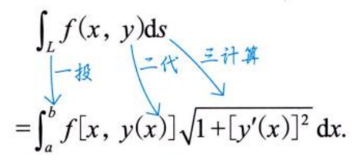
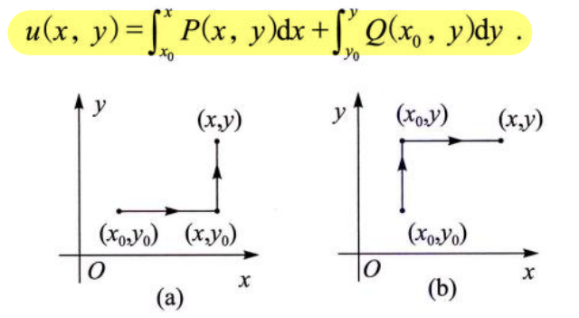
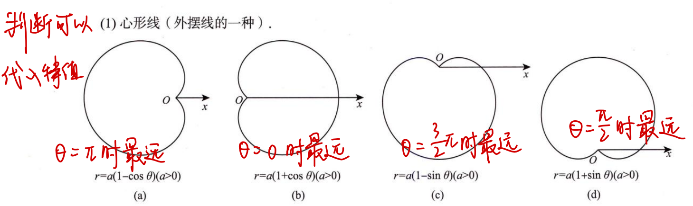
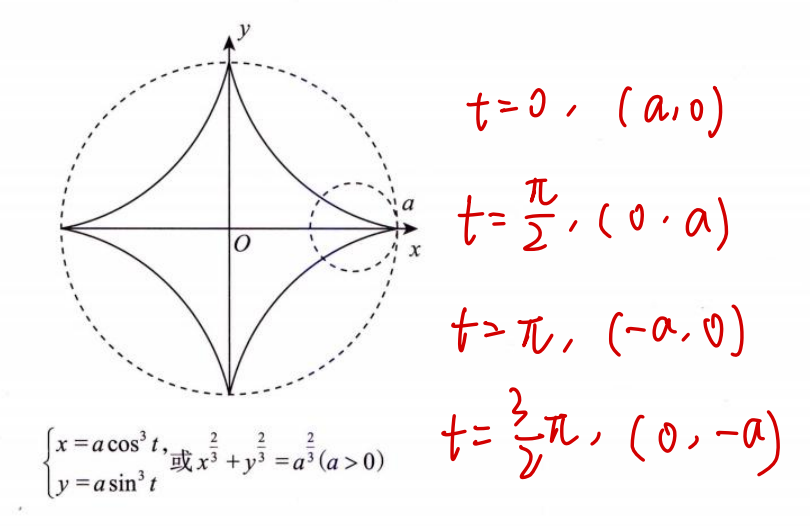
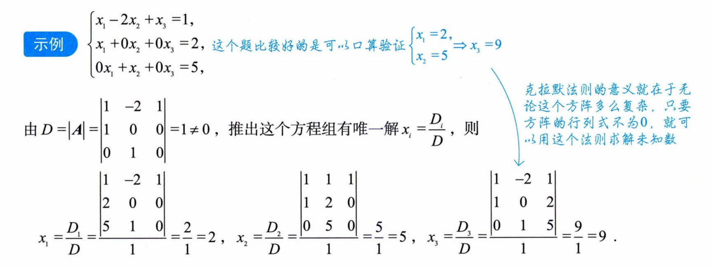
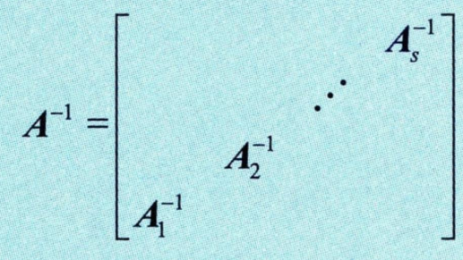
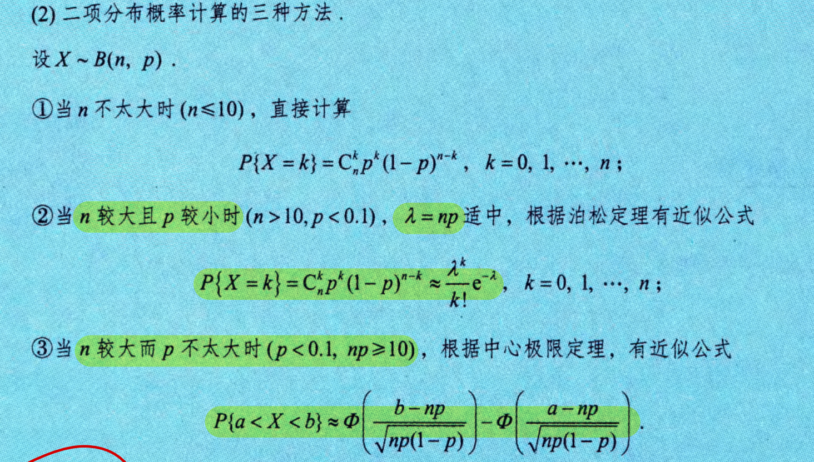
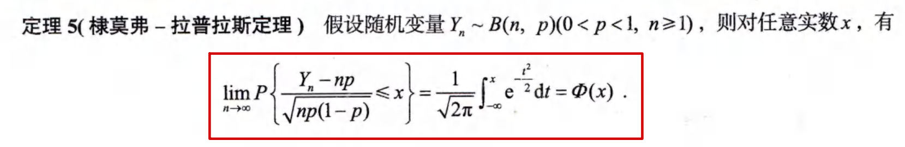
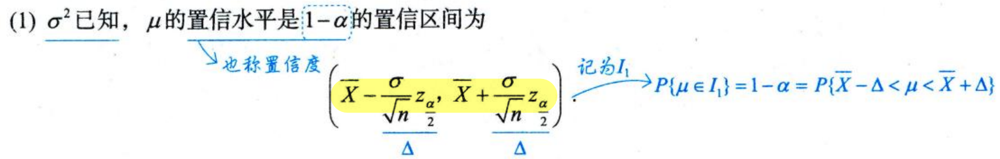

# 高数

## 零基础

### 韦达定理

$$
\text{设}f\left(x\right)=a_{n}x^{n}+a_{n-1}x^{n-1}+\cdots+a_{1}x+a_{0}=0\left(a_{n}\neq0\right)\text{的根为}x_{1},x_{2},\cdots,x_{n},\text{则}\\\\
\begin{cases}x_1+x_2+\cdots+x_n=-\frac{a_{n-1}}{a_n},\\\\x_1x_2+x_1x_3+\cdots+x_{n-1}x_n=\frac{a_{n-2}}{a_n},\\\cdots\cdots\\\\x_1x_2\cdots x_n=(-1)^n\cdot\frac{a_0}{a_n}.&\end{cases}
$$

### 均值不等式

$$
\frac{2}{\frac{1}{a}+\frac{1}{b}}\leqslant\sqrt{ab}\leqslant\frac{a+b}{2}\leqslant\sqrt{\frac{a^{2}+b^{2}}{2}}\left(a,b>0\right)
$$

### 三角不等式

$$
\left\|a\right\|-\left|b\right\|
\leqslant\left|a+b\right|
\leqslant\left|a\right|+\left|b\right|
$$

### 柯西不等式

$$
\begin{pmatrix}a_1^2+a_2^2+\cdots+a_n^2\end{pmatrix}\begin{pmatrix}b_1^2+b_2^2+\cdots+b_n^2\end{pmatrix}\geqslant\begin{pmatrix}a_1b_1+a_2b_2+\cdots+a_nb_n\end{pmatrix}^2
$$

### 对称变换

| 对称轴(中心) | 点 P(x,y)        | 函数 y=f(x)      | 方程 f(x,y)=0       |
| ------------ | ---------------- | ---------------- | ------------------- |
| x=0          | (-x, y)          | y=f(-x)          | f(-x, y)=0          |
| y=0          | (x, -y)          | y=-f(x)          | f(x, -y)=0          |
| (0,0)        | (-x, -y)         | y=-f(-x)         | f(-x, -y)=0         |
| y=x          | (y, x)           | x=f(y)           | f(y, x)=0           |
| y=-x         | (-y, -x)         | x=-f(-y)         | f(-y, -x)=0         |
| x=m          | (2m-x, y)        | y=f(2m-x)        | f(2m-x, y)=0        |
| y=n          | (x, 2n-y)        | y=2n-f(x)        | f(x, 2n-y)=0        |
| (m,0)        | (2m-x, -y)       | y=-f(2m-x)       | f(2m-x, -y)=0       |
| (0,n)        | (-x, 2n-y)       | y=2n-f(-x)       | f(-x, 2n-y)=0       |
| **(m,n)**    | **(2m-x, 2n-y)** | **y=2n-f(2m-x)** | **f(2m-x, 2n-y)=0** |
| **y=x+b**    | **(y-b, x+b)**   | **x=f(y-b)-b**   | **f(y-b, x+b)=0**   |
| **y=-x+b**   | **(b-y, b-x)**   | **x=b-f(b-y)**   | **f(b-y, b-x)=0**   |

注意函数的对称变换和点的对称变换具有对应性

可以理解为之前的y和x具有关系f，对称之后所有点依然连成线，也具有关系f

因此只需将对称过去的点，新的y和x带入f，就可以得到对称过去的函数

### 坐标系旋转变换

X、Y是新坐标系；x、y是旧坐标系

## 第1讲：函数极限与连续

### 1.双曲函数

**反双曲正弦函数**：奇
$$
y=\ln\left(x+\sqrt{x^{2}+1}\right)
$$
**双曲正弦函数**：奇
$$
y=\frac{e^{x}-e^{-x}}{2}
$$
**反双曲余弦函数**：**非奇非偶**
$$
y=\ln\left(x+\sqrt{x^{2}-1}\right)
$$
**双曲余弦函数**：偶
$$
y=\frac{e^{x}+e^{-x}}{2}
$$

### 2.函数的特性

**有界性**：$\left|f(x)\right|\leqslant M$

- **闭区间连续，则必有界**

**单调性**：$\left(x_{1}-x_{2}\right)\left[f\left(x_{1}\right)-f\left(x_{2}\right)\right]>0$

**奇偶性**：

- 前提：**定义域对称**
- 复合函数：**内偶则偶，内奇同外**
- **求导一次，奇偶性互换**

**周期性**：**导数和原函数的周期性相同**

### 3.幂函数

主要的函数图像如下

1. n为整数
	- 奇数，和$x^3$类似
	- 偶数，和$x^2$类似
	- **负数均为双曲线，注意对称性**
2. n为分数
	- **分母为奇数，定义域为R**
	- **分母为偶数，定义域为正数**
	- 大于1，和$x^3$类似
	- 小于1，和$x^\frac{1}{2}$类似
	- **负数均为双曲线，注意定义域和对称性**

### 4.反三角函数

$$
\arcsin(\sin x)=x, x\in\left[-\frac{\pi}{2}, \frac{\pi}{2}\right] \\\\
\arccos(\cos x)=x, x\in[0, \pi]
$$

**注意定义域**！如果题目中的定义域不在这个范围，则要**变换到此范围，然后利用诱导公式**

x相同，和为$\frac{\pi}{2}$
$$
\arcsin x+\arccos x=\frac{\pi}{2}\left(-1\leqslant x\leqslant1\right) \\\\
\arctan x+\operatorname{arccot}x=\frac{\pi}{2}\left(-\infty<x<+\infty\right)
$$

### 5.取整函数

$$
x-1<\left[x\right]\leq x
$$

**夹逼准则**

### 6.极限

**先做实数运算，再做趋核运算**

比如要**把分数的分子或分母看作一个整体**，不能先部分等价无穷小替换

---

极限存在的条件：**左右极限存在且相等**

---

**局部保号性**：极限大于0，则能在邻域找到函数值大于0

---

注意：**$\ln^{\alpha}x\ll x^{\beta}\ll a^{x}$**，无论是多少次幂。可以在极限计算时直接得到无穷或零

---

两个重要极限：
$$
\lim_{x\to0}\frac{\sin x}{x}=1 \\\\
\lim_{x\to\infty}\left(1+\frac{1}{x}\right)^x=e
$$

### 7.洛必达法则

**前提：必须是$\frac{0}{0}$或者$\frac{\infty}{\infty}$**

### 8.泰勒公式

x=a处的泰勒展开：
$$
f(x)=f(a)+f^{\prime}(a)(x-a)+\frac{f^{\prime\prime}(a)}{2!}(x-a)^2+\cdots+\frac{f^{(n)}(a)}{n!}(x-a)^n+o((x-x_0)^n)
$$
拉格朗日余项：
$$
\frac{f^{(n+1)}(\xi)}{(n+1)!}(x-x_0)^{n+1}
$$
佩亚诺余项：
$$
o((x-x_0)^n)
$$
x=0处，麦克劳林公式：
$$
f(x)=f(0)+f^{\prime}(0)x+\frac{f^{\prime\prime}(0)}{2!}x^2+\cdots+\frac{f^{(n)}(0)}{n!}x^n+o(x^n)
$$
**适用于分子或分母出现x的幂**
$$
\mathrm{e}^{x}=1+x+\frac{x^{2}}{2!}+\cdots+\frac{x^{n}}{n!}+\cdots \\\\
\frac{1}{1+x}=1-x+x^{2}-x^{3}+\cdots+(-1)^{n}x^{n}+\cdots \\\\
\frac{1}{1-x}=1+x+x^{2}+\cdots+x^{n}+\cdots \\\\
\ln(1+x)=x-\frac{x^{2}}{2}+\frac{x^{3}}{3}-\frac{x^{4}}{4}+\cdots+(-1)^{n-1}\frac{x^{n}}{n}+\cdots \\\\
\sin x=x-\frac{x^{3}}{3!}+\frac{x^{5}}{5!}-\frac{x^{7}}{7!}+\cdots+(-1)^{n}\frac{x^{2n+1}}{(2n+1)!}+\cdots \\\\
\cos x=1-\frac{x^{2}}{2!}+\frac{x^{4}}{4!}-\frac{x^{6}}{6!}+\cdots+(-1)^{n}\frac{x^{2n}}{(2n)!}+\cdots \\\\
(1+x)^{\alpha}=1+\alpha x+\frac{\alpha(\alpha-1)}{2!}x^{2}+\cdots+\frac{\alpha(\alpha-1)\cdots(\alpha-n+1)}{n!}x^{n}+\cdots \\\\
\tan x=x+\frac{1}{3}x^{3}+\cdots \\\\
\arcsin x=x+\frac{1}{6}x^{3}+\cdots \\\\
\arctan x=x-\frac{1}{3}x^{3}+\cdots
$$

### 9.七种未定式

$$
\frac{0}{0} \\ \frac{\infty}{\infty} \\ 0•\infty
$$

**化简**、**抓大头**

注意：

**n的极限，则把x当作常数进行讨论**

---

$$
\infty-\infty
$$

有分母，则**通分**

否则**提取公因式**（变为乘法），或者做**倒变换**

---

$$
\infty^{0} \\ 0^0
$$

公式法：
$$
u^v=e^{v\ln u}
$$

---

$$
1^{\infty}
$$

公式法：
$$
\lim u^{\nu}=\mathrm{e}^{\lim(u-1)\nu}
$$

### 10.连续与间断

连续：**极限存在且等于函数值**

第一类间断点：可去、跳跃

第二类间断点：无穷、振荡

## 第2讲：数列极限

### 1.数列发散

证明发散：

1. **存在子列发散**
2. **收敛到不同极限**

### 2.海涅定理

### 3.夹逼准则

**压缩映射原理**：

做题时要写出证明过程

### 4.单调有界准则

**证明数列存在极限**的方法：**单调+有界**

重要结论：

### 5.收敛速度

直接看例题理解：

数列极限均收敛于a，但是不知道它们的收敛速度（阶数），因此不能判断$a_n,b_n,c_n$的大小

## 第3讲：一元函数微分学的概念

### 1.可导

可导：**左右导数存在且相等**

**可导->连续->极限存在**

判断可导性，可以用**定义法**

---

$$
(u_{1}u_{2}u_{3})^{\prime}=u_{1}^{\prime}u_{2}u_{3}+u_{1}u_{2}^{\prime}u_{3}+u_{1}u_{2}u_{3}^{\prime}.
$$

$$
\text{设}f(x)\text{ 在 }x=a\text{ 处连续,}F(x)=f(x)|x-a|\text{,则}f(a)=0\text{ 是 }F(x)\text{ 在 }x=a\text{ 处可导的充分必要条件}
$$

**有切线不一定有导数**，比如无穷导数有切线，但是没有导数

### 2.微分

$$
\Delta x=dx \\
\Delta y=dy+O(\Delta x) \\
dy=A\Delta x=Adx=f(x_{0})dx \\
$$

**$dy$是微分，也叫线性主部**

可微的判断：利用$O(\Delta x)$高阶无穷小的性质：
$$
作极限\lim_{\Delta x\to0}\frac{\Delta y-A\Delta x}{\Delta x}\Leftrightarrow\Delta y=A\Delta x+O\left(\Delta x\right) \\
\text{若该极限等于 }0,\text{则 }y=f(x)\text{在点 }x_0\text{处可微,否则不可微}
$$

**复合函数的微分**，把$dx$改为$dg(x)$即可：

## 第4讲：一元函数微分学的计算

### 1.求导公式

$$
(\arcsin x)^{\prime}=\frac{1}{\sqrt{1-x^2}} \\\\
(\arccos x)^{\prime}=-\frac{1}{\sqrt{1-x^2}} \\\\
(\arctan x)^{\prime}=\frac{1}{1+x^2} \\\\
(\operatorname{arccot}x)^{\prime}=-\frac{1}{1+x^2} \\\\
(\tan x)^{\prime}=\sec^{2}x, \ (\cot x)^{\prime}=-\csc^{2}x \\\\
(\sec x)^{\prime}=\sec x\tan x, \ (\csc x)^{\prime}=-\csc x\cot x \\\\
\left[\ln(x+\sqrt{x^2+1})\right]^{\prime}=\frac{1}{\sqrt{x^2+1}} \\\\
\left[\ln(x+\sqrt{x^2-1})\right]^{\prime}=\frac{1}{\sqrt{x^2-1}}
$$

**求导数的时候要注意不可导点**

### 2.反函数求导

反函数一阶导：
$$
\frac{\mathrm{d}x}{\mathrm{d}y}=\frac{1}{\frac{\mathrm{d}y}{\mathrm{d}x}}
$$
反函数二阶导，**推导过程需要掌握**
$$
y_{xx}^{\prime\prime}=\frac{\mathrm{d}^{2}y}{\mathrm{d}x^{2}} \\\\
=\frac{\mathrm{d}\left(\frac{\mathrm{d}y}{\mathrm{d}x}\right)}{\mathrm{d}x} \\\\
=\frac{\mathrm{d}\left(\frac{1}{x_{y}^{\prime}}\right)}{\mathrm{d}x} \\\\
=\frac{\mathrm{d}\left(\frac{1}{x_{y}^{\prime}}\right)}{\mathrm{d}y}\cdot\frac{\mathrm{d}y}{\mathrm{d}x} \\\\
=\frac{\mathrm{d}\left(\frac{1}{x_{y}^{\prime}}\right)}{\mathrm{d}y}\cdot\frac{1}{x_{y}^{\prime}} \\\\
=-\frac{1}{(x_{y}^{\prime})^{2}}\cdot(x_{y}^{\prime})_{y}^{\prime}\cdot\frac{1}{x_{y}^{\prime}} \\\\
=-\frac{x_{yy}^{\prime\prime}}{(x_{y}^{\prime})^{2}}\cdot\frac{1}{x_{y}^{\prime}} \\\\
=-\frac{x_{yy}^{\prime\prime}}{(x_{y}^{\prime})^{3}}
$$

### 3.隐函数求导

注意$y=y(x)$

### 4.参数方程求导

$$
\frac{\mathrm{d}y}{\mathrm{d}x}=\frac{\mathrm{d}y/\mathrm{d}t}{\mathrm{d}x/\mathrm{d}t}=\frac{\psi^{\prime}(t)}{\varphi^{\prime}(t)}
$$

二阶导只需写成：
$$
\frac{d\left(\frac{dy}{dx}\right)/dt}{dx/dt}
$$
然后上下对t求导即可

### 5.对数求导法

- **多个式子乘积**
- **指数形式**

$$
\ln y=\ln f(x) \\\\
\frac{1}{y}y^{\prime}=[\ln f(x)]^{\prime} \\\\
y^{\prime}=\frac{yf^{\prime}(x)}{f(x)}
$$

### 6.幂指函数求导

$$
u\left(x\right)^{\nu\left(x\right)}=e^{\nu\left(x\right)\ln u\left(x\right)}
$$

### 7.高阶导数

**莱布尼茨公式**，适用于**两个函数乘积的高阶导数**：
$$
(u\nu)^{(n)}=u^{(n)}\nu+C_{n}^{1}u^{(n-1)}\nu^{\prime}+C_{n}^{2}u^{(n-2)}\nu^{\prime\prime}+\cdots+C_{n}^{k}u^{(n-k)}\nu^{(k)}+\cdots+C_{n}^{n-1}u^{\prime}\nu^{(n-1)}+u\nu^{(n)}
$$

---

**泰勒展开法**，适用于**x的幂函数**，和另一个**方便泰勒展开的函数**的乘积的高阶导数

泰勒展开具有**唯一性**，可以**对比所求阶(一般是n阶)的系数**

## 第5讲：一元函数微分学的几何应用

### 1.极值

**四种间断点都可以是极值点**

- 极值点**不一定可导**
- 极值点**不一定连续**
- 极值点**不一定有极限**

### 2.极值的判别

**必要条件**：一阶导存在，则一阶导为0

**充分条件**：

1. 去心邻域，左右一阶导异号。**适用于$f^{\prime}(x_0)$不存在的情况**
2. 一阶导为0，二阶导不为0。适用于$f^{\prime}(x_0)$存在的情况
3. 偶数阶导不为0。类比二阶导不为0

注意：充分条件中二阶导不能为0，但不是必要条件。因此极值点的二阶导可以为0：

### 3.凹凸性和拐点

凹凸性的特点：
$$
f\left(\lambda_{1}x_{1}+\lambda_{2}x_{2}\right)<\lambda_{1}f\left(x_{1}\right)+\lambda_{2}f\left(x_{2}\right) \  \text{或}\\\\
f(x_0)+f^{\prime}(x_0)(x-x_0)<f(x)
$$
拐点的特点：**拐点必连续**

**极值点只写横坐标，拐点要全部写完**

### 4.凹凸性和拐点的判别

凹凸性判别：
$$
f^{\prime\prime}(x)>0\text{,} \ \text{凹} \\
f^{\prime\prime}(x)<0\text{,} \ \text{凸}
$$
**必要条件**：二阶导存在，则二阶导为0

**充分条件**：

1. 去心邻域，左右二阶导异号。**适用于$f^{\prime\prime}(x_0)$不存在的情况**
2. 二阶导为0，三阶导不为0。适用于$f^{\prime\prime}(x_0)$存在的情况
3. 奇数阶导不为0。类比三阶导不为0

### 5.极值点和拐点的结论

1. 曲线的**可导点不可同时为极值点和拐点**；曲线的**不可导点可同时为极值点和拐点**

	

2. 设多项式函数$f(x)=(x-a)^ng(x)(n>1)$，**注意n>1**

	$n$为**偶数**时，$x=a$是$f(x)$的**极值点**

	$n$为**奇数**时，点(a,0)是曲线$f(x)$的**拐点**

3. 记$k_{1}$为$n_{i}=1$的个数，$k_{2}$为$n_{i}>1$且$n_{i}$为偶数的个数，$k_{3}$为$n_{i}>1$且$n_{i}$为奇数的个数，

	极值点个数为$k_{1}+2k_{2}+k_{3}-1$

	拐点个数为$k_{1}+2k_{2}+3k_{3}-2$

	

### 6.渐近线

1. **只求出a，求不出b，也没有斜渐近线**

	

2. 曲线可能和渐近线**有交点**

	

### 7.最值

1. **最值不一定是极值**
2. **极值不一定是最值**
3. **非端点的最值是极值**

**驻点+不可导点+端点**

### 8.曲率和曲率半径

**曲率**：
$$
k=\frac{|y^{\prime\prime}|}{[1+(y^{\prime})^2]^{\frac{3}{2}}}
$$
**曲率半径**：
$$
R=\frac{1}{k}=\frac{[1+(y^{\prime})^2]^{\frac{3}{2}}}{|y^{\prime\prime}|}
$$
弯曲程度越大，曲率越大，曲率半径越小

## 第6讲：一元函数微分学的中值定理

### 1.中值定理

前提：**f(x)在闭区间连续**

1. 有界最值定理
2. **介值定理**：最大最小值之间的函数值必存在
3. **平均值定理**：多个函数值的平均值必存在
4. 零点定理

### 2.费马定理

费马定理：极值可导，则一阶导为0

---

**导数零点定理**：闭区间可导，$f_+^{\prime}(a)\cdot f_-^{\prime}(b)<0$，则存在$f^{\prime}(\xi)=0$

证明思路：闭区间可导->闭区间连续->存在最大值->最大值不在端点->最大值在中间->最大值是极值->费马定理得极值点一阶导为0

### 3.罗尔定理

**闭区间连续，开区间可导**，存在两点函数值相等 -> 存在一阶导为0

**适用于证明$f^{\left(n\right)}\left(\xi\right)=0$**（证明$f^{\left(n\right)}\left(\xi\right)\neq0$用泰勒公式）

罗尔定理的使用**需要构造F(x)**

---

F(x)的构造方法：
$$
见到f\left(x\right)f^{\prime}\left(x\right),令F\left(x\right)=f^{2}\left(x\right)\\\\
见到\left[f^{\prime}\left(x\right)\right]^{2}+f\left(x\right)f^{\prime\prime}\left(x\right),令F\left(x\right)=f\left(x\right)f^{\prime}\left(x\right)\\\\
见到f^{\prime}\left(x\right)+f\left(x\right)\varphi^{\prime}\left(x\right),令F\left(x\right)=f\left(x\right)e^{\varphi\left(x\right)}\\\\
见到f^{\prime}\left(x\right)x-f\left(x\right),x\neq0,令F\left(x\right)=\frac{f\left(x\right)}{x}\\\\
见到f^{\prime\prime}(x)f(x)-\left[f^{\prime}(x)\right]^{2},f\left(x\right)\neq0,令F\left(x\right)=\frac{f^{\prime}\left(x\right)}{f\left(x\right)}\\\\
见到f^{\prime\prime}(x)f(x)-\left[f^{\prime}(x)\right]^{2},f(x)>0,亦可考虑令F\left(x\right)=\ln f\left(x\right)\\\\
(u\nu)^{\prime\prime}=u^{\prime\prime}\nu+2u^{\prime}\nu^{\prime}+u\nu^{\prime\prime}\text{亦有可能考到}.
$$

---

罗尔定理的推论：
$$
f^{\left(n\right)}\left(x\right)=0\text{无实根，}f\left(x\right)=0\text{至多有}n\text{个根}
$$

### 4.拉格朗日中值定理

**开区间连续，闭区间可导**，则有：
$$
f(b)-f(a)=f^{\prime}(\xi)(b-a)\\\\
f^{\prime}(\xi)=\frac{f(b)-f(a)}{b-a}
$$

### 5.柯西中值定理

**开区间连续，闭区间可导**，则有：
$$
\frac{f(b)-f(a)}{g(b)-g(a)}=\frac{f^{\prime}(\xi)}{g^{\prime}(\xi)}
$$

### 6.泰勒公式

**适用于证明$f^{\left(n\right)}\left(\xi\right)\neq0$**

适合在$x=\frac{1}{2}$处展开，带拉格朗日余项

## 第7讲：一元函数微分学的物理应用

## 第8讲：一元函数积分学的概念

### 1.不定积分

不定积分存在的**充分条件**：f(x)**连续**

不定积分存在的**必要条件**：f(x)**连续**或含有**振荡间断点**
$$
f(x)连续 \rightarrow F(x)可导 \rightarrow F(x)连续
$$

$$
F(x)可导 \rightarrow f(x)连续或含有振荡间断点 \rightarrow f(x)具有介值定理
$$

### 2.定积分

$$
\int_a^bf(x)\mathrm{d}x=\lim_{n\to\infty}\sum_{i=1}^nf\left(a+\frac{b-a}{n}i\right)\frac{b-a}{n}\\\\
\int_0^1f(x)\mathrm{d}x=\lim_{n\to\infty}\sum_{i=1}^nf\left(\frac{i}{n}\right)\frac{1}{n}
$$

---

定积分存在的**充分条件**：**连续**、**单调**、有限个**第一类间断点**

含有**无穷间断点**，**没有**定积分

定积分存在的**必要条件**：**有界**

---

$$
\left|\int_a^bf(x)\mathrm{d}x\right|\leqslant\int_a^b\left|f(x)\right|\mathrm{d}x\\\\
\int_a^bf(x)\mathrm{d}x=f(\xi)(b-a)
$$

---

$$
\int_0^{\frac{\pi}{2}}f(\sin x)\mathrm{d}x=\int_0^{\frac{\pi}{2}}f(\cos x)\mathrm{d}x
$$

证明方法：**区间重现**

### 3.变限积分

**变限积分存在则连续**

f(x)**连续则变限积分可导**
$$
f(x)可积 \rightarrow F(x)=\int_a^xf(t)\mathrm{d}t连续\\\\
f(x)连续 \rightarrow F(x)=\int_a^xf(t)\mathrm{d}t可导\\\\
F^\prime(x)=f(x)
$$

### 4.反常积分

反常积分的**积分区间无限**，或**被积函数无界**

**瑕点**：被积函数无界的点，比如无穷间断点

**奇点**：$\infty$或瑕点

一个积分中只能有一边是奇点，否则要**拆分区间**

### 5.反常积分的敛散性

**无穷区间**：
$$
0\leqslant\boxed{f\left(x\right)\leqslant g\left(x\right)}\\\\
\boxed{\lim_{x\to+\infty或0}\frac{f(x)}{g(x)}}=\lambda
$$

---

**无界函数**：

**f(x)和g(x)的瑕点必须相同**
$$
0\leqslant\boxed{f\left(x\right)\leqslant g\left(x\right)}\\\\
\boxed{\lim_{x\to+\infty或0}\frac{f(x)}{g(x)}}=\lambda
$$

---

$$
\int_{0}^{1}\frac{1}{x^{p}}dx\left\{\begin{array}{c}\text{收敛, }0<p<1\\\text{发散, }p\geqslant1\end{array}\right.\\\\
\int_{1}^{+\infty}\frac{1}{x^{p}}dx\left\{\begin{array}{c}\text{收敛, }p>1\\\text{发散, }p\leqslant1\end{array}\right.
$$

**p=1时，均发散**

小区间小收敛，大区间大收敛

---

$$
\int\frac{\ln x}{x^\alpha}dx \ 和\int\frac{1}{x^\alpha}dx 敛散性相同
$$

## 第9讲：一元函数积分学的计算

### 1.积分公式

$$
\int\tan x\mathrm{d}x=-\ln\left|\cos x\right|+C\\\\
\int\cot x\mathrm{d}x=\ln\left|\sin x\right|+C
$$

证明：凑微分法

---

$$
\int\frac{\mathrm{d}x}{\cos x}=\int\sec x\mathrm{d}x=\ln\left|\sec x+\tan x\right|+C\\\\
\int\frac{\mathrm{d}x}{\sin x}=\int\csc x\mathrm{d}x=\ln\left|\csc x-\cot x\right|+C;
$$

证明：**万能公式**
$$
t=\tan\frac{x}{2}, \ dx=\frac{2}{1+t^{2}}dt\\\\
\sin x=\frac{2t}{1+t^2}, \ \cos x=\frac{1-t^2}{1+t^2}, \ \tan x=\frac{2t}{1-t^2}
$$

---

$$
\int\sec^2x\mathrm{d}x=\tan x+C, \ \int\csc^2x\mathrm{d}x=-\cot x+C\\\\
\int\sec x\tan x\mathrm{d}x=\sec x+C, \ \int\csc x\cot x\mathrm{d}x=-\csc x+C
$$

---

$$
\int\frac{1}{a^{2}+x^{2}}\mathrm{d}x=\frac{1}{a}\arctan\frac{x}{a}+C(a>0)\\\\
\int\frac{1}{\sqrt{a^{2}-x^{2}}}\mathrm{d}x=\arcsin\frac{x}{a}+C\left(a>0\right)
$$

---

$$
\int\frac{1}{\sqrt{x^{2}+a^{2}}}\mathrm{d}x=\ln(x+\sqrt{x^{2}+a^{2}})+C \ (\text{常见}a=1)\\\\
\int\frac{1}{\sqrt{x^{2}-a^{2}}}\mathrm{d}x=\ln\left|x+\sqrt{x^{2}-a^{2}}\right|+C \ (\left|x\right|>\left|a\right|).
$$

---

$$
\int\frac{1}{x^{2}-a^{2}}\mathrm{d}x=\frac{1}{2a}\ln\left|\frac{x-a}{x+a}\right|+C
$$

证明：裂项

---

$$
\int\sqrt{a^{2}-x^{2}}\mathrm{d}x=\frac{a^{2}}{2}\arcsin\frac{x}{a}+\frac{x}{2}\sqrt{a^{2}-x^{2}}+C(a>\left|x\right|\geqslant0)
$$

证明：换元法，令$x=a\sin t$

---

$$
\int e^{ax}\sin bxdx = \frac{\left| \begin{array}{cc} (e^{ax})' & (\sin bx)' \\ e^{ax} & \sin bx \end{array} \right|}{a^2+b^2} + C \\\\
\int e^{ax}\cos bxdx = \frac{\left| \begin{array}{cc} (e^{ax})' & (\cos bx)' \\ e^{ax} & \cos bx \end{array} \right|}{a^2+b^2} + C
$$

### 2.不定积分求法

凑微分法，适用于比较明显凑微分和莫名其妙一大坨

---

**换元法**：
$$
\left\{\begin{array}{l} \sqrt{a^{2}-x^{2}} \rightarrow 令x=a\sin t \\\\
\sqrt{a^{2}+x^{2}} \rightarrow 令x=a\tan t \\\\
\sqrt{x^{2}-a^{2}} \rightarrow 令x=a\sec t \end{array}\right.
$$
还适用于莫名其妙**一坨根号**

分母次数比分子高2次以上，则**倒代换**

---

**分部积分法**：
$$
\int u\mathrm{d}\nu=u\nu-\int\nu\mathrm{d}u
$$
适用于**u好求导，v好积分**的情况
$$
\int u\nu^{(n+1)}\mathrm{d}x=u\nu^{(n)}-u^{\prime}\nu^{(n-1)}+u^{\prime\prime}\nu^{(n-2)}-\cdots+(-1)^{n}u^{(n)}\nu+(-1)^{n+1}\int u^{(n+1)}\nu\mathrm{d}x
$$
注意**最后两项都是v，第一项是u**

### 3.有理函数积分

1. $Q_{m}(x)$的一次单因式$ax+b$产生一项$\frac A{ax+ b}$ .
2. $Q_m(x)$的$k$重一次因式$(ax+b)^k$产生$k$项，分别为$\frac{A_1}{ax+b},\frac{A_2}{(ax+b)^2},...,\frac{A_k}{(ax+b)^k}(\begin{array}{c}k>0,k\neq1\end{array})$
3. $Q_{m}(x)$的二次单因式$px^2+qx+r$产生一项$\frac Ax+B{px^2+qx+r}.$
4. $Q_m(x)$的$k$重二次因式$(px^2+qx+r)^k$产生$k$项，分别为$$\frac{A_1x+B_1}{px^2+qx+r},\frac{A_2x+B_2}{(px^2+qx+r)^2},\cdots,\frac{A_kx+B_k}{(px^2+qx+r)^k}$$

### 4.定积分求法

奇偶性：
$$
偶函数: \ \int_{-a}^{a}f\left(x\right)dx=2\int_{0}^{a}f\left(x\right)dx\\\\
奇函数: \ \int_{-a}^{a}f\left(x\right)dx=0
$$

---

周期性：
$$
\int_{a}^{a+T}f\left(x\right)dx=\int_{0}^{T}f\left(x\right)dx
$$

---

**区间再现**公式：
$$
\int_{a}^{b}f\left(x\right)dx=\int_{a}^{b}f\left(a+b-x\right)dx
$$
证明：换元法令$x=a+b-t$

例题：
$$
\int_{0}^{\pi}xf(\sin x)\mathrm{d}x=\frac{\pi}{2}\int_{0}^{\pi}f(\sin x)\mathrm{d}x
$$
该结论可以将$xf(\sin x)$转化为$f(\sin x)$使用点火公式

---

华里士**点火公式**：
$$
\int_{0}^{\frac{\pi}{2}}\sin^{n}x\mathrm{d}x=\int_{0}^{\frac{\pi}{2}}\cos^{n}x\mathrm{d}x=\begin{cases}\frac{n-1}{n}\cdot\frac{n-3}{n-2}\cdot\cdots\cdot\boxed{\frac{2}{3}\cdot1} \ \ \ \ n\text{ 为大于 1 的奇数} \\\\
\frac{n-1}{n}\cdot\frac{n-3}{n-2}\cdot\cdots\cdot\boxed{\frac{1}{2}\cdot\frac{\pi}{2}} \ \ n\text{ 为正偶数 }&\end{cases} \\\\

\int_{0}^{\pi}\sin^{n}xdx=\begin{cases}2\cdot\frac{n-1}{n}\cdot\frac{n-3}{n-2}\cdot\cdots\cdot\frac{2}{3}\cdot1,&n\text{ 为大于 1 的奇数} \\\\\
\\2\cdot\frac{n-1}{n}\cdot\frac{n-3}{n-2}\cdot\cdots\cdot\frac{1}{2}\cdot\frac{\pi}{2},&n\text{ 为正偶数}&\end{cases} \\\\

\int_{0}^{\pi}\cos^{n}xdx=\begin{cases}0
&n\text{ 为正奇数}\\\\
2\cdot\frac{n-1}{n}\cdot\frac{n-3}{n-2}\cdot\cdots\cdot\frac{1}{2}\cdot\frac{\pi}{2},&n\text{ 为正偶数}&\end{cases} \\\\

\begin{aligned}\\\int_{0}^{2\pi}\cos^{n}x\mathrm{d}x=\int_{0}^{2\pi}\sin^{n}x\mathrm{d}x=\begin{cases}0,&n\text{为正奇数} \\\\
4\cdot\frac{n-1}{n}\cdot\frac{n-3}{n-2}\cdot\cdots\cdot\frac{1}{2}\cdot\frac{\pi}{2},&n\text{为正偶数}&\end{cases}\end{aligned}
$$

### 5.变限积分求法

$$
F^{\prime}(x)=\frac{\mathrm{d}}{\mathrm{d}x}\left[\int_{\varphi_{1}(x)}^{\varphi_{2}(x)}f(t)\mathrm{d}t\right]=f\left[\varphi_{2}(x)\right]\varphi_{2}^{\prime}(x)-f\left[\varphi_{1}(x)\right]\varphi_{1}^{\prime}(x)
$$

如果**被积函数中有x，则必须消除**，由于是$\mathrm{d}t$，因此**x当作常数**

消除被积函数中x的方法：**换元法**

---

$$
\text{若}f(x)\text{为连续的奇函数,则}\int_a^xf(t)\mathrm{d}t+C\text{也是偶函数,故}f(x)\text{的全体原函数均为偶函数}\\\\
\text{若}f(x)\text{为连续的偶函数,则}f(x)\text{的全体原函数中,只有}\int_0^xf(t)\mathrm{d}t\text{ 是奇函数}
$$

### 6.反常积分的计算

根据奇点**拆分区间**

---

**伽马函数**：用积分表示阶乘函数
$$
\Gamma\left(\alpha\right)=\int_{0}^{+\infty}x^{\alpha-1}e^{-x}dx\xrightarrow{x=t^{2}}2\int_{0}^{+\infty}t^{2\alpha-1}e^{-t^{2}}dt \\\\
\Gamma\left(\alpha+1\right)=\alpha\Gamma\left(\alpha\right) \\\\
\Gamma(1)=1, \ \Gamma\left(\frac{1}{2}\right)=\sqrt{\pi}
$$
可以类似地使用**换元法，将$e^{-x}$改为$e^{-x^n}$**，如果**e的幂次上有系数，则要凑微分**

---

**高斯积分**：
$$
\int_{-\infty}^\infty e^{-x^2}dx=\sqrt{\pi}
$$
证明：利用伽马函数
$$
\Gamma\left(\alpha\right)=\int_{0}^{+\infty}x^{\alpha-1}e^{-x}dx\xrightarrow{x=t^{2}}2\int_{0}^{+\infty}t^{2\alpha-1}e^{-t^{2}}dt \\\\
\int_0^\infty e^{-x^2}dx=\frac{1}{2}\Gamma\left(\frac{1}{2}\right)=\frac{\sqrt{\pi}}{2}
$$

## 第10讲：一元函数积分学的几何应用

### 1.旋转体的体积

$$
V_x=\int_a^b\pi y^2(x)\mathrm{d}x \\\\
V_y=2\pi\int_a^bx|y(x)|\mathrm{d}x
$$

### 2.曲线绕定直线旋转

$$
V=\frac{\pi}{(A^{2}+B^{2})^{\frac{3}{2}}}\int_{a}^{b}\left[Ax+Bf(x)+C\right]^{2}|Af^{\prime}(x)-B|\mathrm{d}x
$$

记忆方法：$Ax+By+C，|Ay^\prime-Bx^\prime|$

### 3.重心公式

$$
\overline{x}=\frac{\iint_Dx\mathrm{d}\sigma}{\iint_D\mathrm{d}\sigma}=\frac{\int_a^b\mathrm{d}x\int_0^{f(x)}x\mathrm{d}y}{\int_a^b\mathrm{d}x\int_0^{f(x)}\mathrm{d}y}=\frac{\int_a^bxf(x)\mathrm{d}x}{\int_a^bf(x)\mathrm{d}x} \\\\
\overline{y}=\frac{\iint_{D}y\mathrm{d}\sigma}{\iint_{D}\mathrm{d}\sigma}=\frac{\int_{a}^{b}\mathrm{d}x\int_{0}^{f(x)}y\mathrm{d}y}{\int_{a}^{b}\mathrm{d}x\int_{0}^{f(x)}\mathrm{d}y}=\frac{\frac{1}{2}\int_{a}^{b}f^{2}(x)\mathrm{d}x}{\int_{a}^{b}f(x)\mathrm{d}x}
$$

### 4.弧长公式

$$
s=\int_{a}^{b}\sqrt{1+[y^{\prime}(x)]^{2}}\mathrm{d}x \\\\
s=\int_{\alpha}^{\beta}\sqrt{\left[x^{\prime}\left(t\right)\right]^{2}+\left[y^{\prime}\left(t\right)\right]^{2}}dt \\\\
s=\int_{\alpha}^{\beta}\sqrt{\left[r(\theta)\right]^{2}+\left[r^{\prime}(\theta)\right]^{2}}\mathrm{d}\theta
$$

### 5.侧面积公式

绕x轴旋转的侧面积
$$
S=2\pi\int_a^b|y|\sqrt{1+(y_x^{\prime})^2}\mathrm{d}x \\\\
S=2\pi\int_{\alpha}^{\beta}|y(t)|\sqrt{(x_{t}^{\prime})^{2}+(y_{t}^{\prime})^{2}}\mathrm{d}t \\\\
S=2\pi\int_{\alpha}^{\beta}|r(\theta)\sin\theta|\sqrt{[r(\theta)]^{2}+[r^{\prime}(\theta)]^{2}}\mathrm{d}\theta
$$
规律：**$2\pi y \cdot 弧长$**

## 第11讲：一元函数积分学的积分等式和不等式

### 1.扩展的积分中值定理

$$
\int_a^bf(x)g(x)\mathrm{d}x=f(\xi)\int_a^bg(x)\mathrm{d}x
$$

其中**$g(x)不变号$**

### 2.拉格朗日中值定理的应用

适用于知道**两个点的函数值，以及它们的大小关系**，则可利用拉中找一个**大于或小于0**的导数值

### 3.夹逼准则

适用于于知道极限大于0，通过**放缩证明极限为0**
$$
\text{设}f\left(x\right)\text{在}\left[0,1\right]\text{上连续,则}\lim_{n\to\infty}\int_{0}^{1}x^{n}f\left(x\right)\mathrm{d}x=0
$$

## 第12讲：一元函数积分学的物理应用

## 第13讲：多元函数微分学

### 1.极限

在邻域$U\left(P_{0},\delta\right)$内，有**无数种方式趋近$P_0$**

如果**两条路径求出的极限不相等**，则极限不存在

### 2.偏导数

求偏导时，可以将其它**无关变量**看作常量，但是如果**有函数关系，则不能**

> **区分对x求偏导，和对第一个位置求偏导**
>
> 对第一个位置求偏导，则有函数关系也当作常量

**几何意义**：**$f_{x}^{\prime}(x_{0},y_{0})$**在几何上表示曲线$\begin{cases}z=f(x,y)\\y=y_{0}\end{cases}$在点$(x_0,y_0,z_0)$处的切线**对x轴的斜率**
$$
连续，则\frac{\partial^2z}{\partial x\partial y}=\frac{\partial^2z}{\partial y\partial x}
$$

---

**根据偏导求积分的时候，不能忘记$\varphi\left(x\right)$**

---

**当$\frac{\partial[f(x,y)]}{\partial x}=0$ 时，无法得到$f(x,y)$只是$y$的函数**

### 3.可微

**全增量$\Delta z$**：
$$
\Delta z=A\Delta x+B\Delta y+o(\rho) \\\\
\rho=\sqrt{(\Delta x)^{2}+\left(\Delta y\right)^{2}}
$$
**全微分$\mathrm{d}z$**：
$$
\mathrm{d}z=A\Delta x+B\Delta y=A\mathrm{d}x+B\mathrm{d}y
$$

---

可微的**必要条件**：**偏导数存在**
$$
二元函数：可微 \rightarrow 偏导数存在 \\\\
A=\frac{\partial z}{\partial x},B=\frac{\partial z}{\partial y} \\\\
\mathrm{d}z=\frac{\partial z}{\partial x}\mathrm{d}x+\frac{\partial z}{\partial y}\mathrm{d}y
$$
可微的**充分条件**：**偏导数连续**

---

**可微的判别**：类比于一元函数可微的判别，构造极限证明是高阶无穷小
$$
\operatorname*{lim}_{\Delta x\to0, \ \Delta y\to0}\frac{\Delta z-(A\Delta x+B\Delta y)}{\sqrt{(\Delta x)^{2}+(\Delta y)^{2}}}
$$

---

全微分的不变性：**两边同时全微分**

### 4.多元函数链式求导法则

$$
z=f[\varphi(x,y),\psi(x,y)] \\\\
\frac{\partial z}{\partial x}=\frac{\partial z}{\partial u}\frac{\partial u}{\partial x}+\frac{\partial z}{\partial\nu}\frac{\partial\nu}{\partial x}; \ \frac{\partial z}{\partial y}=\frac{\partial z}{\partial u}\frac{\partial u}{\partial y}+\frac{\partial z}{\partial\nu}\frac{\partial\nu}{\partial y}
$$

**画图非常重要**

---

**$f_1^{\prime}$只表示对第1个位置求导，与第1个位置是什么无关**

### 5.隐函数存在条件

$$
F(x,y)=0\text{确定的隐函数}y=f(x) \\\\
\frac{\mathrm{d}y}{\mathrm{d}x}=-\frac{F_x^{\prime}(x,y)}{F_y^{\prime}(x,y)}
$$

证明方法：
$$
F\left[x,f\left(x\right)\right]=0 \\\\
等式两边对x求导：
F_{x}^{\prime}(x,y)+F_{y}^{\prime}\left(x,y\right)\cdot\frac{dy}{dx}=0
$$

---

隐函数存在的**充分条件**：**$F_{y}^{\prime}(x,y)\neq0$**

但**非必要条件**，反例：
$$
F(x,y)=x^3-xy,F(0,0)=0,F_y^{\prime}(0,0)=-x|_{x=0}=0,\\\\\text{但}F(x,y)=0\text{在}(0,0)\text{的某领域内可以确定函数}y=x^2
$$

### 6.多元函数的极值与最值

**极值**的**必要条件**：一阶偏导存在，则偏导为0

**极值**的**充分条件**：
$$
\left\{ \begin{array}{l} f_{xx}^{\prime\prime}(x_{0},y_{0})=A, \\ f_{xy}^{\prime\prime}(x_{0},y_{0})=B, \\ f_{yy}^{\prime\prime}(x_{0},y_{0})=C, \end{array} \right. \Delta=AC-B^{2}\left\{ \begin{array}{l} \Delta>0\Rightarrow极值\left\{ \begin{array}{l} A<0\Rightarrow极大值 \\ A>0\Rightarrow极小值 \end{array} \right. \\ \Delta<0\Rightarrow非极值, \\ \Delta=0\Rightarrow方法失效,另谋他法 \end{array} \right.
$$

---

**最值和拉格朗日乘法**：适用于**有约束的最值**
$$
F(x,y,z,\lambda,\mu)=f(x,y,z)+\lambda\varphi(x,y,z)+\mu\psi(x,y,z) \\\\
满足： \\\\
\left\{\begin{aligned}&F_{x}^{\prime}=f_{x}^{\prime}+\lambda\varphi_{x}^{\prime}+\mu\psi_{x}^{\prime}=0,\\&F_{y}^{\prime}=f_{y}^{\prime}+\lambda\varphi_{y}^{\prime}+\mu\psi_{y}^{\prime}=0,\\&F_{z}^{\prime}=f_{z}^{\prime}+\lambda\varphi_{z}^{\prime}+\mu\psi_{z}^{\prime}=0,\\&F_{\lambda}^{\prime}=\varphi(x,y,z)=0,\\&F_{\mu}^{\prime}=\psi(x,y,z)=0;\end{aligned}\right.\\\\
$$
在**满足条件的点**和**端点**中寻找最值

---

**有界闭区间的最值求法**：

1. **无约束的内部**，寻找**极值**
2. **有约束的边界**，利用**拉格朗日乘法**
3. 边界上的**端点**

在上述点中寻找最值

## 第14讲：二重积分

### 1.性质

1. 函数在D内**连续，则有二重积分**

2. **有界性**：在D上必有界

3. **中值定理**：适用于二重积分不好计算，但$f(x,y)$较好计算的情况
	$$
	\iint_{D}f(x,y)\mathrm{d}\sigma=f(\xi,\eta)A
	$$
	中值定理的使用示例：

	

### 2.对称性

普通对称性：
$D和f(x,y)$**均**关于x轴、y轴原点、对称

---

**轮换对称性**：重要

**前提**：**$D$关于$y=x$对称**，则交换x和y后结果不变

### 3.交换积分次序

适用于被积函数**在x下积不出来，但是在y下很好积**的情况

### 4.极坐标下的二重积分

通过雅可比行列式得到：
$$
dxdy=rdrd\theta
$$

### 5.换元法与雅可比行列式

原：$x,y$

换元后：$u,v$

有：$x=f(u,v); \ y=g(u,v)$
$$
\mathrm{d}x\mathrm{d}y=\begin{vmatrix}\frac{\partial x}{\partial u}&&\frac{\partial x}{\partial v}\\\\\frac{\partial y}{\partial u}&&\frac{\partial y}{\partial v}\end{vmatrix}\mathrm{d}u\mathrm{d}v
$$

## 第15讲：微分方程

### 1.可分离变量型微分方程

$$
\frac{\mathrm{d}y}{\mathrm{d}x}=f(x)g(y)\Rightarrow\int\frac{\mathrm{d}y}{g(y)}=\int f(x)\mathrm{d}x
$$

换元后可分离：
$$
形如\frac{\mathrm{d}y}{\mathrm{d}x}=f(ax+by+c)的方程，其中常数a,b 全都不为零.其解法为：\\\\
令u=ax+by+c,则\frac{\mathrm{d}u}{\mathrm{d}x}=a+b\frac{\mathrm{d}y}{\mathrm{d}x},代入原方程得\frac{\mathrm{d}u}{\mathrm{d}x}=a+bf(u)
$$

### 2.齐次型微分方程

$$
形如\frac{\mathrm{d}y}{\mathrm{d}x}=\varphi\left(\frac yx\right)的方程叫作齐次型微分方程 \\\\
其解法为令 u=\frac yx, 则 y=ux\Rightarrow\frac{\mathrm{d}y}{\mathrm{d}x}=u+x\frac{\mathrm{d}u}{\mathrm{d}x},\\\\
于是原方程变为 x\frac{\mathrm{d}u}{\mathrm{d}x}+u=\varphi(u) ,即\frac {\mathrm{d} u}{\varphi ( u) - u}= \frac {\mathrm{d} x}x
$$

### 3.一阶线性微分方程

$$
y^{\prime}+p(x)y=q(x) \\\\
y=\mathrm{e}^{-\int p(x)\mathrm{d}x}\left[\int\mathrm{e}^{\int p(x)\mathrm{d}x}\cdot q(x)\mathrm{d}x+C\right]
$$

证明：

**非常重要**：可以**倒变换$\frac{dy}{dx}$为$\frac{dx}{dy}$**，从而构造一阶线性微分方程

### 4.伯努利方程

$$
\frac{\mathrm{d}y}{\mathrm{d}x}+p(x)y=q(x)y^n \\\\
y^{-n}\cdot\frac{\mathrm{d}y}{\mathrm{d}x}+p(x)y^{1-n}=q(x) \\\\
\text{令 }z=y^{1-n}, \ \text{得}\frac{\mathrm{d}z}{\mathrm{d}x}=(1-n)y^{-n}\frac{\mathrm{d}y}{\mathrm{d}x}, \ \text{则}\frac{1}{1-n}\frac{\mathrm{d}z}{\mathrm{d}x}+p(x)z=q(x)
$$

### 5.二阶可降阶微分方程

$y^{\prime\prime}=f(x,y^{\prime})\text{型}$：$\text{令}y^{\prime}=p,y^{\prime\prime}=p^{\prime}$

---

$y^{\prime\prime}=f(y,y^{\prime})\text{型}$：
$$
\text{令 }y^{\prime}=p, \ y^{\prime\prime}=\frac{\mathrm{d}p}{\mathrm{d}x}=\frac{\mathrm{d}p}{\mathrm{d}y}\cdot\frac{\mathrm{d}y}{\mathrm{d}x}=\frac{\mathrm{d}p}{\mathrm{d}y}\cdot p \\\\
p{\frac{\mathrm{d}p}{\mathrm{d}y}}=f(y,p) \\\\
{\text{通解为}p=\varphi(y,C_{1}), \ \text{则由}p=\frac{\mathrm{d}y}{\mathrm{d}x}}可得\frac{\mathrm{d}y}{\mathrm{d}x}=\varphi(y,C_{1}), \ 分离变量得\frac{\mathrm{d}y}{\varphi(y,C_{1})}=dx
$$

### 6.全微分方程

$$
如果有：\frac{\partial Q}{\partial x}=\frac{\partial P}{\partial y} \\\\
则：P\mathrm{d}x+Q\mathrm{d}y\text{ 是某二元函数 }u(x,y)\text{的全微分} \\\\
有：P(x,y)\mathrm{d}x+Q(x,y)\mathrm{d}y=0
$$

解释：
$$
P=\frac{\partial u}{\partial x}，\frac{\partial P}{\partial y}=\frac{\partial u}{\partial x\partial y} \\\\
Q=\frac{\partial u}{\partial y}，\frac{\partial Q}{\partial x}=\frac{\partial u}{\partial x\partial y} \\\\
因此：\frac{\partial Q}{\partial x}=\frac{\partial P}{\partial y}
$$

### 7.二阶常系数齐次线性方程

$$
y^{\prime\prime}+py^{\prime}+qy=0 \\\\
\text{特征方程为：}r^2+pr+q=0 \\\\
$$

1. $p^{2}-4q>0$，通解为：
	$$
	y=C_1\mathrm{e}^{r_1x}+C_2\mathrm{e}^{r_2x}
	$$

2. $p^{2}-4q=0$，通解为：
	$$
	y=(C_1+C_2x)\mathrm{e}^{rx}
	$$

3. $p^{2}-4q<0$，通解为：
	$$
	\alpha\pm\beta\text{i 是特征方程的一对共轭复根} \\\\
	y=\mathrm{e}^{\alpha x}\left(C_{1}\cos\beta x+C_{2}\sin\beta x\right)
	$$

	> 共轭复根求法：
	> $$
	> x=\frac{-b}{2a}\pm\frac{\sqrt{4ac-b^2}}{2a}i
	> $$

### 8.二阶常系数非齐次线性方程

$$
y^{\prime\prime}+py^{\prime}+qy=f(x)
$$

解的形式：齐次方程的**通解**+非齐次的**特解**

---

$$
\text{自由项}f(x)=P_n(x)\mathrm{e}^{\alpha x}\text{时, 特解要设为 }y^*=\mathrm{e}^{\alpha x}Q_n(x)x^k \\\\
\begin{cases}\mathrm{e}^{\alpha x}\text{照抄}\\\\
Q_n(x)\text{为}x\text{的}n\text{次多项式,}\\\\
k=\begin{cases}0,&\alpha\text{不是特征根},\\1,&\alpha\text{是单特征根},\\2,&\alpha\text{是二重特征根}.&\end{cases}\end{cases}
$$

---

$$
\text{当自由项}f(x)=\mathrm{e}^{\alpha x}\left[P_{m}(x)\cos\beta x+P_{n}(x)\sin\beta x\right]\text{时}\\\\{特解要设为}y^{*}=\mathrm{e}^{\alpha x}[Q_{l}^{(1)}(x)\cos\beta x+Q_{l}^{(2)}(x)\sin\beta x]x^{k}, \\\\
\begin{cases}\mathrm{e}^{\alpha x}\text{照抄},\\\\l=\max\{m,n\},Q_{l}^{(1)}(x),Q_{l}^{(2)}(x)\text{分别为}x\text{ 的两个不同的 }l\text{次多项式}\\\\k=\begin{cases}0,&\alpha\pm\beta\text{i 不是特征根},\\1,&\alpha\pm\beta\text{i 是特征根}.&\end{cases}\end{cases}
$$

### 9.n阶常系数齐次线性方程

(1) 如果解中含特解 $e^{rx}$, 则 $r$ 至少为单实根, 如: 二重根 $(C_{1}+C_{2}x)e^{rx}$, 令 $C_{1}=1$, $C_{2}=0$;

(2) 如果解中含特解 $x^{k-1}e^{rx}$, 则 $r$ 至少为 $k$ 重实根;

(3) 如果解中含特解 $e^{\alpha x}\cos\beta x$ 或 $e^{\alpha x}\sin\beta x$, 则 $\alpha\pm\beta i$ 至少为单复根;

(4) 如果解中含特解 $e^{\alpha x}x\cos\beta x$ 或 $e^{\alpha x}x\sin\beta x$, 则 $\alpha\pm\beta i$ 至少为二重复根.

### 10.欧拉方程

$$
x^{2}\frac{d^{2}y}{dx^{2}}+px\frac{dy}{dx}+qy=f(x) \\\\
\text{当}x>0\text{ 时,令 }x=\mathrm{e}^t,\text{ 则 }t=\ln x,\frac{\mathrm{d}t}{\mathrm{d}x}=\frac{1}{x},\text{于是} \\\\
\frac{\mathrm{d}y}{\mathrm{d}x}=\frac{\mathrm{d}y}{\mathrm{d}t}\cdot\frac{\mathrm{d}t}{\mathrm{d}x}=\frac{1}{x}\frac{\mathrm{d}y}{\mathrm{d}t},\\\\
\frac{\mathrm{d}^{2}y}{\mathrm{d}x^{2}}=\frac{\mathrm{d}}{\mathrm{d}x}\left(\frac{1}{x}\frac{\mathrm{d}y}{\mathrm{d}t}\right)=-\frac{1}{x^{2}}\frac{\mathrm{d}y}{\mathrm{d}t}+\frac{1}{x}\frac{\mathrm{d}}{\mathrm{d}x}\left(\frac{\mathrm{d}y}{\mathrm{d}t}\right)=-\frac{1}{x^{2}}\frac{\mathrm{d}y}{\mathrm{d}t}+\frac{1}{x^{2}}\frac{\mathrm{d}^{2}y}{\mathrm{d}t^{2}} \\\\
\text{于是转化为：}\frac{\mathrm{d}^2y}{\mathrm{d}t^2}+(p-1)\frac{\mathrm{d}y}{\mathrm{d}t}+qy=f(\mathrm{e}^t) \\\\
当x<0时,令x=-e^t,同理可得
$$

## 第16讲：无穷级数

### 1.级数的敛散性

$$
\lim_{n\to\infty}S_n=\sum_{n=1}^{\infty}u_n \\\\
\lim_{n\to\infty}S_{n}=S \\\\
\sum_{n=1}^\infty u_n\text{ 收敛,并称 }S\text{ 为该收敛级数}\sum_{n=1}^\infty u_n\text{ 的和}
$$

---

性质：

1. 改变级数**任意有限项**，不会改变该级数的敛散性

2. 收敛级数的**项任意加括号**后所得的新级数**仍收敛**，且其和不变
	- 若加括号后得到的新级数发散，则原级数必然发散（逆否命题）
	- 若**加括号后得到的新级数收敛，不能断言原级数一定收敛**
	
3. **若$\sum_{n=1}^\infty u_n$收敛，则$\lim_n\to\infty u_n=0$**

	> 级数收敛的必要条件，适用于证明级数不收敛

### 2.正项级数的敛散性判别

1. **部分和$\left\{S_n\right\}$有界**

2. **比较判别法$(u_{n}\leq\nu_{n})$**

	> 适用于给你一个函数f(x)，可以从中**得出$x与g(x)$的关系**
	>
	> 适用于数列极限存在得出有界，利用$a_n<M$**放缩**
	> $$
	> 正项级数\sum_{n=1}^{\infty}a_{n}收敛 \rightarrow \sum_{n=1}^{\infty}a_n^2、\sum a_{n}^{3}、\sum a_{2n}、\sum a_{2n+1}都收敛
	> $$
	> 证明：前两个可以利用**数列极限存在必有界**，$a_{n}<M$，$\sum_{n=1}^\infty a_n^2<M\sum_{n=1}^\infty a_n$，然后比较判别法
	>
	> 后两个是部分和，直接比较判别法

3. **无穷小比阶$(\lim_{n\to\infty}\frac{u_{n}}{\nu_{n}}=A)$**

	> 适用于**可求等价无穷小**
	>
	> 
	>
	> 

4. **比值判别法**
	$$
	\lim_{n\to\infty}\frac{u_{n+1}}{u_{n}}=\rho \\\\
	\begin{aligned}\text{若 }\rho<1\text{, 则}\sum_{n=1}^\infty u_n\text{收敛};\\\\\text{若 }\rho>1\text{, 则}\sum_{n=1}^\infty u_n\text{发散 }.\end{aligned}
	$$
	若**$\rho=1$,无法用此法判定$\sum_{n=1}^{\infty}u_{n}$的敛散性**

5. **根值判别法**
	$$
	\lim_{n\to\infty}\sqrt[n]{u_n}=\rho \\\\
	\text{若 }\rho<1,\text{则}\sum_{n=1}^{\infty}u_{n}\text{收敛}\\\\
	\text{若 }\rho>1,\text{则}\sum_{n=1}^{\infty}u_{n}\text{发散}
	$$

	1. **积分判别法**：**函数必须单减**
	
	$$
	\text{设}\sum_{n=1}^\infty u_n\text{为正项级数, 若存在}[1,+\infty)\text{上单调减少的非负连续函数}f(x)\text{, 使得 }u_n=f(n) \\\\
	\text{则级数}\sum_{n=1}^\infty u_n\text{ 与反常积分}\int_1^{+\infty}f(x)\mathrm{d}x\text{ 的敛散性相同} 
	$$
	
	> 常见情况：
	> $$
	> \int_{1}^{+\infty}\frac{1}{x^{p}}\mathrm{d}x\text{与}\sum_{n=1}^{\infty}\frac{1}{n^{p}}\text{敛散性相同;}\\\\
	> \int_{1}^{+\infty}\frac{\ln x}{x^{p}}\mathrm{d}x\text{与}\sum_{n=1}^{\infty}\frac{\ln n}{n^{p}}\text{敛散性相同;}\\\\
	> \int_{2}^{+\infty}\frac{1}{x\ln^{q}x}\mathrm{d}x\text{与}\sum_{n=2}^{\infty}\frac{1}{n\ln^{q}n}\\\text{敛散性相同}\left\{\begin{array}{ll}\text{收敛,}&q>1,\\\text{发散,}&q\leqslant1;\end{array}\right.\\\\
	> \int_{2}^{+\infty}\frac{1}{x^{p}\ln^{q}x}\mathrm{d}x\text{与}\sum_{n=2}^{\infty}\frac{1}{n^{p}\ln^{q}n}\text{敛散性相同}\left\{\begin{array}{ll}\text{收敛,}&p>1,\\\text{收敛,}&p=1,q>1,\\\text{发散,}&\text{其他}\end{array}\right.
	> $$
	

### 3.交错级数的敛散性判别

$$
\sum_{n=1}^\infty(-1)^{n-1}u_n=u_1-u_2+u_3-u_4+\cdots+(-1)^{n-1}u_n+\cdots \\\\
\text{莱布尼茨判别法：若}\{u_n\}\text{ 单调不增; }\lim_{n\to\infty}u_n=0\text{, 则该级数收敛}
$$

**$u_n$单调不增仅为充分条件，不是必要条件**

### 4.绝对值判别法

$$
\text{设}\sum_{n=1}^\infty u_n\text{为任意项级数,
若}\sum_{n=1}^\infty|u_n|\text{收敛, 则称}\sum_{n=1}^\infty u_n\text{绝对收敛} \\\\
\text{设}\sum_{n=1}^\infty u_n\text{为任意项级数, 若}\sum_{n=1}^\infty u_n\text{收敛, 但}\sum_{n=1}^\infty\lvert u_n\rvert\text{发散, 则称}\sum_{n=1}^\infty u_n\text{条件收敛}
$$

**绝对收敛和条件收敛的区别**：
$$
设v_n是u_n的全体正项，w_n是u_n的全体负项\\\\
绝对收敛，则v_n和w_n均收敛\\\\
条件收敛，则只有u_n收敛，而v_n和w_n均发散
$$

----

**绝对收敛和条件收敛的性质**：非常重要

1. 若$\sum_{n=1}^{\infty}u_{n}$，$\sum_{n=1}^{\infty}v_{n}$均绝对收敛，则$\sum_{n=1}^{\infty}(u_{n}\pm v_{n})$绝对收敛

2. 若 $\sum_{n=1}^{\infty} u_n$ 绝对收敛, $\sum_{n=1}^{\infty} v_n$ 条件收敛, 则 $\sum_{n=1}^{\infty} (u_n \pm v_n)$ 条件收敛

3. 若$\sum_{n=1}^{\infty}u_{n}$, $\sum_{n=1}^{\infty}v_{n}$均条件收敛，则$\sum_{n=1}^{\infty}(u_{n}\pm v_{n})$**可能绝对收敛，也可能条件收敛**

4. 如果级数 $\sum_{n=1}^{\infty}|u_n|$ 发散，我们不能断定级数 $\sum_{n=1}^{\infty}u_n$ 也发散（否命题不一定成立）

	> 如果我们是用 $\lim_{n\to\infty}\left|\frac{u_{n+1}}{u_{n}}\right|=\rho>1$ 或 $\lim_{n\to\infty}\sqrt[n]{|u_{n}|}=\rho>1$ 而判定级数 $\sum_{n=1}^{\infty}|u_{n}|$ 发散的, 那么我们可以断定级数 $\sum_{n=1}^{\infty}u_n \text{也必定发散}$
	
5. 

---

只有
$$
\text{设}\sum_{n=1}^{\infty}u_{n}^{2}\text{收敛,则}\sum_{n=1}^{\infty}\frac{u_{n}}{n}\text{ 绝对收敛(提示:}\left|\frac{u_{n}}{n}\right|\leqslant\frac{1}{2}\left(u_{n}^{2}+\frac{1}{n^{2}}\right)) \\\\
\text{设}\sum_{n=1}^{\infty}u_{n}\text{收敛,则}\sum_{n=1}^{\infty}\left(u_{2n-1}+u_{2n}\right)\text{收敛}
$$
这两条可以确定收敛，其它都是不定

### 5.幂级数及其收敛域

$$
\sum_{n=1}^\infty u_n(x_0)\text{收敛,则称点 }x_0\text{ 为函数项级数}\sum_{n=1}^\infty u_n(x)\text{的收敛点}\\\\
所有收敛点的集合称为它的收敛域
$$

---

**阿贝尔定理**：**只适用于幂级数**
$$
\text{幂级数}\sum_{n=0}^{\infty}a_{n}x^{n}\text{ 在点 }x=x_{1}(x_{1}\neq0)\text{处收敛时, 对于满足}|x|<|x_{1}|\text{的一切 }x\text{, 幂级数}\text{绝对收敛}\\\\
{幂级数}\sum_{n=0}^\infty a_nx^n\text{ 在点 }x=x_2(x_2\neq0)\text{处发散时, 对于满足}|x|>|x_2|\text{的一切 }x幂级数发散
$$
**收敛半径**：只适用于幂级数

**收敛半径的端点条件收敛**

---

**收敛域的求法**：

1. 对于**幂级函数（$\sum_{n=0}^\infty a_nx^n$）**：
	$$
	\text{若}\lim_{n\to\infty}\left|\frac{a_{n+1}}{a_n}\right|=\rho\text{或}\lim_{n\to\infty}\sqrt[n]{|a_n|}=\rho\\\\
	\text{则}\sum_{n=0}^\infty a_nx^n\text{ 的收敛半径 }R\text{ 的表达式为 }R=\begin{cases}\frac{1}{\rho},&\rho\neq0,\rho\neq+\infty,\\\\+\infty,\rho=0,\\\\0,\rho=+\infty.\end{cases}
	$$
	然后**单独讨论端点值**

2. 对于**一般函数**：

	加绝对值，然后采用正项级数的判别方法：
	$$
	\text{令}\lim_{n\to\infty}\frac{\left|u_{n+1}(x)\right|}{\left|u_{n}(x)\right|}\text{(或}\lim_{n\to\infty}\sqrt[n]{\left|u_{n}(x)\right|}\text{)<1,求出收敛区间}\left(a,b\right)
	$$
	然后**单独讨论端点值**

	> 幂级函数的判定方法其实是特殊情况：
	> $$
	> \sum a_{n}x^{n},\lim_{n\to\infty}\left|\frac{a_{n+1}x^{n+1}}{a_{n}x^{n}}\right|=\left|x\right|\lim_{n\to\infty}\frac{\left|a_{n+1}\right|}{\left|a_{n}\right|}<1,\text{即}\left|x\right|\cdot\rho<1\Rightarrow\left|x\right|<\frac{1}{\rho}
	> $$

3. 上述的判定均为**充分不必要条件**，当 $\sum_{n=0}^{\infty} a_n x^n$ 的收敛半径存在时，极限 $\lim_{n \to \infty} \left| \frac{a_{n+1}}{a_n} \right|$ 或 $\lim_{n \to \infty} \sqrt[n]{|a_n|}$可能不存在

4. **收敛域考虑端点值**，而**收敛半径不考虑端点值**

---

已知$\sum a_n(x-x_1)^n$的敛散性，讨论$\sum b_n(x-x_2)^m$的敛散性

1. 对级数提出或者**乘以因式 $(x-x_{0})^{k}$**，或者作**平移**等，**收敛半径不变**
2. 对级数**逐项求导，收敛半径不变**，收敛域可能缩小
3. 对级数**逐项积分，收敛半径不变**，收敛域可能缩小

### 6.幂级数求和函数

$$
\sum_{n=0}^{\infty}a_{n}x^{n}\cdot\sum_{n=0}^{\infty}b_{n}x^{n}=\sum_{n=0}^{\infty}\left(\sum_{i=0}^{n}a_{i}b_{n-i}\right)x^{n}
$$

记忆方法：

1. **幂级数的和函数必连续**
2. 逐项积分，收敛半径不变，收敛域可能变大
3. 逐项求导，收敛半径不变，收敛域可能变小

### 7.傅里叶级数

$$
f(x)\text{是周期为 2}l\text{ 的周期函数} \\\\
a_{n}=\frac{1}{l}\int_{-l}^{l}f(x)\cos\frac{n\pi}{l}x\mathrm{d}x(n=0,1,2,\cdots)\\\\
b_{n}=\frac{1}{l}\int_{-l}^{l}f(x)\sin\frac{n\pi}{l}x\mathrm{d}x(n=1,2,3,\cdots)\\\\
f(x)\sim\frac{a_0}{2}+\sum_{n=1}^\infty\left(a_n\cos\frac{n\pi}{l}x+b_n\sin\frac{n\pi}{l}x\right)=S(x)\\\\
$$

**狄利克莱公式**：
$$
S(x)\text{收敛于点的}\frac{\text{左极限}+\text{右极限}}{2}
$$

---

$$
f(x)\text{为奇函数时}：\\\\
f(x)\sim\sum_{n=1}^{\infty}b_{n}\sin\frac{n\pi x}{l}\\\\
f(x)\text{为偶函数时}：\\\\
f(x)\sim\frac{a_0}{2}+\sum_{n=1}^\infty a_n\cos\frac{n\pi x}{l}
$$

**给出的f(x)是sin，则要奇扩展**

**给出的f(x)是cos，则要偶扩展**

## 第17讲：多元函数积分学概念

### 1.向量代数

**点乘**：
$$
a\cdot b=|a||b|\cos\theta\\\\
\cos\theta=\frac{a\cdot b}{|a||b|}=\frac{a_{x}b_{x}+a_{y}b_{y}+a_{z}b_{z}}{\sqrt{a_{x}^{2}+a_{y}^{2}+a_{z}^{2}}\cdot\sqrt{b_{x}^{2}+b_{y}^{2}+b_{z}^{2}}}
$$
**叉乘**：
$$
\left|a\times b\right|=\left|a\right|\left|b\right|\sin\theta\\\\
=\begin{vmatrix}i&j&k\\a_x&a_y&a_z\\b_x&b_y&b_z\end{vmatrix}\\\\
右手螺旋定则
$$
**方向余弦**：
$$
\cos\alpha=\frac{a_x}{|a|},\cos\beta=\frac{a_y}{|a|},\cos\gamma=\frac{a_z}{|a|}
$$

### 2.空间平面与直线

**平面方程**：

1. **点法式**$:A(x-x_0)+B(y-y_0)+C(z-z_0)=0$

	

2. 截距式：$\frac{x}{a}+\frac{y}{b}+\frac{z}{c}=1$（平面过$(a,0,0)$，$(0,b,0)$，$(0,0,c)$三点）

	

3. 平面束方程：**过两个平面交线的平面**
	$$
	A_{1}x+B_{1}y+C_{1}z+D_{1}+\lambda(A_{2}x+B_{2}y+C_{2}z+D_{2})=0\ (\text{不含 }\pi_{2})\\\\A_{2}x+B_{2}y+C_{2}z+D_{2}+\lambda(A_{1}x+B_{1}y+C_{1}z+D_{1})=0\text{\ (不含 }\pi_{1})
	$$
	

---

**直线方程**：

1. **两平面交线的方向向量**：$$\tau=n_{1}\times n_{2}$$

2. **点向式**: 
	$$
	\frac{x-x_{0}}{l}=\frac{y-y_{0}}{m}=\frac{z-z_{0}}{n}
	$$
	
3. **参数式**：
	$$
	\begin{cases}x=x_0+lt,\\y=y_0+mt,\\z=z_0+nt,&\end{cases}
	$$

4. **两点式**：
	$$
	\frac{x-x_{1}}{x_{2}-x_{1}}=\frac{y-y_{1}}{y_{2}-y_{1}}=\frac{z-z_{1}}{z_{2}-z_{1}}
	$$

---

**位置关系**：

1. **点到直线距离**：
	$$
	\text{点}M_1(x_1,y_1,z_1)\text{到直线}L:\frac{x-x_0}{l}=\frac{y-y_0}{m}=\frac{z-z_0}{n}\text{的距离}\\\\
	d=\frac{\left|\tau\times\overrightarrow{M_1M_0}\right|}{\left|\tau\right|}
	$$
	

2. **点到平面的距离**：
	$$
	d=\frac{\left|Ax_0+By_0+Cz_0+D\right|}{\sqrt{A^2+B^2+C^2}}
	$$

### 3.空间曲线与曲面

**曲线在坐标面上的投影**：
$$
\text{将 }\Gamma:\begin{cases}F(x,y,z)=0\\\\G(x,y,z)=0\end{cases}&\text{中的}z\text{ 消去, 得到 }\varphi(x,y)=0
$$

---

**空间曲面**：**z轴的截面**

|           曲面           |                            方程                             |                             图形                             |
| :----------------------: | :---------------------------------------------------------: | :----------------------------------------------------------: |
|        **椭球面**        |    $$\frac{x^2}{a^2}+\frac{y^2}{b^2}+\frac{z^2}{c^2}=1$$    |  |
|      **单叶双曲面**      |    $$\frac{x^2}{a^2}+\frac{y^2}{b^2}-\frac{z^2}{c^2}=1$$    |  |
|      **双叶双曲面**      | $$\frac{x^2}{a^2} - \frac{y^2}{b^2} - \frac{z^2}{c^2} = 1$$ |  |
|      **椭圆抛物面**      |       $$\frac{x^2}{2p}+\frac{y^2}{2q}=z(p\:,\:q>0)$$        |  |
|       **椭圆锥面**       |     $$\frac{x^2}{a^2}+\frac{y^2}{b^2}=\frac{z^2}{c^2}$$     |  |
| **双曲抛物面（马鞍面）** |       $$-\frac{x^{2}}{2p}+\frac{y^{2}}{2q}=z(p,q>0)$$       |  |
| **双曲抛物面（马鞍面）** |                         $$z = xy$$                          |  |

---

**旋转曲面**：
$$
\overrightarrow{M_{1}P} \perp \tau, \quad |\overrightarrow{M_{0}P}| = |\overrightarrow{M_{0}M_{1}}|
$$

$$
\begin{cases}l(x-x_1)+m(y-y_1)+n(z-z_1)=0,\\\\(x-x_0)^2+(y-y_0)^2+(z-z_0)^2=(x_1-x_0)^2+(y_1-y_0)^2+(z_1-z_0)^2\end{cases}
$$

$$
\text{与方程 }F(x_1,y_1,z_1)=0\text{ 和 }G(x_1,y_1,z_1)=0\text{ 联立消去 }x_1,y_1,z_1\text{, 便可得到旋转曲面的方程}
$$

常见**绕z轴旋转一周**：
$$
x^{2}+y^{2}+z^{2}=x_{1}^{2}+y_{1}^{2}+z_{1}^{2}\text{ 且 }z=z_{1}
$$

### 4.空间曲线的切线与法平面

**参数方程形式**：
$$
\begin{cases}x=x(t)\\\\y=y(t)\\\\z=z(t)&\end{cases}
$$
**切向量**：
$$
\tau=(x^{\prime}(t_0),y^{\prime}(t_0),z^{\prime}(t_0))
$$
切线和法平面可通过切向量易得

---

**两曲面形式**：
$$
\begin{cases}F(x,y,z)=0\\\\G(x,y,z)=0&\end{cases}
$$
**切向量**：两曲面在交线上一点，两个梯度向量的叉乘

$$
\tau=\begin{vmatrix}i&j&k\\\\F_x^{\prime}&F_y^{\prime}&F_z^{\prime}\\\\G_x^{\prime}&G_y^{\prime}&G_z^{\prime}\end{vmatrix}
$$

### 5.空间曲面的切平面与法线

**法向量**：
$$
F(x,y,z)=0\\\\
n=(F_{x}^{\prime}|_{P_{0}},\ F_{y}^{\prime}|_{P_{0}},\ F_{z}^{\prime}|_{P_{0}})
$$

---

$$
z=f(x,y)\\\\
n=(f_{x}^{\prime}(x_{0},y_{0}),\ f_{y}^{\prime}(x_{0},y_{0}),\ -1)
$$
注意：**若为-1，则法向量向下；若为+1，则法向量向上**

---

可以**通过法线判断曲面的类型**：

### 6.场论

**方向导数**：方向导数表示**函数在某一点沿着某个方向的变化率**（即“坡度”）

**偏导数是方向导数的特例**，表示沿坐标轴方向（如x轴、y轴）的变化率
$$
方向导数\left.\frac{\partial u}{\partial l}\right|_{P_0}=梯度\cdot单位向量
$$

---

**梯度**：
$$
\mathbf{grad}u|_{P_0}=(u_x^{\prime}(P_0),\ u_y^{\prime}(P_0),\ u_z^{\prime}(P_0))
$$
$$\text{grad}(u \pm v) = \text{grad } u \pm \text{grad } v;$$
$$\text{grad}(uv) = v \text{grad } u + u \text{grad } v;$$
$$\text{grad} \left( \frac{u}{v} \right) = \frac{v \text{grad } u - u \text{grad } v}{v^2} (v \neq 0).$$

满足函数求导法则

---

$$
\left.\frac{\partial u}{\partial l}\right|_{P_0}=\left|\mathbf{grad}u\right|_{P_{0}}\mid\left|\boldsymbol{l}^{\circ}\right|\cos\theta=\left|\mathbf{grad}u\right|_{P_{0}}\left|\cos\theta\right|
$$

$$
\text{当}\cos\theta=1\text{时, }\frac{\partial u}{\partial\boldsymbol{l}}|_{P_0}\text{有最大值}
$$

**梯度和方向向量同向**，**方向导数有最大值**：
$$
\left|\mathbf{grad}u\right|=\sqrt{(u_x^{\prime})^2+(u_y^{\prime})^2+(u_z^{\prime})^2}
$$

---

**散度**：
$$
\text{设向量场}A(x,y,z)=P(x,y,z)\boldsymbol{i}+Q(x,y,z)\boldsymbol{j}+R(x,y,z)\boldsymbol{k}\\\\
\operatorname{div}A=\frac{\partial P}{\partial x}+\frac{\partial Q}{\partial y}+\frac{\partial R}{\partial z}
$$

---

**旋度**：
$$
\text{设向量场}A(x,y,z)=P(x,y,z)\boldsymbol{i}+Q(x,y,z)\boldsymbol{j}+R(x,y,z)\boldsymbol{k}\\\\
\mathrm{rot}A=\begin{vmatrix}\boldsymbol{i}&\boldsymbol{j}&\boldsymbol{k}\\\\\frac{\partial}{\partial x}&\frac{\partial}{\partial y}&\frac{\partial}{\partial z}\\\\P&Q&R\end{vmatrix}
$$
注意：$\frac{\partial}{\partial x}$上面的$\partial$需要和下面的$P,Q,R$组合，比如$\frac{\partial R}{\partial x}\cdot i$

## 第18讲：多元函数积分学

### 1.三重积分

1. $\iiint_{\Omega}1d\nu=\iiint_{\Omega}$d$\nu=V$，其中$V$为$\Omega$的体积
2. 可定积分->必有界
3. $$\iiint_{\Omega}f(x,\:y,\:z)\mathrm{d}\nu=f(\xi,\:\eta,\:\zeta)V$$

----

**轮换对称性**：**需要xy、yz、xz互换后，积分区间不变**

---

**柱坐标系=极坐标下的三重积分**：
$$
\iiint_{\Omega}f(x,y,z)\mathrm{d}x\mathrm{d}y\mathrm{d}z=\iiint_{\Omega}f(r\cos\theta,r\sin\theta,z)r\mathrm{d}r\mathrm{d}\theta\mathrm{d}z
$$

---

**球坐标系下的三重积分**：
$$
\begin{cases}x=r\sin\varphi\cos\theta\\\\y=r\sin\varphi\sin\theta\\\\z=r\cos\varphi,&\end{cases}
$$

$$
\mathrm{d}\nu=\boxed{r^{2}\sin\varphi}\mathrm{d}r\mathrm{d}\varphi\mathrm{d}\theta
$$

用**三阶雅可比行列式**推导

---

**重心**：
$$
\overline{x}=\frac{\iiint_{\Omega}x\rho(x,y,z)\mathrm{d}\nu}{\iiint_{\Omega}\rho(x,y,z)\mathrm{d}\nu}
$$
y、z同理

可以利用该公式，求解$\iiint_{\Omega}x\rho(x,y,z)\mathrm{d}\nu$

---

**万有引力**：
$$
F_{x}=Gm\iiint_{\Omega}\frac{\rho(x,y,z)(x-x_{0})}{\left[(x-x_{0})^{2}+(y-y_{0})^{2}+(z-z_{0})^{2}\right]^{\frac{3}{2}}}\mathrm{d}\nu
$$

### 2.第一类曲线积分

$$
\int_Lf(x,y)\mathrm{d}s
$$

1. $\int_{\Gamma}1$d$s=l_{\Gamma}$,其中$l_{\Gamma}$为$\Gamma$的长度
2. $$\int_{\Gamma}f(x,y,z)ds=f(\xi,\eta,\zeta)l_{\Gamma}$$

---

$$
\mathrm{d}s=\sqrt{1+[y'(x)]^2}\,dx\\\\
\mathrm{d}s=\sqrt{\left[x^{\prime}\left(t\right)\right]^{2}+\left[y^{\prime}\left(t\right)\right]^{2}}\mathrm{d}t\\\\
\mathrm{d}s=\sqrt{\left[r\left(\theta\right)\right]^{2}+\left[r^{\prime}\left(\theta\right)\right]^{2}}\mathrm{d}\theta\\\\
\mathrm{d}s=\sqrt{[x^{\prime}(t)]^{2}+[y^{\prime}(t)]^{2}+[z^{\prime}(t)]^{2}}\mathrm{d}t
$$

---

**重心**：
$$
\overline{x}=\frac{\int_Lx\rho(x,y,z)\mathrm{d}s}{\int_L\rho(x,y,z)\mathrm{d}s}
$$
转动惯量（抽象

### 3.第一类曲面积分

$$
\iint_{\Sigma}f(x,y,z)\mathrm{d}S
$$

1. $\iint1$d$S=S$ ,其中$S$为$\Sigma$的面积
2. $$\iint\limits_{\Sigma}f(x,y,z)dS=f(\xi,\eta,\zeta)S$$

---

$$
\mathrm{d}S=\sqrt{1+(z_{x}^{\prime})^{2}+(z_{y}^{\prime})^{2}}\,\mathrm{d}x\mathrm{d}y
$$

**投影后不能有重合的点**

**如果有，则拆分原曲面**

---

**重心**：
$$
\overline{x}=\frac{\iint x\rho(x,\:y,\:z)\mathrm{d}S}{\iint\rho(x,\:y,\:z)\mathrm{d}S}
$$
转动惯量（抽象

### 4.平面第二类曲线积分

类比于变力沿曲线做工
$$
\int_LP(x,\:y)\mathrm{d}x+Q(x,\:y)\mathrm{d}y
$$
**第二类曲线积分没有普通对称性和轮换对称性**

拆分曲线，消掉部分段：
$$
\text{当}\widehat{AC}=\widehat{AB}+\widehat{BC}\text{时,}\int_{\widehat{AC}}\boldsymbol{F}\cdot\mathrm{d}\boldsymbol{s}=\int_{\widehat{AB}}\boldsymbol{F}\cdot\mathrm{d}\boldsymbol{s}+\int_{\widehat{BC}}\boldsymbol{F}\cdot\mathrm{d}\boldsymbol{s}
$$

---

**格林公式**：非常重要

1. **曲线封闭**
2. $P(x,y),Q(x,y)$有**一阶连续偏导**（封闭曲线围成的曲面**内部无奇点**（函数值不存在或一阶导不存在））
3. 方向**正向（逆时针**）

$$
\oint_{L}P\mathrm{d}x+Q\mathrm{d}y=\iint_{D}\left(\frac{\partial Q}{\partial x}-\frac{\partial P}{\partial y}\right)\mathrm{d}\sigma
$$

**曲线不封闭**：

**内部有奇点**：**设分母为常数，从而消除奇点**

---

**与路径无关的条件**：
$$
\frac{\partial P}{\partial y}=\frac{\partial Q}{\partial x}
$$

### 5.第二类曲面积分

$$
\iint_{\Sigma}P(x,y,z)\mathrm{d}y\mathrm{d}z+Q(x,y,z)\mathrm{d}z\mathrm{d}x+R(x,y,z)\mathrm{d}x\mathrm{d}y
$$

可以类比于通量，**流入为负，流出为正**

**$\Sigma$的指定侧为上侧时，取正；否则取负**

---

**普通对称性**：
$$
\text{曲面 }\Sigma\text{是关于 x}Oz\text{ 面对称的有向曲面, 设函数}Q(x,y,z)\text{是关于 }y\text{ 的偶函数, 则：}\\\\
\iint_{\Sigma}Q(x,y,z)\mathrm{d}z\mathrm{d}x=0
$$
解释：**流入和流出抵消了**

---

**有向曲面正向单位法向量**：

方向：上正下负、右正左负、前正后负（**和xyz坐标系三个轴的正负方向一致**）

---

**转换投影定理**：
$$
\begin{aligned}&\iint_{\Sigma}P(x,y,z)\mathrm{d}y\mathrm{d}z+Q(x,y,z)\mathrm{d}z\mathrm{d}x+R(x,y,z)\mathrm{d}x\mathrm{d}y\\&=\pm\iint_{D}\left(-P\frac{\partial z}{\partial x}-Q\frac{\partial z}{\partial y}+R\right)\mathrm{d}x\mathrm{d}y,\end{aligned}
$$
就是**乘了曲面的法向量**，这里的方向为正，因此里面的符号是(- - +)

实际的**正负的选取规则，和上面的正向法向量的规则一致**

---

**高斯公式**：

1. **曲面封闭**
2. $P(x,y,z),Q(x,y,z),R(x,y,z)$有**一阶连续偏导**（封闭曲面**内部无奇点**）
3. 方向**正向（外侧**）

$$
\oint_{\Sigma}P\mathrm{d}y\mathrm{d}z+Q\mathrm{d}z\mathrm{d}x+R\mathrm{d}x\mathrm{d}y=\iiint_{\Omega}\left(\frac{\partial P}{\partial x}+\frac{\partial Q}{\partial y}+\frac{\partial R}{\partial z}\right)\mathrm{d}\nu
$$

**曲面不封闭**：补全

**内部有奇点**：**设分母为常数，从而消除奇点**

### 6.空间第二类曲线积分

$$
\int_\Gamma P\mathrm{d}x+Q\mathrm{d}y+R\mathrm{d}z \\\\
$$

**斯托克斯公式**：
$$
\oint_{\Gamma}P\mathrm{d}x+Q\mathrm{d}y+R\mathrm{d}z=\iint_{\Sigma}\begin{vmatrix}\mathrm{d}y\mathrm{d}z&\mathrm{d}z\mathrm{d}x&\mathrm{d}x\mathrm{d}y\\\frac{\partial}{\partial x}&\frac{\partial}{\partial y}&\frac{\partial}{\partial z}\\P&Q&R\end{vmatrix}\\\\
=\iint_{\Sigma}\begin{vmatrix}\cos\alpha&\cos\beta&\cos\gamma\\\frac{\partial}{\partial x}&\frac{\partial}{\partial y}&\frac{\partial}{\partial z}\\P&Q&R\end{vmatrix}\mathrm{d}S
$$
后面的**$\mathrm{d}S$是曲线$\Gamma$围成的的曲面，转化为第一类曲面积分后，可以投影到xOy面**

格林公式是二阶的斯托克斯公式

## 附录2：极坐标图形

核心思路：记忆常见图形形状，描点，做匹配

## 附录4：重要公式

### 倍角公式

$$
\sin2\alpha=2\sin\alpha\cos\alpha,\cos2\alpha=\cos^2\alpha-\sin^2\alpha=1-2\sin^2\alpha=2\cos^2\alpha-1 \\\\
\tan2\alpha=\frac{2\tan\alpha}{1-\tan^2\alpha},\cot2\alpha=\frac{\cot^2\alpha-1}{2\cot\alpha}
$$

### 半角公式

$$
\sin^2\frac{\alpha}{2}=\frac{1}{2}(1-\cos\alpha),\cos^2\frac{\alpha}{2}=\frac{1}{2}(1+\cos\alpha) \\\\
\tan\frac{\alpha}{2}=\frac{1-\cos\alpha}{\sin\alpha}=\frac{\sin\alpha}{1+\cos\alpha}=\pm\sqrt{\frac{1-\cos\alpha}{1+\cos\alpha}}
$$

### 和差公式

$$
\tan(\alpha\pm\beta)=\frac{\tan\alpha\pm\tan\beta}{1\mp\tan\alpha\tan\beta},\cot(\alpha\pm\beta)=\frac{\cot\alpha\cot\beta\mp1}{\cot\beta\pm\cot\alpha}
$$

### 积化和差公式

$$
\sin\alpha\cos\beta=\frac{1}{2}[\sin(\alpha+\beta)+\sin(\alpha-\beta)],\cos\alpha\sin\beta=\frac{1}{2}[\sin(\alpha+\beta)-\sin(\alpha-\beta)],\\\\\cos\alpha\cos\beta=\frac{1}{2}[\cos(\alpha+\beta)+\cos(\alpha-\beta)],\sin\alpha\sin\beta=\frac{1}{2}[\cos(\alpha-\beta)-\cos(\alpha+\beta)]
$$

### 和差化积公式

$$
\sin\alpha+\sin\beta=2\sin\frac{\alpha+\beta}{2}\cos\frac{\alpha-\beta}{2},\sin\alpha-\sin\beta=2\sin\frac{\alpha-\beta}{2}\cos\frac{\alpha+\beta}{2},\\\\
\cos\alpha+\cos\beta=2\cos\frac{\alpha+\beta}{2}\cos\frac{\alpha-\beta}{2},\cos\alpha-\cos\beta=-2\sin\frac{\alpha+\beta}{2}\sin\frac{\alpha-\beta}{2}
$$

### 万能公式

$$
\text{若 }u=\tan\frac{x}{2}(-\pi<x<\pi)\text{,则}\sin x=\frac{2u}{1+u^2}\mathrm{,}\cos x=\frac{1-u^2}{1+u^2}
$$

适用于积分

### 二项式定理

$$
(a+b)^n=\sum_{k=0}^n\mathrm{C}_n^ka^{n-k}b^k=\\\\a^n+na^{n-1}b+\frac{n(n-1)}{2!}a^{n-2}b^2+\cdots+\frac{n(n-1)\cdots(n-k+1)}{k!}a^{n-k}b^k+\cdots+nab^{n-1}+b^n
$$

### 阶乘

$$
(2n)!!=2\cdot4\cdot6\cdot\cdots\cdot(2n)=2^n\cdot n!\\\\
(2n-1)!!=1\cdot3\cdot5\cdot\cdots\cdot(2n-1).
$$

**$!!$ 就是中间隔一个**

## 附录5：双曲函数

$$
\begin{aligned}shx=\frac{\mathrm{e}^{x}-\mathrm{e}^{-x}}{2}.\\chx=\frac{\mathrm{e}^x+\mathrm{e}^{-x}}{2}.\\thx=\frac{\sinh x}{\cosh x}=\frac{\mathrm{e}^{x}-\mathrm{e}^{-x}}{\mathrm{e}^{x}+\mathrm{e}^{-x}}\end{aligned}
$$

---

**和差公式**：
$$
\mathrm{sh}(u\pm\nu)=\mathrm{sh}u\mathrm{ch}\nu\pm\mathrm{ch}u\mathrm{sh}\nu\mathrm{ch}(u\pm\nu)=\mathrm{ch}u\mathrm{ch}\nu\pm\mathrm{sh}u\mathrm{sh}\nu
$$

---

**恒等式**：
$$
\operatorname{ch}^2u-\operatorname{sh}^2u=1
$$

---

**倍角公式**：
$$
\begin{aligned}\operatorname{sh}2u&=2\operatorname{sh}u\operatorname{ch}u,\\\operatorname{ch}2u&=\operatorname{ch}^2u+\operatorname{sh}^2u=2\operatorname{ch}^2u-1\end{aligned}
$$

---

**反双曲函数**：
$$
\mathrm{arsh}x=\ln(x+\sqrt{x^2+1}) (-\infty<x<+\infty)\\\\
\mathrm{arch}x=\pm\ln(x+\sqrt{x^{2}-1})(x\geqslant1)\\\\
\mathrm{arth}x=\frac{1}{2}\ln\frac{1+x}{1-x}(-1<x<1)
$$

# 线性代数

## 第1讲：行列式

### 1.行列式的本质

向量相当于input，矩阵相当于function，乘积结果相当于output

行列式是对**n维单位空间的伸缩变换**。比如二阶行列式的值，就是平行四边形的面积

**行列式为0，线性相关；行列式不为0，线性无关**

### 2.行列式的性质

#### 性质一

$$
\left|A\right|=\left|A^{\mathrm{T}}\right|
$$

> **行列式的行和列等价**

#### 性质二

某一行或某一列为0，则行列式为0

#### 性质三

$$
\begin{vmatrix}a_{11}&a_{12}&\cdots&a_{1n}\\\vdots&\vdots&&\vdots\\ka_{i1}&ka_{i2}&\cdots&ka_{in}\\\vdots&\vdots&&\vdots\\a_{n1}&a_{n2}&\cdots&a_{nn}\end{vmatrix}=k\begin{vmatrix}a_{11}&a_{12}&\cdots&a_{1n}\\\vdots&\vdots&&\vdots\\a_{i1}&a_{i2}&\cdots&a_{in}\\\vdots&\vdots&&\vdots\\a_{n1}&a_{n2}&\cdots&a_{nn}\end{vmatrix}
$$

> 注意其与矩阵的区别：
> $$
> k{\begin{bmatrix}a&b\\c&d\end{bmatrix}}={\begin{bmatrix}ka&kb\\kc&kd\end{bmatrix}}
> $$

#### 性质四

$$
\begin{vmatrix}a_{11}&a_{12}&\cdots&a_{1n}\\\vdots&\vdots&&\vdots\\a_{11}&a_{12}+b_{12}&\cdots&a_{in}+b_{in}\\\vdots&\vdots&&\vdots\\a_{n1}&a_{n2}&\cdots&a_{nn}\end{vmatrix}=\begin{vmatrix}a_{11}&a_{12}&\cdots&a_{1n}\\\vdots&\vdots&&\vdots\\a_{i1}&a_{i2}&\cdots&a_{in}\\\vdots&\vdots&&\vdots\\a_{n1}&a_{n2}&\cdots&a_{nn}\end{vmatrix}+\begin{vmatrix}a_{11}&a_{12}&\cdots&a_{1n}\\\vdots&\vdots&&\vdots\\b_{i1}&b_{i2}&\cdots&b_{in}\\\vdots&\vdots&&\vdots\\a_{n1}&a_{n2}&\cdots&a_{nn}\end{vmatrix}
$$

> 注意其与矩阵的区别：
> $$
> \begin{bmatrix}1+2&3+4\\5+6&7+8\end{bmatrix}=\begin{bmatrix}1&3\\5&7\end{bmatrix}+\begin{bmatrix}2&4\\6&8\end{bmatrix}
> $$

#### 性质五

行列式中的两行(列)元素相等或对应成比例，则行列式为零

#### 性质六

行列式中**某行(列)的k倍加到另一行(列)**，行列式不变

#### 性质七

行列式的**行与行(列与列)之间交换，值变为相反数**

> 两个向量位置交换，旋转的方向改变，面积取相反数

### 3.行列式的逆序数法定义

**逆序数**：
$$
\text{逆序的总数称为该排列的逆序数, 记作 }\tau(i_1i_2\cdots i_n)\text{, 如 }\tau(231546)=3
$$
逆序数为奇数，排列为奇排列；逆序数为偶数，排列为偶排列

**每一项的行下标都是从1到n**

二阶有2!项，三阶有3!项，四阶有4!项

### 4.行列式的展开定义

#### 余子式

#### 代数余子式

$$
A_{ij}=(-1)^{i+j}M_{ij}
$$

---

**行列式按行\列展开**：

行列式的**某行(列)元素**分别乘**另一行(列)元素的代数余子式**后再求和，**结果为零**

### 5.特殊行列式

#### 主对角线行列式

利用代数余子式展开，可以递归求解

#### 副对角线行列式

证明：

将第一列放到最后一列，需要进行(n-1)次交换（类似于冒泡排序）

将第二列放到倒数第二列，需要进行(n-2)次交换

最终变为主对角线行列式，需要$\frac{n(n-1)}{2}$次变换，即需要乘$\frac{n(n-1)}{2}$个-1

#### 分块矩阵行列式

#### 范德蒙德行列式

### 6.抽象型行列式的计算

$$
\begin{vmatrix}AB\end{vmatrix}=\begin{vmatrix}A\end{vmatrix}\begin{vmatrix}B\end{vmatrix}
$$

**构造系数矩阵**

### 7.余子式和代数余子式的线性组合的计算

$$
k_{1}A_{i1}+k_{2}A_{i2}+\cdots+k_{n}A_{in}=\begin{vmatrix}&&*&\\k_{1}&k_{2}&\cdots&k_{n}\\&&*&\end{vmatrix},
$$

**系数是1 1 1 -1，因此第三行改写为1 1 1 -1**

### 8.克拉默法则

#### 非齐次方程组

若**行列式D$\neq$0**，则非齐次方程组**有唯一解**

若**行列式D=0**，则非齐次方程组**无解或有无穷多解**

可以利用 $x_i=\frac{D_i}{D}$ 

#### 齐次线性方程组

若**行列式D$\neq$0**，则非齐次方程组**只有零解**

若**行列式D=0**，则非齐次方程组**有非零解**

## 第2讲：矩阵

### 1.矩阵的基本运算

#### 矩阵的乘法不满足交换律

$$
AB\neq BA
$$

#### 矩阵的乘法不满足消去律

$$
AB=O \ 无法推出 \ A=O或B=O \\\\
AB=AC\Rightarrow A\left(B-C\right)=0,此时即使有A\neq0,一般也得不出B=C
$$
#### 矩阵的结合律

$$
A^{n}=(\alpha\beta^{\mathrm{T}})(\alpha\beta^{\mathrm{T}})\cdotp\cdotp\cdotp({\alpha\beta^{\mathrm{T}}})=\alpha({\beta^{\mathrm{T}}\alpha})(\beta^{\mathrm{T}}\alpha)\cdotp\cdotp\cdotp(\beta^{\mathrm{T}}\alpha)\beta^{\mathrm{T}}
$$

### 2.矩阵的转置

$$
(kA)^{\mathrm{T}}=kA^{\mathrm{T}} \\\\
\left|kA\right|=k^{n}\left|A\right|\neq k\left|A\right| \\\\
(A+B)^{\mathrm{T}}=A^{\mathrm{T}}+B^{\mathrm{T}} \\\\
(AB)^\mathrm{T}=B^\mathrm{T}A^\mathrm{T}
$$
### 3.矩阵的逆

#### 逆的定义

$$
AB=BA=E
$$
**可逆的充分必要条件**：
$$
\left|A\right|\neq0
$$

#### 逆的性质

$$
(kA)^{-1}=\frac{1}{k}A^{-1} \\\\
(AB)^{-1}=B^{-1}A^{-1} \\\\
(A^{\mathrm{T}})^{-1}=(A^{-1})^{\mathrm{T}} \\\\
\begin{vmatrix}A^{-1}\end{vmatrix}=\begin{vmatrix}A\end{vmatrix}^{-1}
$$

**构造E，提公因子**
$$
A+B=A(E+A^{-1}B)=A(B^{-1}+A^{-1})B
$$

#### 分块矩阵的逆

$$
\begin{bmatrix}A&O\\O&B\end{bmatrix}^{-1}=\begin{bmatrix}A^{-1}&O\\O&B^{-1}\end{bmatrix}
$$

$$
\begin{bmatrix}O&A\\B&O\end{bmatrix}^{-1}=\begin{bmatrix}O&B^{-1}\\A^{-1}&O\end{bmatrix}
$$

注意**副对角线的A、B要换位**

推论：

分块矩阵求矩阵的逆，可以**先设出 $A^{-1}$，再比较系数**：

### 4.伴随矩阵

#### 伴随矩阵的定义

注意，**每一个元素都是代数余子式**
$$
A^{*}=\begin{bmatrix}A_{11}&A_{21}&\cdots&A_{n1}\\A_{21}&A_{22}&\cdots&A_{n2}\\\vdots&\vdots&&\vdots\\A_{1n}&A_{2n}&\cdots&A_{nn}\end{bmatrix}
$$
$$
AA^*=A^*A=\begin{vmatrix}A\end{vmatrix}E
$$

#### 伴随矩阵的性质

$$
\left|A^*\right|=\left|A\right|^{n-1} \\\\
\left(kA\right)^*=k^{n-1}A^* \\\\
(A^{\mathrm{T}})^{*}=(A^{*})^{\mathrm{T}}\\\\
(A^{-1})^{*}=(A^{*})^{-1}\\\\
(AB)^{*}=B^{*}A^{*}\\\\
(A^{*})^{*}=|A|^{n-2}A
$$

遇到伴随矩阵，**第一步永远都是写出 $AA^*=A^*A=\begin{vmatrix}A\end{vmatrix}E$**，不管这里的“A”是$A^{*}$还是$kA$等

### 5.矩阵公式总结

#### 常数乘矩阵

$$
\left|kA\right|=k^{n}\left|A\right| \\\\
(kA)^{\mathrm{T}}=kA^{\mathrm{T}} \\\\
(kA)^{-1}=\frac{1}{k}A^{-1} \\\\
\left(kA\right)^*=k^{n-1}A^*
$$

#### 矩阵加法

$$
\left|A+B\right|\neq\left|A\right|+\left|B\right| \\\\
\left(A+B\right)^{T}=A^{T}+B^{T} \\\\
\left(A+B\right)^{-1}\neq A^{-1}+B^{-1} \\\\
\left(A+B\right)^{*}\neq A^{*}+B^{*}
$$

#### 矩阵乘法

$$
|AB|=|A||B| \\\\
(AB)^\mathrm{T}=B^\mathrm{T}A^\mathrm{T} \\\\
(AB)^{-1}=B^{-1}A^{-1} \\\\
(AB)^{*}=B^{*}A^{*}
$$

#### 混合运算

$$
(A^{\mathrm{T}})^{-1}=(A^{-1})^{\mathrm{T}} \\\\
(A^{\mathrm{T}})^{*}=(A^{*})^{\mathrm{T}}\\\\
(A^{-1})^{*}=(A^{*})^{-1}
$$

#### 对自己多次运算

$$
\begin{aligned}&\left\|A\right\|=\left|A\right| \\\\
&(A^\mathrm{T})^\mathrm{T}=A \\\\
&(A^{-1})^{-1}=A \\\\
&\left(A^*\right)^*=\left|A\right|^{n-2}A\end{aligned}
$$

#### 行列式计算

$$
|A^{T}|=|A| \\\\
|A^{-1}|=|A|^{-1} \\\\
|A^{*}|=|A|^{n-1}
$$

### 6.初等变换和初等矩阵

#### 初等变换

**初等变换**：倍乘、互换、倍加初等行(列)变换

**初等行变换=左乘初等矩阵**；**初等列变换=右乘初等矩阵**

#### 初等矩阵

$$
\boldsymbol{E}_i(k) \ \text{表示单位矩阵}{E}\text{ 的第 }i\text{ 行(或第 }i\text{ 列)乘以非零常数 }k\text{ 所得的初等矩阵} \\\\
\boldsymbol{E}_{ij} \ \text{表示单位矩阵}{E}\text{交换第 }i\text{ 行与第 }j\text{ 行 }(\text{ 或交换第 }i\text{ 列与第 }j\text{列 })\text{所得的初等矩阵} \\\\
\boldsymbol{E}_{ij}(k) \ \text{表示单位矩阵}E\text{ 的第}j\text{ 行的 }k\text{ 倍加到第 }i\text{ 行(或第 }i\text{ 列的 }k\text{ 倍加到第 }j\text{ 列 })\text{ 所得的初等矩阵}
$$

**性质**：
$$
\left|\boldsymbol{E}_{i}(k)\right|=k\neq0 \\\\
\left|\boldsymbol{E}_{ij}\right|=-1\neq0 \\\\
\left|\boldsymbol{E}_{ij}(k)\right|=1\neq0
$$
**初等变换后，可逆矩阵依然可逆**
$$
[\boldsymbol{E}_i(k)^{-1}]=\boldsymbol{E}_i\left(\frac{1}{k}\right) \\\\
\boldsymbol{E}_{ij}^{-1}=\boldsymbol{E}_{ij} \\\\
\left[\boldsymbol{E}_{ij}(k)\right]^{-1}=\boldsymbol{E}_{ij}(-k)
$$

**任何可逆矩阵，可以表示为有限个初等矩阵的乘积**

#### 初等变换求矩阵的逆

$$
[A:E]\xrightarrow{\text{初等行变换}}[E:A^{-1}]
$$

### 7.等价矩阵和等价标准型

#### 等价矩阵

$$
\text{可逆矩阵}\boldsymbol{P}_{m\times m}, \ \boldsymbol{Q}_{n\times n}\text{, 使得}\boldsymbol{P}\boldsymbol{A}\boldsymbol{Q}=\boldsymbol{B}\text{, 则称}\boldsymbol{A},\boldsymbol{B}\text{ 是等价矩阵}
$$
#### 等价标准型

$$
A\text{ 等价于形如}\begin{bmatrix}\boldsymbol{E}_r&\boldsymbol{o}\\\boldsymbol{o}&\boldsymbol{o}\end{bmatrix}\text{的矩阵}, \ \begin{bmatrix}\boldsymbol{E}_r&\boldsymbol{o}\\\boldsymbol{o}&\boldsymbol{o}\end{bmatrix}为A的等价标准型，r(A)=r
$$

$$
等价 \Leftrightarrow 秩相等
$$

### 8.矩阵的秩

#### 秩的定义

**如果 $r(A)=n$，则 A 存在 n 阶子式不等于0，且所有大于 n 阶的子式均为0**
$$
r(A_{n\times n})=n\Leftrightarrow\left|A\right|\neq0\Leftrightarrow A\text{可逆}
$$

#### 秩的结论

$$
\text{若}A_{m\times n}B_{n\times s}=O\text ，\ r(A)+r(B)\leqslant n \\\\
r(A)=r(A^{\mathrm{T}})=r(A^{\mathrm{T}}A)=r(AA^{\mathrm{T}})
$$

---

$$
r(AB)\leqslant\min\{r(A),r(B)\}
$$

---

$$
r(A+B)\leqslant r(A)+r(B)
$$

---

$$
r(A^{*})=\begin{cases}n,&r(A)=n\\\\1,&r(A)=n-1\\\\0,&r(A)<n-1&\end{cases}
$$

余子式M本质就是一个n-1阶的子式，因此至少存在一个余子式M不等于0，因此$r(A^*)\geq1$

## 第3讲：向量组

### 1.正交矩阵

#### 规范正交积

向量**两两正交**，且**单位化**
$$
\boldsymbol{\alpha}_i^\mathrm{T}\boldsymbol{\alpha}_j=\begin{cases}0,&i\neq j\\\\1,&i=j&\end{cases}
$$

#### 正交矩阵

$$
A\text{ 是正交矩阵 }\Leftrightarrow\left|A^{\mathrm{T}}A=E\right|\Leftrightarrow\left|A^{\mathrm{T}}=A^{-1}\right|\Leftrightarrow\left|A\text{ 的行 }\left(\text{列 }\right)\text{向量组是规范正交基}\right|
$$

#### 施密特正交化

$$
\beta_{1}=\alpha_{1}，\beta_{2}=\alpha_{2}-\frac{(\beta_{1},\alpha_{2})}{(\beta_{1},\beta_{1})}\beta_{1}，\beta_{3}=\alpha_{3}-\frac{(\beta_{1},\alpha_{3})}{(\beta_{1},\beta_{1})}\beta_{1}-\frac{(\beta_{2},\alpha_{3})}{(\beta_{2},\beta_{2})}\beta_{2}
$$

### 2.线性相关

$$
k_1\boldsymbol{\alpha}_1+k_2\boldsymbol{\alpha}_2+\cdots+k_m\boldsymbol{\alpha}_\mathrm{m}=\mathbf{0}
$$

**$k_i$ 不全为0**

### 3.线性相关判定定理

#### 定理一

$$
至少一个向量可由其它n个向量表示
$$

#### 定理二

$$
\boldsymbol{\alpha}_1,\boldsymbol{\alpha}_2,\cdots,\boldsymbol{\alpha}_n\text{线性无关,} \\\\
{\boldsymbol{\beta}},\boldsymbol{\alpha}_1,\boldsymbol{\alpha}_2,\cdots,\boldsymbol{\alpha}_n\text{线性相关,} \\\\
\boldsymbol{\beta}\text{可由}\boldsymbol{\alpha}_1,\boldsymbol{\alpha}_2,\cdots,\boldsymbol{\alpha}_n\text{线性表示, 且表示法唯一}
$$

#### 定理三

$$
\text{如果向量组 }\boldsymbol{\beta}_1,\boldsymbol{\beta}_2,\cdotp\cdotp\cdotp,\boldsymbol{\beta}_t\text{ 可由向量组 }\boldsymbol{\alpha}_1,\boldsymbol{\alpha}_2,\cdots,\boldsymbol{\alpha}_s\text{线性表示, 且 }t>s\text{ , 则 }\boldsymbol{\beta}_1,\boldsymbol{\beta}_2,\cdotp\cdotp\cdotp,\boldsymbol{\beta}_t线性相关
$$
**多的可由少的表示，则多的线性相关**

**逆否命题**：
$$
\text{如果向量组}\boldsymbol{\beta}_1,\boldsymbol{\beta}_2,\cdots,\boldsymbol{\beta}_t\text{可由向量组}\boldsymbol{\alpha}_1,\boldsymbol{\alpha}_2,\cdots,\boldsymbol{\alpha}_s\text{线性表示, 且}\boldsymbol{\beta}_1,\boldsymbol{\beta}_2,\cdots,\boldsymbol{\beta}_t\text{线性}\text{无关, 则 }t\leqslant s
$$

#### 定理四

线性相关 $\Leftrightarrow$ 齐次线性方程组**有非零解** $\Leftrightarrow$ **$|D|=0$** $\Leftrightarrow$ **秩$<m$** $\Leftrightarrow$ **方程的个数小于未知数的个数**

#### 定理五

$$
r(\begin{bmatrix}\boldsymbol{\alpha}_1,\boldsymbol{\alpha}_2,\cdots,\boldsymbol{\alpha}_s\end{bmatrix})=r(\begin{bmatrix}\boldsymbol{\alpha}_1,\boldsymbol{\alpha}_2,\cdots,\boldsymbol{\alpha}_s,\boldsymbol{\beta}\end{bmatrix})
$$
**系数矩阵的秩 = 增广矩阵的秩**

#### 定理六

$$
\text{如果向量组}\alpha_1,\alpha_2,\cdotp\cdotp\cdotp,\alpha_m\text{ 中有一部分向量线性相关, 则整个向量组也线性相关} \\\\
如果α_1,α_2,\cdotp\cdotp\cdotp,α_m线性无关, \ 则其任一部分向量组都线性无关
$$

#### 定理七

**竖着变长依然线性无关；竖着变短依然线性相关**

### 4.极大线性无关组、向量组的秩

#### 极大线性无关组

$$
\boldsymbol{a}_{i_1},\boldsymbol{a}_{i_2},\cdots,\boldsymbol{a}_{i_r}\text{线性无关}\\\\
\text{向量组中任一向量}\boldsymbol{a}_i(i=1,2,\cdots,s)\text{均可由}\boldsymbol{a}_{i_1},\boldsymbol{a}_{i_2},\cdots,\boldsymbol{a}_{i_r}\text{线性表示}
$$

---

**求极大线性无关组的方法**：**对行向量组做列变换，列向量组做行变换，线性相关性不变**

---

**利用极大线性无关组，将矩阵进行拆分**：

#### 向量组的秩

$$
极大线性无关组\alpha_{i_1},\alpha_{i_2},\cdots,\alpha_{i_r}中所含向量的个数r称为向量组的秩
$$
**若A向量组的每一个元素均可被B向量组线性表示，则 $r(A) \leq r(B)$**

### 5.等价矩阵、等价向量组

#### 等价矩阵

**同型+三秩相等**
$$
r(\alpha_{1},\alpha_{2},\cdots,\alpha_{s})=r(\beta_{1},\beta_{2},\cdots,\beta_{t})=r(\alpha_{1},\alpha_{2},\cdots,\alpha_{s},\beta_{1},\beta_{2},\cdots,\beta_{t})
$$

#### 等价向量组

$$
若向量组(I),(II)可以相互线性表示，则称向量组(I)与向量组(II)是等价向量组
$$

$$
r(\alpha_1,\alpha_2,\cdots,\alpha_s)=r(\beta_1,\beta_2,\cdots,\beta_t)=r(\alpha_1,\alpha_2,\cdots,\alpha_s,\beta_1,\beta_2,\cdots,\beta_t)
$$

### 6.向量空间

#### 过渡矩阵

$$
\text{矩阵 }C\text{称为由基 }\xi_1,\xi_2,\cdotp\cdotp\cdotp,\xi_n\text{到基}\eta_1,\eta_2,\cdotp\cdotp\cdotp,\eta_n\text{的过渡矩阵}\\\\
{C的第}i\text{列即是}\eta_i\text{在基}\xi_1,\xi_2,\cdotp\cdotp\cdotp,\xi_n\text{下的坐标, 且过渡矩阵}C\text{是可逆矩阵}
$$

#### 坐标变换公式

## 第4讲：线性方程组

### 1.齐次线性方程组

#### 解的形式

$$
\begin{cases}a_{11}x_1+a_{12}x_2+\cdots+a_{1n}x_n=0,\\a_{21}x_1+a_{22}x_2+\cdots+a_{2n}x_n=0,\\......\\a_{m1}x_1+a_{m2}x_2+\cdots+a_{mn}x_n=0&\end{cases}
$$

$$
r(A)=n(a_{1},a_{2},\cdots,a_{n}\text{线性无关})\text{时，方程组}\text{有唯一零解} \\\\
r(A)=r<n\mathrm{(}a_1,a_2,\cdots,a_n\text{线性相关)时，方程组}\text{有非零解(无穷多解)，且}\text{有 }n-r\text{ 个线性无关解 }
$$

**线性无关解 = 自由变量 = 未知数个数(n) - 实际约束的个数(r)**

#### 基础解系

$$
\text{方程组 }Ax=0\text{ 的任一解均可由线性无关的向量组 }\xi_1,\xi_2,\cdots,\xi_{n-r}\text{线性表示}\\\\
{则 }\xi_1,\xi_2,\cdots,\xi_{n-r}是方程组的基础解系
$$
**$r \leq n$ 才有基础解系**

#### 通解

$$
k_{1}\xi_{1}+k_{2}\xi_{2}+\cdots+k_{n-r}\xi_{n-r}
$$
齐次线性方程组求解：只能做**初等行变换或列变换**，**不能混用**

### 2.非齐次线性方程组

#### 解的形式

$$
\begin{cases}a_{11}x_1+a_{12}x_2+\cdots+a_{1n}x_n=b_1,\\a_{21}x_1+a_{22}x_2+\cdots+a_{2n}x_n=b_2,\\......\\a_{m1}x_1+a_{m2}x_2+\cdots+a_{mn}x_n=b_m&\end{cases}
$$

$$
\begin{aligned}&\text{若 }r(A)\neq r([A,b])(b\text{ 不能由 }a_1,a_2,\cdots,a_n\text{线性表示 }),\text{ 则方程组}\text{无解};\\\\
&\text{若 }r(A)=r([A,b])=n\text{ (即 }a_1,a_2,\cdots,a_n\text{线性无关,}a_1,a_2,\cdots,a_n,b\text{ 线性相关 }),\text{ 则方程组}\text{有}\\&\text{唯一解;}\\\\
&\text{若 }r(A)=r([A,b])=r<n\text{,则方程组}\text{有无穷多解}.\end{aligned}
$$

#### 通解

**齐次方程组的通解+非齐次方程组的特解**

### 3.两个方程组的公共解

#### 公共解的定义

$$
A_{m\times n}x=0\text{ 和 }B_{m\times n}x=0\text{ 的公共解是满足方程组}\begin{bmatrix}A\\B\end{bmatrix}x=0 \\\\
Ax=\alpha\text{与 }Bx=\beta\text{ 的公共解}是满足方程组\left(\begin{bmatrix}A\\B\end{bmatrix}x=\begin{bmatrix}\alpha\\\beta\end{bmatrix}\right)的解
$$

#### 方法一

#### 方法二

#### 方法三

### 4.同解方程组

$$
A_{m\times n}\boldsymbol{x}=\boldsymbol{0}\boldsymbol{\text{和}B}_{s\times n}\boldsymbol{x}=\boldsymbol{0}\text{有完全相同的解的充要条件：} \\\\
r(A)=r(B)=r\left(\begin{bmatrix}A\\B\end{bmatrix}\right)
$$

## 第5讲：特征值和特征向量

### 1.特征值和特征向量

$$
A\xi=\lambda\xi
$$

**求法**：
$$
\text{特征方程}\left|\lambda\boldsymbol{E}-\boldsymbol{A}\right|=0\text{ 求出 }\lambda，\\\\
\text{再解齐次线}\text{性方程组 }(\lambda\boldsymbol{E}-\boldsymbol{A})\boldsymbol{x}=\boldsymbol{0}\text{，求出特征向量}
$$

> **系数均为整数的因式分解技巧**
>
> 

### 2.特征值和特征向量的结论

$$
\begin{cases}a_{11}+a_{22}+a_{33}=\lambda_{1}+\lambda_{2}+\lambda_{3}\\\\
{A_{11}+A_{22}+A_{33}=\lambda_{1}\lambda_{2}+\lambda_{1}\lambda_{3}+\lambda_{2}\lambda_{3}，(k\text{ 阶主子式之和}=\text{任意}k\text{ 个特征值乘积之和 })}\\\\
{|A|=\lambda_{1}\lambda_{2}\lambda_{3}}&\end{cases}
$$

$$
f(x)\text{为多项式，若矩阵}A\text{ 满足}f(A)=\boldsymbol{O}，\lambda\text{是}A\text{ 的任一特征值，则 }\lambda\text{满足}f(\lambda)=0 \\\\
A^T的特征值与A相同，但特征向量不再是\xi
$$

> 构造$A\xi=\lambda\xi$：
>
> 
>
> 

### 3.矩阵的相似

#### 相似的定义

$$
可逆矩阵P，使得P^{-1}AP=B，则称A相似于B，记成A\sim B
$$

#### 必要条件

**就算必要条件全部成立，也不能证明矩阵相似**

#### 性质

$$
\text{若}A\sim B\text{,则}A^k\sim B^k,f(A)\sim f(B) \\\\
\text{若}A\sim B\text{,且}A\text{可逆,则}A^{-1}\sim B^{-1},f(A^{-1})\sim f(B^{-1}) \\\\
\text{若}A\sim B\text{,则}A^*\sim B^*\\\\
\text{若}A\sim B\text{,则}A^\mathrm{T}\sim B^\mathrm{T} \\\\
\text{若}A\sim C,B\sim D,\text{则}\begin{bmatrix}A&O\\O&B\end{bmatrix}\sim\begin{bmatrix}C&O\\O&D\end{bmatrix}
$$

> **特别注意**：
>
> 
>
> **$A^k，f(A)，A^{-1}，f(A^{-1})，A^*$ 所乘的可逆矩阵都是 P，而 $A^T$ 乘的可逆矩阵是 $P^T$，因此不能将 $A^T$ 和其它的线性相加**
>
> 例子：
>
> 

### 4.矩阵的相似对角化

#### 定义

$$
\boldsymbol{P}=[\boldsymbol{\xi}_1,\boldsymbol{\xi}_2,\cdots,\boldsymbol{\xi}_n],\boldsymbol{\Lambda}=\begin{bmatrix}\lambda_1&&&\\&\lambda_2&&\\&&\ddots&\\&&&\lambda_n\end{bmatrix} \\\\
P^{-1}AP=\Lambda \\\\
A[\xi_1,\xi_2,\cdots,\xi_n]=[\xi_1,\xi_2,\cdots,\xi_n]\begin{bmatrix}\lambda_1&&&\\&\lambda_2&&\\&&\ddots&\\&&&\lambda_n\end{bmatrix} \\\\
[A\xi_1,A\xi_2,\cdots,A\xi_n]=[\lambda_1\xi_1,\lambda_2\xi_2,\cdots,\lambda_n\xi_n] \\\\
A\xi_i=\lambda_i\xi_i
$$

**可见P的列向量是对应特征值的特征向量**

#### 判定条件

$$
n\text{ 阶矩阵 }A\text{ 可相似对角化}\Leftrightarrow A\text{ 对应于每个 }k_i\text{重特征值都有 }k_i\text{ 个线性无关的特征向量}\\\\
n\text{ 阶矩阵 }A\text{ 有 }n\text{ 个不同特征值}\Rightarrow A\text{ 可相似对角化}\\\\
n\text{ 阶矩阵 }A\text{ 为实对称矩阵}\Rightarrow A\text{ 可相似对角化}
$$

### 5.实对称矩阵的相似对角化

$$
\text{实对称矩阵}A\text{ 的属于不同特征值的特征向量相互正交}
$$

$$
Q^\mathrm{T}AQ=Q^{-1}AQ=\begin{bmatrix}\lambda_1&&&\\&\lambda_2&&\\&&\ddots&\\&&&\lambda_n\end{bmatrix}
$$
**$Q$ 是正交矩阵**

---

实对称矩阵相似对角化**步骤**：

1. 求特征值
2. 求特征向量
3. 将特征向量正交化（施密特正交法）
4. 将特征向量单位化，得到正交矩阵Q

## 第6讲：二次型

### 1.二次型的定义

**二次型f(x)的矩阵**：
$$
A^\mathrm{T}=A=\begin{bmatrix}a_{11}&a_{12}&\cdots&a_{1n}\\a_{21}&a_{22}&\cdots&a_{2n}\\\vdots&\vdots&\vdots\\a_{n1}&a_{n2}&\cdots&a_{nn}\end{bmatrix},x=\begin{bmatrix}x_1\\x_2\\\vdots\\x_n\end{bmatrix} \\\\
f(x)=x^\mathrm{T}Ax
$$
二次型f(x)的矩阵$A$是**对称矩阵**

**如果$A$不是对称矩阵，那么就不一定唯一**：

### 2.合同变换、二次型的合同标准型、规范型

#### 线性变换

$$
x=Cy\\\\
|C|\neq0\text{，则称为可逆线性变换}\\\\
f(x)=(Cy)^{\mathrm{T}}A(Cy)=y^{\mathrm{T}}(C^{\mathrm{T}}AC)y\\\\
B=C^{\mathrm{T}}AC\\\\
f(x)=y^{\mathrm{T}}\operatorname*{B}y=g(y)\\\\
\text{二次型}f(x)=x^\mathrm{T}Ax\text{ 通过线性变换 }x=Cy\text{ 得到一个新二次型 }g(y)=y^\mathrm{T}By
$$

#### 合同矩阵

**对称矩阵的合同矩阵必须也是对称矩阵**

合同的**充要条件**：有**相同的正、负惯性指数**

#### 标准型

**只有平方项，没有交叉项**
$$
d_1x_1^2+d_2x_2^2+\cdots+d_nx_n^2
$$
#### 规范型

**系数只能是{1、-1、0}**的标准型

$$
C\text{的列向量一般不是}A\text{ 的特征向量，}d_i(i=1,2,\cdots,n)\text{一般也不是}A\text{ 的特征值}
$$

> **配方法**：
>
> 
>
> 

$$
正交变换只能化二次型为标准形，不能化为规范形 (除非特征值都属于 {1, -1, 0})
$$

### 3.惯性定理

若二次型的秩为r，则**$r=p+q$**，**可逆线性变换不改变正、负惯性指数**

### 4.正定二次型及其判定

#### 正定的充要条件

#### 正定的必要条件

$$
\begin{aligned}&a_{ii}>0(i=1,2,\cdots,n).\\\\&\begin{vmatrix}A\end{vmatrix}>0.\end{aligned}
$$

#### 方法一

#### 方法二

#### 方法三

#### 方法四

#### 方法五

# 概率论

## 第1讲：随机事件与概率

### 1.基本概念

#### 随机试验和样本

$$
\text{随机试验的每一个可能结果称为样本点，记为}\omega\\\\
\text{样本点的全体组成的集合称为样本空间}\text{，记为 }\Omega\text{，即 }\Omega=\{\omega\}
$$

#### 排列数和组合数

$$
P_{n}^{m}=n\left(n-1\right)\left(n-2\right)\cdots\left(n-m+1\right)=\frac{n!}{\left(n-m\right)!} \\\\
C_{n}^{m}=\frac{P_{n}^{m}}{m!}
$$

### 2.小球放盒问题

### 3.随机抽样问题

典型例题：

第(4)问是抓阄模型，即使每次不放回，抽到白球的概率也是$\frac{2}{5}$

### 4.几何概型

基本事件有限则为古典概型，基本事件无限则为几何概型

### 5.概率的性质和公式

#### 集合论公式

$$
P(A-B)=P(A)-P(AB)=P(A\overline{B}) \\\\
P(A\bigcup B)=P(A)+P(B)-P(AB) \\\\
P(A_{1}\cup A_{2}\cup A_{3}\cup A_{4})=\sum_{i=1}^4P(A_i)-\sum_{i\neq j}P(A_iA_j)+\sum_{i\neq j\neq k}P(A_iA_jA_k)-P(A_1A_2A_3A_4) \\\\
P\left(A\right)=0，不能断言A=\varnothing；P\left(A\right)=1，不能断言A=\Omega
$$

#### 条件概率

$$
P(B\mid A)=\frac{P(AB)}{P(A)} \\\\
P(A_1A_2\cdots A_n)=P(A_1)P(A_2\mid A_1)P(A_3\mid A_1A_2)\cdots P(A_n\mid A_1A_2\cdots A_{n-1})
$$
#### 全概率公式

$$
P(B)=\sum_{i=1}^{n}P(A_{i})P(B\mid A_{i})
$$
#### 贝叶斯公式

$$
P(A_j\mid B)=\frac{P(A_j)P(B\mid A_j)}{\sum_{i=1}^nP(A_i)P(B\mid A_i)}
$$

### 6.事件的独立性

$$
P(AB)=P(A)P(B)
$$

## 第2讲：一维随机变量及其分布

### 1.分布函数

$$
F\left(x\right)=P\left\{{X}\leq x\right\} \\\\
F\left(x\right)是x的单调不减函数 \\\\
F\left(x\right)是x的右连续函数 \\\\
F(-\infty)=\lim_{x\to-\infty}F(x)=0，F(+\infty)=\lim_{x\to+\infty}F(x)=1
$$

### 2.离散型随机变量及其概率分布

$$
P\{X=x_{i}\}=P\{X\leqslant x_{i}\}-P\{X<x_{i}\}=F(x_{i})-F(x_{i}-0) \\\\
$$

### 3.连续型随机变量及其概率分布

$$
P\{a<X<b\}=\int_{a}^{b}f(x)\mathrm{d}x=F(b)-F(a)
$$

### 4.常见的随机变量分布类型

#### 0——1分布

$$
X\sim B(1,p)
$$

#### 二项分布

$$
X\sim B(n,p) \\\\
P\{X=k\}=C_{n}^{k}p^{k}\left(1-p\right)^{n-k}
$$

#### 泊松分布

$$
X\sim P(\lambda) \\\\
P\{X=k\}=\frac{\lambda^{k}}{k!}e^{-\lambda}
$$

> **用二项分布近似泊松分布**：非常重要
>
> 前提：**n很大，p很小，大量样本中的小概率事件**
> $$
> \lambda=np \\\\
> C_{n}^{k}p^{k}\left(1-p\right)^{n-k}\approx\frac{\lambda^{k}}{k!}e^{-\lambda}
> $$
> 

> **近似估计二项分布**：
>
> 

#### 几何分布

$$
X\sim G(p) \\\\
P\{X=k\}=(1-p)^{k-1}p
$$

#### 超几何分布

$$
X\sim H(n,N,M) \\\\
P\left\{X=k\right\}=\frac{C_{M}^{k}C_{N-M}^{n-k}}{C_{N}^{n}}
$$

> **用二项分布近似超几何分布**：非常重要
>
> 前提：$n\ll N\left(\text{即抽取个数}n\text{远远小于产品总数}N\right)$
> $$
> p=\frac{M}{N} \\\\
> C_{n}^{k}p^{k}\left(1-p\right)^{n-k}\approx\frac{C_{M}^{k}C_{N-M}^{n-k}}{C_{N}^{n}}
> $$

#### 均匀分布

$$
X\sim U(a,b) \\\\
f(x)=\begin{cases}\frac{1}{b-a},&a<x<b,\\0,&\text{其他,}&\end{cases} \\\\
F(x)=\begin{cases}0,&x<a,\\\frac{x-a}{b-a},&a\leqslant x<b,\\1,&\cdot x\geqslant b,&\end{cases}
$$

#### 指数分布

$$
X\sim E(\lambda) \\\\
f(x)=\begin{cases}\lambda\mathrm{e}^{-\lambda x},&x>0,\\0,&\text{其他,}&\end{cases} \\\\
F(x)=\begin{cases}1-\mathrm{e}^{-\lambda x},&x\geqslant0,\\0,&x<0&\end{cases}(\lambda>0)
$$

> 指数分布具有**无记忆性**：
> $$
> P\left\{X\geqslant t+s\left|X\geqslant t\right|\right\}=P\left\{X\geqslant s\right\}
> $$

#### 正态分布

$$
X\sim N(\mu,\sigma^{2}) \\\\
f(x)=\frac{1}{\sqrt{2\pi}\sigma}\mathrm{e}^{-\frac{1}{2}\left(\frac{x-\mu}{\sigma}\right)^2}
$$

> **用标准正态分布表示一般正态分布**：
> $$
> F(x)=P\{X\leqslant x\}=\Phi\left(\frac{x-\mu}{\sigma}\right)
> $$

### 5.一维随机变量函数的分布

#### 离散型

$$
Y\sim\begin{pmatrix}g(x_1)&g(x_2)&\cdots\\p_1&p_2&\cdots\end{pmatrix}
$$

#### 连续型

$$
F_{Y}(y)=P\{Y\leqslant y\}=P\{g(X)\leqslant y\}=P\{X\leqslant h(y)\}=\int_{-\infty}^{h(y)}f_{X}(x)\mathrm{d}x \\\\
f_Y(y)=\begin{cases}f_X[h(y)]\cdot|h^{\prime}(y)|,&\alpha<y<\beta,\\0,&\text{其他,}&\end{cases}
$$

可以**通过 $P\{g(X)\leqslant y\}$ 反解出x**

#### Y=F(X)~U(0,1)

$$
F_x\left(x\right)\text{在}X\text{的正概率密度区间上严格单调增加时，若}X{\sim}F_{X}\left(x\right)，\text{则}Y=F_{X}\left(X\right){\sim}U\left(0,1\right)
$$

> 使用场景：
>
> 

## 第3讲：多维随机变量及其分布

### 1.联合分布函数

$$
F(x_{1},x_{2},\cdots,x_{n})=P\{X_{1}\leqslant x_{1},X_{2}\leqslant x_{2},\cdots,X_{n}\leqslant x_{n}\}
$$

### 2.边缘分布函数

$$
F_{X}(x)=P\{X\leqslant x\}=P\{X\leqslant x,{Y<+\infty}\}=F(x,+\infty)
$$

### 3.二维离散型随机变量

#### 联合分布律

#### 边缘分布

$$
p_{i*}=P\{X=x_{i}\}=\sum_{j=1}^{\infty}P\{X=x_{i},Y=y_{j}\}=\sum_{j=1}^{\infty}p_{ij}(i=1,2,\cdots)
$$

#### 条件分布

$$
P\{X=x_{i}|Y=y_{j}\}=\frac{P\{X=x_{i},Y=y_{j}\}}{P\{Y=y_{j}\}}=\frac{p_{ij}}{p_{.j}}
$$

### 4.二维连续型随机变量

#### 概率密度

$$
F(x,y)=P\{X\leqslant x,Y\leqslant y\}=\int_{-\infty}^{y}\mathrm{d}\nu\int_{-\infty}^{x}f(u,\nu)\mathrm{d}u \\\\
f(x,y)=\frac{\partial^{2}F(x,y)}{\partial x\partial y}
$$

#### 边缘概率密度

$$
F_{X}(x)=F(x,+\infty)=\int_{-\infty}^{x}\left[\int_{-\infty}^{+\infty}f(u,\nu)\mathrm{d}\nu\right]\mathrm{d}u \\\\
f_{X}(x)=\int_{-\infty}^{+\infty}f(x,y)dy
$$

**求谁不积谁**

#### 条件概率密度

$$
f_{Y|X}(y\mid x)=\frac{f(x,y)}{f_X(x)}
$$

### 5.常见二维分布

#### 二维均匀分布

$$
f(x,y)=\begin{cases}\frac{1}{S_D},&(x,y)\in D\\\\\frac{S_D}{0,}&\text{其他}&\end{cases}
$$

#### 二维正态分布

$$
f(x,y)=\frac{1}{2\pi\sigma_{1}\sigma_{2}\sqrt{1-\rho^{2}}}e^{-\frac{1}{2(1-\rho^{2})}\left[\left(\frac{x-\mu_{1}}{\sigma_{1}}\right)^{2}-2\rho\left(\frac{x-\mu_{1}}{\sigma_{1}}\right)\left(\frac{y-\mu_{2}}{\sigma_{2}}\right)+\left(\frac{y-\mu_{2}}{\sigma_{2}}\right)^{2}\right]} \\\\
(X,Y)\sim N(\mu_{1},\mu_{2};\sigma_{1}^{2},\sigma_{2}^{2};\rho) \\\\
X_1\sim N(\mu_1,\sigma_1^2)，X_2\sim N(\mu_2,\sigma_2^2)
$$

**若 $\rho=0$，则 $X_1, X_2$ 相互独立**

若 $X_1, X_2$ 服从二维正态分布，则其**线性组合 $k_1X_1+k_2X_2$ 也服从正态分布**

### 6.随机变量的相互独立性

$$
F(x,y)=F_{X}(x)\cdot F_{Y}(y)
$$

#### 离散型

$$
P\{X=x_{i},Y=y_{j}\}=P\{X=x_{i}\}\cdot P\{Y=y_{j}\}
$$

#### 连续型

$$
f(x,y)=f_X(x)\cdot f_Y(y)
$$

独立，则**条件概率密度=边缘概率密度**

---

证明不独立，只需找一个点

### 7.多维随机变量函数的分布

#### 两个离散型

#### 一个离散型、一个连续型

对**离散型的一切可能值进行全集分解**，而后应用全概率公式求得Z的分布

#### 两个连续型

$$
Z=g(X,\:Y) \\\\
F(z)=P\{g(X,Y)\leqslant z\}=\iint_{g(x,y)\leqslant z}f(x,y)\mathrm{d}x\mathrm{d}y
$$

#### 换元法的情况

$$
\left(X,Y\right)\sim f\left(x,y\right)，\begin{cases}u=u\left(x,y\right)\\v=v\left(x,y\right)&\end{cases}\begin{cases}x=x\left(u,v\right)\\y=y\left(u,v\right)&\end{cases} \\\\
f_{U,V}\left(u,v\right)=f\left[x\left(u,v\right),y\left(u,v\right)\right]\cdot\left|J\right| \\\\
U\sim f_{U}\left(u\right)=\int_{-\infty}^{+\infty}f\left[x\left(u,v\right),y\left(u,v\right)\right]\left|J\right|dv \\\\
V\sim f_{\nu}\left(\nu\right)=\int_{-\infty}^{+\infty}f\left[x\left(u,\nu\right),y\left(u,\nu\right)\right]\left|J\right|du
$$

注意是将 $f_{U,V}\left(u,v\right)$ 换元为 $$

> 通过换元法**轻松推出卷积公式**：
>
> 

### 8.多维随机变量函数的卷积公式

#### 和的分布

$$
\begin{aligned}f_{z}(z)&=\int_{-\infty}^{+\infty}f(x,z-x)\mathrm{d}x=\int_{-\infty}^{+\infty}f(z-y,y)\mathrm{d}y\\\\
&\overset{\text{独立}}{\operatorname*{=}}\int_{-\infty}^{+\infty}f_{X}(x)f_{Y}(z-x)\mathrm{d}x=\int_{-\infty}^{+\infty}f_{X}(z-y)f_{Y}(y)\mathrm{d}y\end{aligned}
$$

#### 差的分布

$$
\begin{aligned}f_{z}(z)&=\int_{-\infty}^{+\infty}f(x,x-z)\mathrm{d}x=\int_{-\infty}^{+\infty}f(y+z,y)\mathrm{d}y\\\\
&\frac{\text{独立}}{=}\int_{-\infty}^{+\infty}f_{X}(x)f_{Y}(x-z)\mathrm{d}x=\int_{-\infty}^{+\infty}f_{X}(y+z)f_{Y}(y)\mathrm{d}y\end{aligned}
$$

> 使用**换元法推导上述两个公式**：
>
> 

#### 积的分布

$$
f_{Z}(z)=\int_{-\infty}^{+\infty}\frac{1}{\left|x\right|}f\left(x,\frac{z}{x}\right)\mathrm{d}x=\int_{-\infty}^{+\infty}\frac{1}{\left|y\right|}f\left(\frac{z}{y},y\right)\mathrm{d}y\\\\
\frac{\text{独立}}{=}\int_{-\infty}^{+\infty}\frac{1}{|x|}f_{X}(x)f_{Y}\left(\frac{z}{x}\right)\mathrm{d}x=\int_{-\infty}^{+\infty}\frac{1}{|y|}f_{X}\left(\frac{z}{y}\right)f_{Y}(y)\mathrm{d}y
$$

> **换元法推导**：
>
> 注意，是把 $f(x,y)$ 换为 $f(u,v)$，只不过通过 $u=xy$ 得到了关系式
>
> 

#### 商的分布

$$
f_{z}(z)=\int_{-\infty}^{+\infty}\lvert y\rvert f(yz,y)\mathrm{d}y\overset{\text{独立}}{\operatorname*{=}}\int_{-\infty}^{+\infty}\lvert y\rvert f_{x}(yz)f_{y}(y)\mathrm{d}y
$$

> **换元法推导**：
>
> 注意，是把 $f(x,y)$ 换为 $f(u,v)$，只不过通过 $u=xy$ 得到了关系式
>
> 

公式记忆方法：积谁不换谁，换完求偏导

比如 $f_{z}(z)=\int_{-\infty}^{+\infty}\lvert y\rvert f(yz,y)\mathrm{d}y$ 中**对y积分，就把x换为yz**；**雅可比行列式的值为yz对z求偏导**

#### max{X,Y}分布

$$
F_{\max}(z)=P\{\max\{X,Y\}\leqslant z\}=P\{X\leqslant z,Y\leqslant z\}=F(z,z)\overset{\text{独立}}{\operatorname*{=}}F_X(z)\cdot F_Y(z)
$$

#### min{X,Y}分布

$$
\begin{aligned}F_{\min}(z)&=P\left\{\min\left\{X,Y\right\}\leqslant z\right\}\\\\
&=1-P\left\{\min\{X,Y\}>z\right\}\\\\
&=1-P\begin{Bmatrix}X>z\end{Bmatrix}P\begin{Bmatrix}Y>z\end{Bmatrix}\\\\
&=1-\begin{bmatrix}1-F_\chi(z)\end{bmatrix}\cdot\begin{bmatrix}1-F_\gamma(z)\end{bmatrix}\end{aligned}
$$

### 9.常见分布的可加性

可加的**前提**：**独立**
$$
\text{若}X\sim B(n,p)，Y\sim B(m,p)，\text{则}X+Y\sim B(n+m,p) \\\\
\text{若}X\sim P(\lambda_1)，Y\sim P(\lambda_2)，\text{则}X+Y\sim P({\lambda_1+\lambda_2}) \\\\
\text{若}X\sim N(\mu_{1},\sigma_{1}^{2})，Y\sim N(\mu_{2},\sigma_{2}^{2})，\text{则}X+Y\sim N(\mu_{1}+\mu_{2},\sigma_{1}^{2}+\sigma_{2}^{2}) \\\\
\text{若}X\sim\chi^2(n)，Y\sim\chi^2(m)，\text{则}X+Y\sim\chi^2(n+m)
$$

## 第4讲：随机变量的数字特征

### 1.期望

#### 离散型

$$
EX=\sum_{i=1}^\infty x_ip_i \\\\
E[g(X)]=\sum_{i=1}^{\infty}g(x_{i})p_{i}
$$

#### 连续型

$$
EX=\int_{-\infty}^{+\infty}xf(x)\mathrm{d}x \\\\
E[g(X)]=\int_{-\infty}^{+\infty}g(x)f(x)\mathrm{d}x
$$

#### 性质

$$
Ea=a，E(EX)=EX \\\\
E(aX+bY)=aEX+bEY \\\\
E\left(\sum_{i=1}^na_iX_i\right)=\sum_{i=1}^na_iEX_i \\\\
\text{若}X，Y\text{相互独立，则}E(XY)=EXEY
$$

### 2.方差

$$
DX=E[(X-EX)^{2}]=E(X^{2})-(EX)^{2}
$$

推导，注意 $E(E(X))=E(X)$ 即可：
$$
\begin{aligned}\mathrm{DX}&=E\left[(X-EX)^{2}\right]=E\left[X^{2}-2X\cdot EX+(EX)^{2}\right]\\\\
&=E(X^2)-2EX\cdot EX+(EX)^2\\\\
&=E(X^2)-(EX)^2\end{aligned}
$$

#### 性质

$$
E(X^{2})=DX+(EX)^{2} \\\\
Dc=0(c\text{为常数 }) \\\\
D(aX+b)=a^{2}DX \\\\
D(X\pm Y)=DX+DY\pm2\mathrm{Cov}(X,Y) \\\\
$$

$$
若X、Y独立，则有：\\\\
D(aX+bY)=a^{2}DX+b^{2}DY \\\\
D(XY)=DXDY+DX(EY)^2+DY(EX)^2\geqslant DXDY
$$

> 最后一条性质的推导：
>
> 

$$
\text{对任意常数 }c\text{,有 }DX=E[(X-EX)^{2}]\leqslant E[(X-c)^{2}]\\\\
即EX是函数g(c)=E[(X-c)^{2}]的最小值点
$$

### 3.常见分布的期望和方差

> **全概率公式拆分离散型随机变量**：
>
> 
>

### 4.二维随机变量的数字特征

#### 期望

**离散型**：
$$
E[g(X,Y)]\overset{Z=g(X,Y)}{\longrightarrow}EZ=\sum_{i}\sum_{j}g(x_{i},y_{j}){p_{ij}}
$$
**连续型**：
$$
E[g(X,Y)]\overset{Z=g(X,Y)}{\longrightarrow}EZ=\int_{-\infty}^{+\infty}\int_{-\infty}^{+\infty}g(x,y)f(x,y)\mathrm{d}x\mathrm{d}y
$$

#### 协方差

$$
\mathrm{Cov}(X,Y)=E[(X-EX)(Y-EY)]=E(XY)-EX\cdot EY \\\\
若X=Y，则Cov(X,Y)=D(X)=D(Y)
$$

#### 相关系数

$$
\rho_{XY}=\frac{\mathrm{Cov}(X,Y)}{\sqrt{DX}\sqrt{DY}}
$$

#### 随机变量的矩

#### 性质

$$
\begin{aligned}
&\mathrm{Cov}(X,Y)=\mathrm{Cov}(Y,X)\\\\
&\mathrm{Cov}(aX,bY)=ab\mathrm{Cov}(X,Y)\\\\
&\mathrm{Cov}(X_{1}+X_{2},Y)=\mathrm{Cov}(X_{1},Y)+\mathrm{Cov}(X_{2},Y)\\\\
&|\rho_{XY}|\leqslant1
\end{aligned}
$$

**若X,Y线性相关，则它们的协方差的绝对值为1**：
$$
&\rho_{XY}=1\Leftrightarrow P\{Y=aX+b\}=1(a>0)\\\\
&\rho_{XY}=-1\Leftrightarrow P\{Y=aX+b\}=1(a<0)
$$

### 5.独立性与不相关性的判定

#### 独立

$$
F(x,y)=F_{X}(x)\cdot F_{Y}(y) \\\\
P\{X=x_{i},Y=y_{j}\}=P\{X=x_{i}\}\cdot P\{Y=y_{j}\} \\\\
f(x,y)=f_{X}(x)\cdot f_{Y}(y)
$$

#### 不相关

$$
\rho_{XY}=0 \\\\
\rho_{XY}=0\Leftrightarrow\mathrm{Cov}(X,Y)=0\Leftrightarrow E(XY)=EX\cdot EY\Leftrightarrow D(X\pm Y)=DX+DY
$$

#### 独立和不相关

$$
独立 \Rightarrow 不相关 \\\\
(X,Y)\text{服从二维正态分布}\Rightarrow X,Y\text{独立} \\\\
相关 \Rightarrow 不独立
$$

### 6.切比雪夫不等式

$$
P\{\left|X-EX\right|\geqslant\varepsilon\}\leqslant\frac{DX}{\varepsilon^{2}}\text{ 或 }P\{\left|X-EX\right|<\varepsilon\}\geqslant1-\frac{DX}{\varepsilon^{2}}
$$

## 第5讲：大数定律和中心极限定理

### 1.依概率收敛

$$
\lim_{n \to \infty} P\left\{|X_n - X| \geq \varepsilon\right\} = 0 \text{ 或 } \lim_{n \to \infty} P\left\{|X_n - X| < \varepsilon\right\} = 1 \\\\
\lim_{n\to\infty} X_{n}=X(P) \text{ 或 } X_{n}\xrightarrow{P}X(n\to\infty)
$$

随着n的增大，$X_n$越来越靠近X

### 2.大数定律

#### 切比雪夫大数定律

#### 伯努利大数大数定律

#### 辛钦大数定律

> 
>
> 

### 3.中心极限定理

#### 列维——林德博格定理

> 前提不仅是独立同分布，**还要求期望和方差存在**：
>
> 

> 应用题中的中心极限定理：
>
> 

#### 棣莫弗——拉普拉斯定理

可以将 $Y_n $~$ B$ 写作n个0~1分布的和，从而由列维——林德博格定理推导出棣莫弗——拉普拉斯定理：

## 第6讲：数理统计

### 1.总体和样本

> **🍎 总体 vs 样本 🍏**
>
> 1. **总体** = 你想研究的**所有对象**（比如一筐1000个苹果）
> 2. **样本** = 你实际**观察的部分对象**（比如随手抓的10个苹果）
>
> ------
>
> **🌰 举个栗子：**
>  • ​**​问题​**​：想知道一筐苹果甜不甜？
>  • ​**​总体​**​：整筐1000个苹果（但不可能全吃完！）
>  • ​**​样本​**​：随机挑20个苹果尝一尝（用这20个的甜度推测整筐）
>
> **💡 关键逻辑**：样本是总体的"代言人"，就像通过试吃了解整箱水果！
>
> ------
>
> **📊 统计中的意义**
>  • ​**​总体参数​**​：真实但未知（比如筐里苹果平均甜度=7分）
>  • ​**​样本统计量​**​：实际算出的值（你测的20个苹果平均甜度=6.8分）
>  • ​**​目标​**​：用样本的6.8分​**​估计​**​总体的7分！
>
> ------
>
> **⚠️ 注意**：样本必须**随机选**（不能专挑红的），否则会像只吃烂水果的人说"这筐苹果全是坏的！"（这就是著名的"抽样偏差"错误）

**样本相互独立，且与总体$X$同分布**

### 2.统计量

**统计量是关于样本的函数，不含任何未知参数，用于观测和估计总体**
$$
T=g\left(X_{1},X_{2},\cdots,X_{n}\right)
$$

### 3.常用统计量

#### 样本均值

$$
\overline{X}=\frac{1}{n}\sum_{i=1}^nX_i
$$

#### 样本方差

$$
S^{2}=\frac{1}{n-1}\sum_{i=1}^{n}(X_{i}-\overline{X})^{2} \\\\
\text{注意是“}n-1\text{”，而不是“}n\text{”。因}\frac{1}{n}\sum_{i=1}^n(X_i-\overline{X})^2\text{不满足无偏性}
$$

#### 样本k阶原点矩

$$
A_{k}=\frac{1}{n}\sum_{i=1}^{n}X_{i}^{k}(k=1,2,\cdots)
$$

#### 样本k阶中心矩

$$
B_{k}=\frac{1}{n}\sum_{i=1}^{n}(X_{i}-\overline{X})^{k}(k=2,3,\cdots)
$$

#### 顺序统计量

$$
\text{将样本}X_1,X_2,\cdots,X_n\text{的}n\text{ 个观测值按其取值从小到大的顺序排列}\\\\
X_{(1)}是排序后的第1个数,为最小值；同理X_{(n)}为最大值\\\\
X_{(1)}=\min\{X_{1},X_{2},\cdots,X_{n}\}，X_{(n)}=\max\{X_{1},X_{2},\cdots,X_{n}\}
$$

#### 性质

$$
\text{总体 }X\text{ 的期望 }EX=\mu，\text{方差 }DX=\sigma^2\\\\
\overline{X}，S^2\text{分别为样本均值和样本方差}\\\\
EX_{i}=\mu，DX_{i}=\sigma^{2}(i=1,2,\cdots,n)\\\\
EX=E\overline X=\mu\\\\
D\overline{X}=\frac{1}{n}DX=\frac{\sigma^{2}}{n}\\\\
E(S^{2})=DX=\sigma^{2}
$$

### 4.卡方分布

#### 上$\alpha$分位数

$$
P\{\chi^{2}>\chi_{\alpha}^{2}(n)\}=\int_{\chi_{\alpha}^{2}(n)}^{+\infty}f(x)\mathrm{d}x=\alpha
$$

注意：$\chi_{\alpha}^{2}(n)$ 是一个**常数**

#### 性质

$$
X_1+X_2\sim\chi^2(n_1+n_2) \\\\
EX=n，DX=2n
$$

### 5.t分布

#### 上$\alpha$分位数

$$
P\{t>t_\alpha(n)\}=\alpha
$$

#### 性质

$$
关于x=0对称 \\\\
t_{1-\alpha}\left(n\right)=-t_{\alpha}\left(n\right)
$$

### 6.F分布

$$
X\sim\chi^2(n_1), Y\sim\chi^2(n_2) \\\\
F=\frac{X/n_1}{Y/n_2}
$$

#### 上$\alpha$分位数

#### 性质

$$
\frac{1}{F}\sim F(n_{2},n_{1}) \\\\
F_{1-\alpha}(n_1,n_2)=\frac{1}{F_\alpha(n_2,n_1)}（\text{常用来求}F\text{分布表中未列出的上}\alpha\text{分位数}） \\\\
\text{若}t\sim t(n)\text{，则}t^2\sim F(1,n)
$$

### 7.正态总体下的结论

前提：**正态总体**
$$
\overline{X}\sim N\left(\mu,\frac{\sigma^{2}}{n}\right)，\text{即}\frac{\overline{X}-\mu}{\frac{\sigma}{\sqrt{n}}}=\frac{\sqrt{n}(\overline{X}-\mu)}{\sigma}\sim N(0,1) \\\\
\frac{1}{\sigma^{2}}\sum_{i=1}^{n}\left(X_{i}-\overline{\mu}\right)^{2}\sim\chi^{2}\left(n\right) \\\\
\frac{(n-1)S^{2}}{\sigma^{2}}=\sum_{i=1}^{n}\left(\frac{X_{i}-\overline{X}}{\sigma}\right)^{2}\sim\chi^{2}(n-1) \\\\
\overline{X}\text{ 与 }S^2\text{ 相互独立，}\frac{\sqrt{n}(\overline{X}-\mu)}{S}\sim t(n-1) \\\\
\frac{n(\overline{X}-\mu)^2}{S^2}\sim F(1,n-1)
$$

### 8.参数的点估计

#### 估计量

$$
用X_{1},X_{2},...,X_{n}的函数\hat{\theta}(X_1,X_2,\cdots,X_n)表示参数\theta
$$

#### 矩估计

$$
\overline{X}=EX\\\\
\frac{1}{n}\sum_{i=1}^nX_i^2=E(X^2) \\\\
\frac{1}{n}\sum_{i=1}^{n}X_{i}^{k}=E\left(X^{k}\right)
$$

**阶数必须从小到大，能用一阶矩估计解出就不能用更高阶矩估计**

> 矩估计的结果可以含有 $\overline{X}$
>
> 

#### 最大似然估计

$$
求\theta，使得联合概率密度f(x_1,x_2,\cdots x_n;\theta)=f_1(x_1;\theta)f_2(x_2;\theta)\cdots f_n(x_n;\theta)=\prod_{i=1}^nf(x_i;\theta)\\\\
或联合分布律\prod_{i=1}^np(x_i;\theta)最大
$$

通常**取对数简化运算**

> **最大似然估计的不变性原则**：
>
> 

#### 估计量的评价标准

> 证明**相合性**，可以利用**切比雪夫不等式+夹逼准则**：
>
> 
>
> 
>
> 核心是：
> $$
> 1\geqslant P\{|Y-\mu|<\varepsilon\}\geqslant1-\frac{DY}{\varepsilon^{2}}
> $$

### 9.区间估计

#### 正态总体的均值和方差的置信区间

### 10.假设检验

死记硬背即可

原假设$H_0$为不等式时，只取等式形式的另一边（比如原假设小于，则拒绝域取大于的一边）：

### 11.两类错误

> **取伪比弃真严重**：
>
> 
